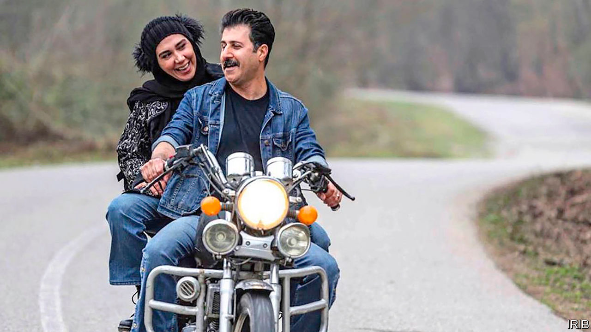

## The revolution will be televised

# The battle over state TV in Iran

> Come for the entertainment, stay for the propaganda

> May 28th 2020TEHRAN

THE COMEDY series “Payetakht” (Capital) has been one of the most popular shows on Iranian state TV since it began airing in 2011. It follows a family from the north who get into all sorts of trouble. In one season, for example, they take a balloon ride in Turkey—and end up in Syria, fighting jihadists. Such storylines allow the show to promote official policy, such as Iran’s support for President Bashar al-Assad of Syria. But in a more recent episode the shot of two newly-weds on a motorcycle (pictured) enraged conservatives. It seemed to emulate a film made before the Islamic revolution in 1979, a period they view with sanctimonious disdain.

Was the offending scene a result of negligence or the work of a “fifth column”? An internal probe aims to find out. But the row has already shed light on a larger struggle over state TV. Young hardliners think their pious and conservative older managers are not pious enough. The young hotheads want to use the airwaves to spread Iran’s revolutionary theology.

At the moment few people are watching. Viewership of state TV has been declining for years, according to IRIB, the state broadcasting monopoly. This is partly a result of a boom in satellite dishes. The government banned them in 1994, but that hasn’t stopped Iranians from watching Western entertainment on satellite TV channels broadcast from abroad. Iranian versions of Netflix and apps such as Instagram also draw viewers. Meanwhile, IRIB has done itself no favours. Many Iranians switched off after 2009, when state channels aired false reports about reformist presidential candidates and promoted the fishy victory of the hardline incumbent, Mahmoud Ahmadinejad.

That trend has continued. During the presidential elections of 2013 and 2017 state TV touted the hardline opponents of Hassan Rouhani, who won both races and continues to be a target of harsh attacks. Many have been aired on a channel called “Ofogh” (Horizon), which was created in 2014 and is overseen by the young crowd. They have since taken control of other networks, such as the popular Channel 3. Now they are seeking two of the top jobs at IRIB, in charge of news and programming. The youngsters accuse the current leaders of corruption. More importantly, they say the old guard is too cosy with Mr Rouhani and others who have favoured engagement with the West. In their eyes the scene in “Payetakht” and others like it are out of step with revolutionary ideology.

But, desperate to win back viewers, the youngsters are crossing their own red lines. They show Western-style programmes on Channel 3, such as Iranian versions of “Who Wants to be a Millionaire?” and “America’s Got Talent”. They have hired relatively liberal celebrities to host new shows. It seems to be part of a strategy: regain an audience before injecting them with a strong dose of propaganda. Take the series “Gando”, which appeared on Channel 3 last year. It was a thriller based loosely on the story of Jason Rezaian, an Iranian-American reporter charged with espionage and imprisoned for 544 days before being released in a prisoner swap in 2016. (Mr Rezaian denies all charges.) The show’s message was clear: those who reach out to the West are weak and traitorous, while hardliners want to protect Iran.

Networks on the other side of the divide use similar tactics. A satellite channel called Manoto, which appears sympathetic to the ousted monarchy, began by broadcasting entertaining shows and documentaries. But after gaining an audience it started airing slanted reports critical of the government and shows that portray the late shah, Muhammad Reza Pahlavi, in a positive light. In order to attract more viewers still, broadcasters of all stripes might consider telling it straight.

## URL

https://www.economist.com/middle-east-and-africa/2020/05/28/the-battle-over-state-tv-in-iran
