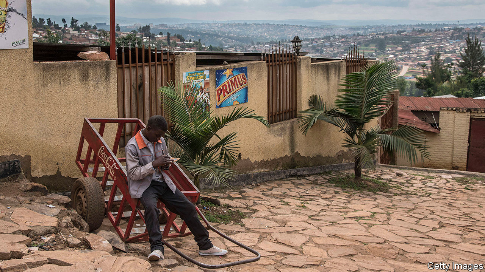
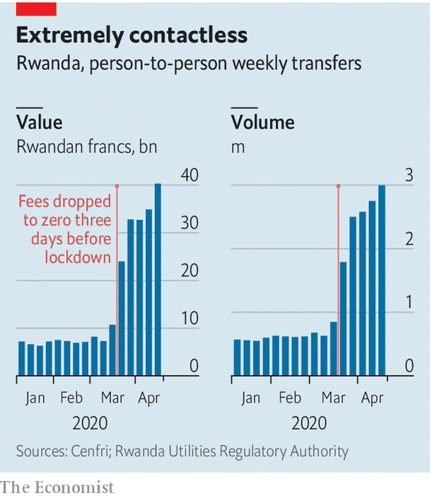

## Dial it up

# The covid-19 crisis is boosting mobile money

> In Rwanda, transactions rose fivefold during a lockdown

> May 28th 2020KAMPALA

THE STORY of mobile money is one that turns during crises. In Kenya in 2008, violence broke out after a disputed election the year before. As supporters of the rival candidates clashed on the streets, ordinary folk were afraid to go out. Many started sending money to each other by phone using a newfangled service called M-Pesa. The habit stuck. Today M-Pesa is the most celebrated mobile-money service in the world. It processes 11bn transactions a year and has spawned imitators across Africa and farther afield.

Could covid-19 have a similar catalytic effect in other countries? In Rwanda the number of mobile-money transfers doubled in the week after a lockdown was imposed in March, according to data collected by the telecommunications regulator and analysed by Cenfri, a South African think-tank. By late April users were making 3m transactions a week, five times the pre-pandemic norm (see chart). The value of transfers between individuals had risen six-fold to 40bn Rwandan francs ($42m).

The data do not show what caused the spike. Maybe Rwandans switched to digital payments because restrictions on movement made it hard to use cash; perhaps they were sending help to loved ones in need. A third explanation is that official policy changed. Just before the lockdown, the central bank told telecoms companies to eliminate charges on all mobile-money transfers for a three-month period. It also raised transaction limits.

The picture elsewhere is mixed. Tayo Oviosu of Paga, a Nigerian payments firm, says the number of customers signing up to use its mobile wallet has been 330% higher in this financial quarter than in the one before. MTN, a South African telecoms firm, says it has seen a rise in payments across its 16 African markets. Operators and regulators have agreed to reduce charges in several countries temporarily, sacrificing profits. “The transactions have gone up but I think we have been earning less money,” says Raghunath Mandava, the boss of Airtel Africa, another mobile-phone company.

But the crisis has also made people poorer. In Kenya, where mobile money is well established, the central bank reports a 10% rise in the number of daily transactions but a 5% fall in their total value. Although the volume of digital transfers has risen in many countries, housebound users are loading and withdrawing cash less often, says Ruan Swanepoel of the GSMA, a global association of mobile operators. The use of these “cash-in, cash-out” services fell by half in the weeks after a curfew was imposed in Kenya, reckon Caribou Digital, a research firm, and MicroSave Consulting, a consultancy. That is a blow to the thousands of agents who earn commission on the transactions they handle.

Many of these effects will be temporary. Lockdowns are already starting to ease. In several countries transaction charges are being restored: without them, the mobile-money business is unprofitable. But as the M-Pesa story shows, habits formed during a crisis can sometimes outlast it. One of the biggest barriers to mobile-money adoption is that people do not trust the service, says Hennie Bester of Cenfri. The pandemic is forcing them to set aside their wariness, perhaps for good. ■

Editor’s note: Some of our covid-19 coverage is free for readers of The Economist Today, our daily [newsletter](https://www.economist.com/https://my.economist.com/user#newsletter). For more stories and our pandemic tracker, see our [coronavirus hub](https://www.economist.com//news/2020/03/11/the-economists-coverage-of-the-coronavirus)

## URL

https://www.economist.com/middle-east-and-africa/2020/05/28/the-covid-19-crisis-is-boosting-mobile-money
