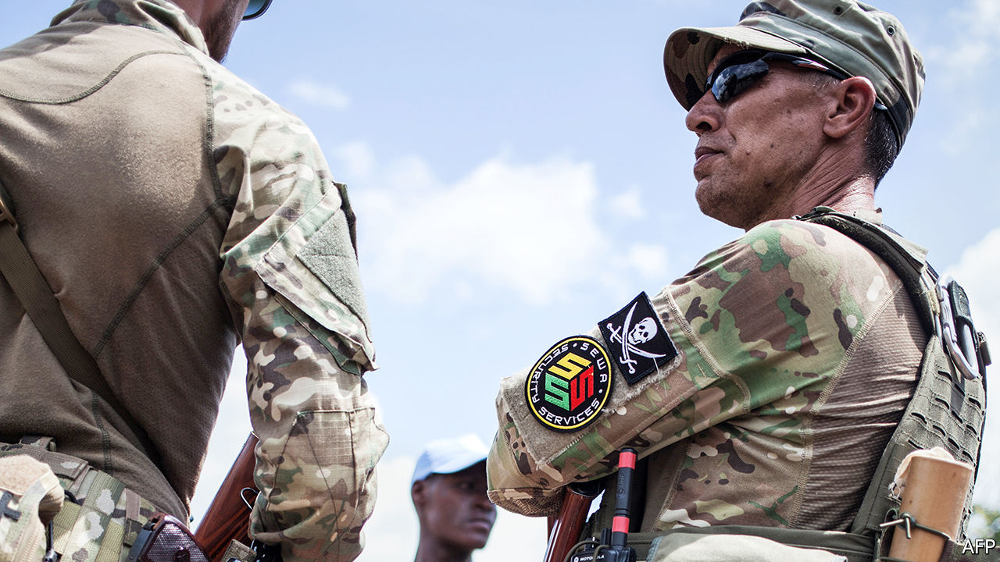

## Soldiers of misfortune

# Why African governments still hire mercenaries

> Professional gunmen are cheap, efficient and deniable

> May 28th 2020

WHEN PRESIDENT FILIPE NYUSI wanted help last year to tackle a jihadist insurgency in northern Mozambique, various private military firms were keen to oblige. Mr Nyusi chose Russia’s Wagner Group, which vowed to make short work of the rebels. But after a bunch of its men were killed, it pulled out, humiliated.

In its place, the government has hired a firm with a very different pedigree: the Dyck Advisory Group (DAG), led by a South Africa-based colonel, Lionel Dyck. Mr Dyck served in the army of Rhodesia, the white-run state that became Zimbabwe at independence in 1980. In the 1970s, when Mr Dyck wore its uniform, the Rhodesian army used to attack Mozambique and the Zimbabwean guerrilla bases that Mr Nyusi’s Frelimo party was hosting. Times change, as do alliances.

Despite a UN treaty banning mercenaries, their day is far from over. Some analysts think there are now more of them in Africa than ever. But can they ever be a force for good? Some of them served in special forces known for their ruthlessness during the dying days of white rule in southern Africa. Since then many have worked in Iraq and Afghanistan before returning closer to their old haunts.

In the years after most African countries gained independence, mercenaries were notorious for supporting secessionist movements and mounting coups. They fought for Moïse Tshombe in Katanga as it tried to break away from Congo in the early 1960s, and in Biafra when it sought to secede from Nigeria in the late 1960s. More recently Simon Mann, a former officer in Britain’s special forces, tried to overthrow the dictator of oil-rich Equatorial Guinea in 2004, but ended up in jail.

Western governments have in the past winked at mercenary activity that served their commercial interests. But nowadays Russia is seen as the leading country egging on mercenaries to help it wield influence. It does so mainly through Wagner, whose founder, Yevgeny Prigozhin, is close to President Vladimir Putin. Shortly after Mr Nyusi met Mr Putin in Moscow last year, Wagner was awarded the contract for Mozambique, which has rich gasfields and is developing Africa’s largest energy project.

Wagner has been hired to prop up a number of shaky African regimes. In Sudan it tried to sustain the blood-drenched dictatorship of Omar al-Bashir. He was ousted last year after big protests. In 2018 hundreds of Wagner men arrived in the Central African Republic to guard diamond mines, train the army and provide bodyguards for an embattled president, Faustin-Archange Touadéra. In Guinea, where Rusal, a Russian aluminium giant, has a big stake, Wagner has cosied up to President Alpha Condé, who has bloodily faced down protests against a new constitution that lets him have a third term in office.

In Libya, despite a UN arms embargo, Wagner is reported to have deployed 800-1,200 operatives in support of a rebel general, Khalifar Haftar, who has been trying to defeat the UN-recognised government. On May 26th America’s military command for Africa said Russia had flown modern fighter jets to Libya to give air support to Wagner. It released satellite photos purporting to show the jets at al-Jufra airbase. It seems, however, that Wagner has been failing in Libya too, with hundreds of its men being forced to retreat.

Private military firms typically say they fill gaps in security that would otherwise lead to chaos. In the Central African Republic, for example, France withdrew almost all of its peacekeeping troops in late 2016, leaving a UN force and a small European training mission that struggled to keep order. Wagner has hardly fared better. In north-eastern Nigeria in 2015 a South African firm called STTEP (Specialised Tasks, Training, Equipment and Protection), had some success in bolstering the Nigerian army in its fight against the jihadists of Boko Haram. However, its contract was cancelled by a new president, Muhammadu Buhari, who reckoned his own forces should finish the job alone. They have signally failed to do so.

Mercenaries have three main advantages over regular armies. First, they give plausible deniability. Using them, a government such as Russia’s can sponsor military action abroad while pretending not to. Second, they tend to be efficient, experienced, nimble and flexible. Third, they are cheaper than regular armies. Whereas soldiers receive lifelong contracts and pensions, mercenaries are often paid by the job. They are also better value for money than the heavy, expensive weaponry that African governments often import, which is not much use against terrorists. DAG’s hardware in Mozambique is reported to include several helicopters (one of which recently crashed after being shot at by jihadists) and some small aircraft, but nothing hugely expensive.

Colonel Tim Collins, a veteran of Britain’s Iraq campaign who has been running a private military firm in Afghanistan, says that “for the money Britain spends on booze at Christmas” such firms could provide African governments with a continental force (not that they would ask for one). He points out that in Sierra Leone in 1995, mercenaries from Executive Outcomes played a key part in routing the murderous rebels of the Revolutionary United Front. That bare-bones force was co-founded by a South African, Eeben Barlow, who now chairs STTEP. Manned mainly by former apartheid-era commandos, Executive Outcomes had previously helped the Angolan government to defeat the rebels of UNITA, which South Africa had once fostered.

DAG’s website claims it has undertaken “security-based operations” in at least eight countries, including the Central African Republic, Malawi and South Africa. Zimbabwe’s president, Emmerson Mnangagwa, is said to be close to Mr Dyck, who caught his eye back in 1981. That was when he led a battalion of the mainly black Rhodesian African Rifles in suppressing a mutiny of disgruntled ex-guerrillas loyal to Prime Minister Robert Mugabe’s bitter rival, Joshua Nkomo, leaving many dead.

OAM Middle East, another security firm run by a former Rhodesian, John Gartner, lists no fewer than 18 African countries where it has operated. Many such companies stress their credentials as wildlife conservationists, using helicopter gunships to deter poachers.

Although opposed to mercenaries on paper, the UN may have softened its stance of late. It now has a code of conduct for how they may work and has itself used them to help with things such as logistics, neutralising landmines and training security teams. Chris Kwaja, a Nigerian who chairs a “working group on the use of mercenaries” for the UN’s High Commissioner for Human Rights, thinks they can be useful as long as they are subject to “binding international instruments”. Some private military firms now accept ethics clauses written into their contracts.■

## URL

https://www.economist.com/middle-east-and-africa/2020/05/28/why-african-governments-still-hire-mercenaries
