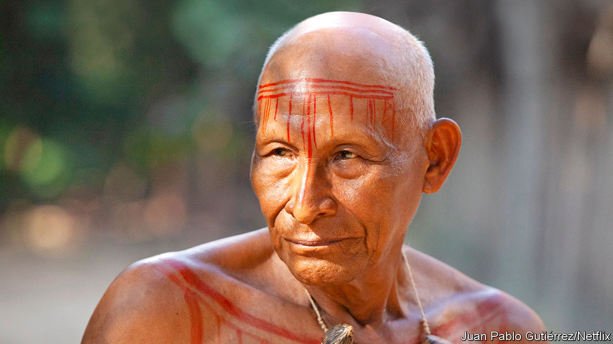

## The wisdom of the forest

# Antonio Bolívar died on April 30th

> The star of “The Embrace of the Serpent” and custodian of tribal stories was 75

> May 28th 2020

WHEN HE SPOKE of Jaguar, lord of the forest, the embodiment of power, strength and violence, Antonio Bolívar would begin to growl deep in his throat. His head would move up and down, around, warily, as if he was on the prowl himself and hunting was his being. When he mentioned Anaconda, the great snake, god of the Amazon and of all water, his hands would slither, swim and twine around each other, getting faster, until—still smiling his tender penetrating smile—he might leap from his chair and fling his snake-arms round whoever was listening to him.

The gesture was a vivid reminder of the film that had made him famous, Ciro Guerra’s “The Embrace of the Serpent”. In 2016 it was nominated for an Academy Award for best foreign film, the first Colombian film to be so honoured, and he found himself in Hollywood, not in a loincloth on the red carpet (he had been warned not to), but in a feather headdress with his smart blue suit, and embraced by Cate Blanchett, who towered over him. He was glad then that he had not turned his friend Ciro down. He had refused to take the role at first because he had been tricked before, when he and some other indigenous actors had not been paid for their work; you could geld a cat once, but not twice. Ciro had promised him what he wanted, serious respect.

His part in the film had been that of Old Karamakate, a shaman guiding a white explorer, Evan, in his search through the Amazon rainforest for the magic yakruna flower. As a young man he had guided another white explorer, 40 years earlier, on the same quest. Both journeys displayed how the forest was being defiled and colonised by outsiders: rubber-seekers who bled the trees and massacred the tribes, crazed religious sects. The later expedition also became a search for wisdom. Both Evan and Karamakate had come into the forest to fill the empty shells of themselves, their chullachaquis, with memories, understanding and dreams. Karamakate did so as the last of his tribe. As much as Evan needed him to find the magic flower, he needed this white man in order to pass on, with his jaguar-tooth necklace, his knowledge and his power. And, even though he did not fully trust him, he did so.

Many who saw the film assumed that Antonio Bolívar and Old Karamakate were one and the same. (In 2019 too, for a Netflix crime-thriller series of Ciro Guerra’s called “The Green Frontier”, he played a detective thoroughly steeped in ancestral wisdom.) He was not a shaman, but he came close. His role was to gather and preserve his tribe’s myths and tales, its knowledge of medicinal botany, its ways of hunting and planting. He was everyone’s grandfather, the one who, round the fire or in the longhouse, would vividly and emphatically retell the old stories. Father-God when he walked on Earth had left footprints there, handprints there, and huge rocks carved like seats. When humans appeared, some of the great beings who had come before them remained as animals and hence as gods. The stars, too, had once been living beings inside the Earth (some were still there, as diamonds or emeralds), but with evolution over thousands of years had moved up to the sky.

He passed on cures, too. The ancestors, who had no hospitals, would take water, pray over it and use it. Before there were vaccines, they would make red annatto dye from the achiote tree to paint protective stripes on their skin. He did not, like Karamakate, crush yakruna leaves into powder to give people psychedelic dreams. But if he found himself sitting by some unfamiliar plant he would instinctively pluck a leaf and squeeze it, maybe bite into it, to test what it could do.

And he too, like Karamakate, was almost the last of his tribe. He was Ocaina; there were perhaps 60 left. His blue eyes marked him out, but because his family had been displaced by rubber-seekers he had been brought up among the Huitoto people. His own language had become strange to him, though he knew Tikuna and Cubeo as well as Huitoto, and acted as an interpreter and script-translator on the film set. Well, people naturally dispersed and intermarried; some tribes were bound to disappear, just as the noise and glitter of modern life meant that the young inevitably had no interest in hunting or weaving baskets, or piercing their cheeks with sticks. They wanted to walk around looking good, in white people’s fashions, with headphones on their ears and phones in their pockets and fizzy drinks in their hands.

Part of him accepted that most people hoped to progress and change. But a great truth was disappearing along with the old ways: that Nature was the interconnected life of all things, from soil to fish, from trees to humans, and that any harm done to the forest did violence to all beings. The rubber barons who had destroyed his family and much of the region in the early 20th century had been only the bloodiest in a string of invaders and exploiters going back, he reckoned, to Columbus’s time. And their place had now been taken by narcotraficantes, by loggers and miners doing “black” or illegal work while governments did nothing, and even by the tourists who took quick day-trips from the cities, threw their money around and left again, proclaiming that all was well.

All was not well. The Amazon, as he constantly repeated, was the lungs of the world, the great purifying filter of all its modern filth. Those lungs had a cancer now, and if it went on growing both they, and all living things, would be finished. Like Karamakate, he had to pass on this truth to his white brothers. The rainforest and its tribes must be supported and protected against invaders. He did not include among those the new illness that crept (from Brazil, the government feared), into his home town of Leticia, where Brazil, Peru and Colombia all met on the great river, and where most of the people were indigenous. For a while, infection rates there were Colombia’s worst. He caught it at the end of April.

But he still had bigger worries. Often he felt like one of those dogs that went on barking, yap! yap! yap! until everyone was tired of it. He refused to be patted quiet. As he spoke of the dog he writhed and barked, while his blue eyes continued to smile with a wisdom barely known in the wider world, and fast vanishing.■

## URL

https://www.economist.com/obituary/2020/05/28/antonio-bolivar-died-on-april-30th
