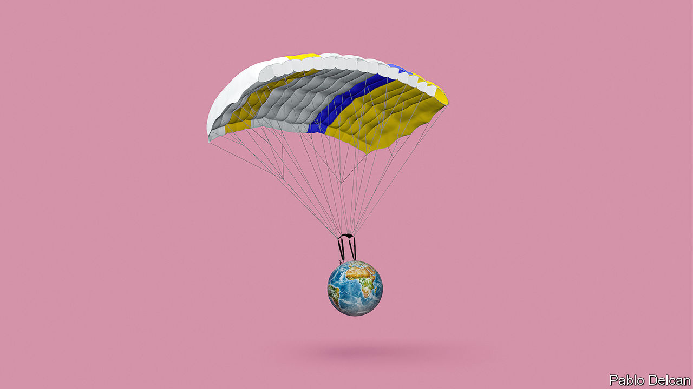
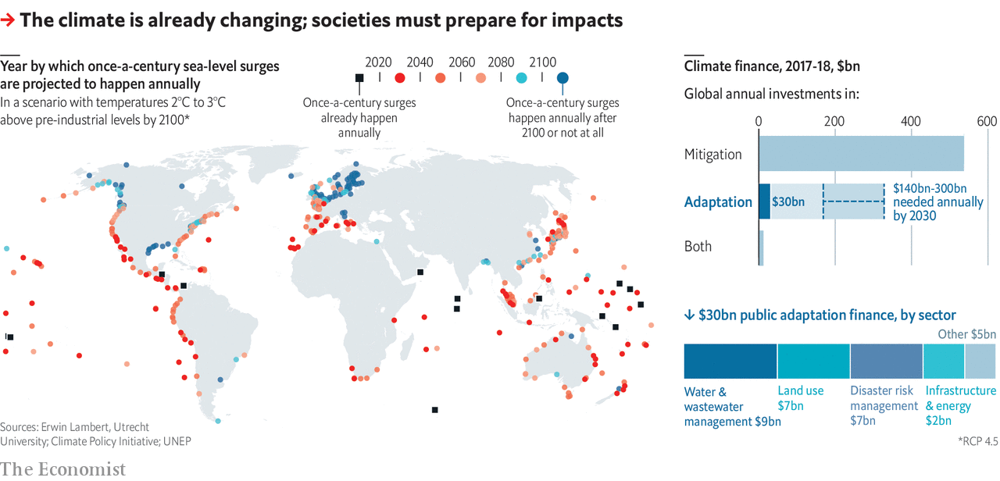

## Softening the blow

# Climate adaptation policies are needed more than ever

> People are already suffering from catastrophic losses as a result of extreme weather events like cyclone Amphan

> May 30th 2020

ON MAY 16TH a telltale anticlockwise spiral of clouds in satellite images taken over the Bay of Bengal warned of impending disaster. Four days later Supercyclone Amphan made landfall, the most powerful storm to do so in the region in 20 years. Winds gusting at up to 185km/h pounded the coast of the Indian state of West Bengal, which took the brunt of the impact. Huge waves swept over the Indian and Bangladeshi coast. Trees were lifted out of the ground, city streets turned to rivers, tens of thousands lost their homes. Yet the number of deaths was relatively low. As of May 27th there had been around 100 overall, though the number could rise as emergency services reach the more remote areas. In Bangladesh there were just over 20.

For several decades now Bangladesh’s cyclone death tolls have been falling. The storms have not become less brutal; and rising sea levels, combined with the country’s flat-as-a-pancake coastline and growing population, have put ever more people at risk. But Bangladesh has developed a layered adaptation plan to cope with these disasters. It now has an early-warning system offering precious extra minutes for people to evacuate to concrete cyclone shelters, and sea walls to protect stretches of coastline. In 2019, Cyclone Fani—not a storm on Amphan’s scale, but one which at its peak would have been a Category 4 hurricane in the Atlantic—killed dozens. In the late 20th century and early 21st, death tolls for powerful storms were in the thousands to hundreds of thousands.

Bangladesh’s success shows what sort of adaptation to climate risks is possible. In the early 2000s the country’s policymakers recognised that international efforts to cut emissions would never be sufficient to protect it from many of the impacts of climate change. The country’s low-lying coastline and position at the top of the Bay of Bengal—a funnel for cyclones—meant that even without climate change there were benefits to be had from building storm defences. Starting in 2005, they began devising programmes to help its residents adapt their way of life to a warmer, more erratic climate. Today, that includes storm defences, cyclone shelters, new rice varieties and floating farms. But globally such successes remain rare.

In the early days of political action on climate change adaptation was seen as, at best, a poor relation to cutting greenhouse-gas emissions—at worst as a distraction. In his first book on the subject, “Earth in the Balance” (1992) Al Gore, who became America’s vice-president the following year, described it as “a kind of laziness”.

In 2010, with attempts to agree on reductions in emissions stalled by the failure of the Copenhagen summit, and with emissions rising steeply as the world bounced back from the financial crisis of 2007-09, adaptation began to take its proper place as a topic of international concern. The countries party to the UN Framework Convention on Climate Change took on a commitment to a global adaptation framework and set up a Green Climate Fund, with the goal of raising $100bn annually by 2020 to help developing nations reduce their emissions and establish plans for adaptation.

A decade on, adaptation is more urgent than ever. Global average temperatures are already roughly 1°C warmer than they were in the 19th century, bringing more extreme and more erratic weather patterns. Intense, unprecedented and sustained effort co-ordinated among all the world’s large economies could see the total rise capped at less than twice what has been seen so far: the “well below 2°C” goal that features in the Paris agreement reached in 2015. But even such heroic efforts would still leave a lot of change to adapt to. And current trends suggest something more like 3°C.

Faced with these projections, the need to adapt societies and economies to be more resilient to a hotter climate is clear. The Global Commission on Adaptation, an NGO, estimates that, if nothing is done to prepare for climate change, it could lower global agriculture yields by as little as 5% and as much as 30% by 2050—depending on a range of assumptions. Roughly 5bn people could suffer water shortages at least one month a year. Hundreds of millions of people may have to abandon their homes in coastal cities. Adaptation is not just a matter for poor countries. The damage which Hurricane Sandy wreaked on New York City in 2012 showed that extreme events could bring one of the world’s most important financial centres to its knees. Damages topped $19bn. Such losses spurred a $19.5bn urban-adaptation plan.

Businesses have also started to look at their vulnerabilities to climate change—partly because of pressure from activist investors. Several are adapting. Mylan, a pharmaceutical company, has reinforced its buildings in hurricane-prone Puerto Rico; Microsoft has built redundant cloud capacity in case servers are knocked out by extreme weather. Individuals in a few places are spending to ensure their future comfort and livelihood. The fact that some adaptation can be provided privately brings with it incentives that are lacking when it comes to mitigation, which is notoriously vulnerable to the free-rider problem. But it also brings worries of its own. If the wealthy can adapt for themselves, the pressure on states to help may decrease.

In some developed countries adaptation is already saving lives. An estimated 15,000 died in France in 2003 as a result of scorching August temperatures. A heatwave in 2019 is estimated to have killed 1,500. The improvement was thanks to increased awareness of the threat, public policy and private investment. There is now targeted support and medical attention for the most vulnerable. Opening hours for swimming pools were extended. The authorities put air-conditioning into some public buildings. Many private citizens installed it, too.

The successes in France and Bangladesh are both tailored to the needs of specific populations facing specific threats; this is a general truth about adaptation. What has to be done to reduce emissions is pretty similar around the world; providing resilience through adaptation depends on policies shaped by local needs and capacities. Sub-Saharan communities at risk of more intense droughts that threaten their food supply do not need to deploy the same toolkit as ones on the Florida coastline where the land beneath their homes is eroding.

All this comes at a cost. Estimates vary a lot because they are based on so many assumptions. In 2016 the UN Environment Programme said that adaptation would cost $140bn-300bn annually by 2030. Those sums are widely thought to be outweighed by the benefits they bring. According to the Global Commission on Adaptation, investments totalling $1.8trn globally between 2020 and 2030 could generate $7.1trn in net benefits.

The problem is that flows of private capital and money from both governments and foreign-development funders fall short. Accounting is made hard by the overlap between funding for adaptation and more general flows of development finance. But the Climate Policy Initiative, a think-tank, estimates that in 2017-18 a paltry $30bn, primarily from public sources, was invested worldwide, compared with $537bn for mitigation.

One limit to adaptation is the ability to pay for it. Another is more fundamental. There are things even the best-funded adaptation programme cannot hold at bay: the consequences of climate change that must be avoided entirely. In Bangladesh rice is a major crop. Rising seas are turning the paddies salty. In response, agricultural researchers have developed salt-tolerant rice varieties, with each new generation able to grow in soil that is more saline than the last. But even they concede that this has limits. To expect agronomic advances to create rice that can grow in pure sea water would be daft.

For the people in the small village of Newtok in Alaska, the limits to adaptation are tangible. During the past decades, hotter summers have melted the permafrost from beneath their feet. In October last year they began the laborious process of resettlement. “Managed retreat” is an extreme form of climate adaptation that will become a reality for millions if the mercury does not stop rising. Earlier this month a study found that parts of the tropics could become too hot to sustain human life with 2.5°C of global warming.

Long before the world gets to that point, communities, especially in poorer regions, will suffer catastrophic losses. Many already are. Who pays for the losses and damages is yet another thorn in the side of UN climate talks. The calls from more vulnerable nations for international funds to help them foot the bill have fallen on deaf ears. Governments of wealthy nations want no part in any formal text that might contain a whiff of liability.

In the eyes of some, rich governments are not the only guilty parties. In December the Philippines’s Commission on Human Rights declared that events leading to devastating storms like Typhoon Haiyan, which killed thousands of people in 2013, were a violation of human rights. They pointed the finger at fossil-fuel companies and other corporations. The commission claimed these companies could, hypothetically, be held accountable. ■

## URL

https://www.economist.com/schools-brief/2020/05/30/climate-adaptation-policies-are-needed-more-than-ever
