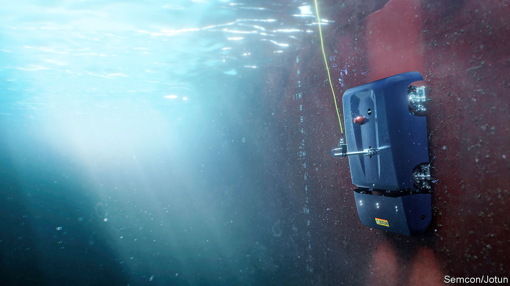

## Antifouling technology

# A new robot may help keep ships’ bottoms clean

> It stops shellfish and seaweed from growing

> May 28th 2020

ALL SHIPS suffer from fouling: the build-up below the waterline of shellfish, seaweeds and other organisms. This causes drag, which slows the affected craft and increases its fuel consumption. Regular hull cleaning thus makes a considerable difference to the profitability of shipping. It also results in a useful reduction in the amount of planet-warming carbon dioxide emitted by the world’s merchant shipping—an industry that many environmentalists think is notoriously dirty and which could therefore do with burnishing its green credentials.

Roar Ådland, a shipping economist at the Norwegian School of Economics, in Bergen, says that a midsized oil tanker’s fuel consumption (and also, consequently, its emission of carbon dioxide) drops by around 9% after its hull is cleaned at sea—something that happens, on average, once every six or seven months. If the cleaning is done in a dry dock, which allows the process to be more thorough, that figure can be as much as 17%.

At the moment, cleaning at sea is done by teams of divers. In recent years, robots have sometimes been added to underwater cleaning crews, and have proved effective. Jotun, a Norwegian coatings company, and Semcon, a Swedish engineering firm, propose, however, to go one step further. They want to replace the divers completely with a machine. That machine, moreover, would not merely defoul a ship’s hull, but stop it fouling up in the first place.

HullSkater, as the consortium dub their invention, is a 200kg hull-crawling robot. It will reside permanently on-board ship, ready to be launched whenever the vessel is stationary—for example, when it is waiting in the roads outside a port for a berth to unload and load. To deploy the robot, it is first lowered overboard by a crane. Its four magnetic wheels, each of which is fitted with a motor, then clamp it to the hull and it can start trundling around. After this, the ship’s crew need do nothing. Wherever the vessel happens to be on the planet, the robot is piloted remotely by an operator on land, who may be half a world away, via a 4G phone connection.

Inspecting and cleaning a hull takes HullSkater between two and eight hours, depending on the size and design of the ship. The robot is fitted with special brushes that can probe the nooks and crannies of naval architecture—the areas around propellers, for example—and its four cameras provide its operators with a detailed view of what is going on, and also help to keep track of whereabouts on the hull the machine is.

The idea is to keep the hull permanently clean, by regularly removing from it the layers of slime-producing bacteria that are the first stage of the fouling process. Bacterial biofilms, as these layers are known technically, are used as anchorages by the larvae of so-called “hard growth” organisms, such as barnacles and molluscs, and by the spores of trailing seaweeds.

An absence of biofilms means fouling will never get going in the first place. Jotun claims that regular pre-emptive cleaning in this way of a typical bulk carrier will result in a continuous reduction in that ship’s fuel consumption of 12-13%, as opposed to the episodic reductions brought about by current cleaning regimes. This translates into a saving of 4,000 tonnes of oil a year, and a concomitant reduction of around $800,000 in fuel bills.

A bonus of all this effort is that an unfouled ship has little risk of carrying unwanted passengers in the form of alien animal species that might make a nuisance of themselves if they were to become established far from home. Asian paddle crabs, North Pacific seastars, Asian green mussels and European fan worms are four common hull-fouling animals that can turn into pests if introduced into the wrong settings.

That can easily happen with conventional cleaning-by-diving, because this leaves a mass of debris floating in the water and on the seabed which can harbour such undocumented migrants. Many ports have therefore introduced restrictions on what sorts of hull cleaning can be carried out in their waters. Widespread adoption of the International Maritime Organisation’s biofouling guidelines, which require an assessment of the risks associated with any cleaning carried out while afloat, is likely to tighten things up still further, so new cleaning methods are desirable.

The HullSkater approach is not perfect. Regular cleaning by robot could, the makers admit, wear away some types of antifouling coating, thus limiting the process’s efficacy. Jotun has, however, developed a special, hard-wearing coating, which it plans to sell in conjunction with the robot, to minimise this problem.

HullSkater is now being tested in various parts of the world (for rates of fouling depend on local conditions, such as sea temperatures), and the plan—at least at the moment—is to roll it out commercially this summer. If that is a success, according to Hans Peter Havdal, Semcon’s general manager, the next stage will be to develop a family of such robots, designed for ships of different sizes and types. Ideally, these will have higher levels of autonomy than HullSkater. They may even be able to learn the shape of the hull they have been designated to keep spick and span, and thus get on with the job unsupervised.■