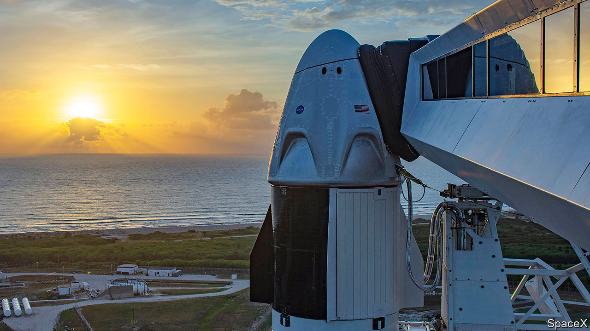

## Space flight

# Crew Dragon’s launch is postponed

> The weather was unpropitious

> May 30th 2020

THE WORLD WILL have to wait a little longer for the first launch of human beings into space in a craft not run by a national government. Crew Dragon (pictured) is designed, built and operated by SpaceX, a private firm founded by Elon Musk—as is the Falcon 9 rocket its sits on. This was intended to carry it into orbit for a rendezvous and docking with the International Space Station after a lift-off from the Kennedy Space Centre at Cape Canaveral, Florida, on May 27th. It would have been the first crewed launch from American soil since the final Space Shuttle flight nine years ago, but it was scrubbed shortly before lift-off because of bad weather, and has been rescheduled for May 30th.

Update: The Crew Dragon did eventually take off, on schedule, on May 30th. See our article on the launch at [https://www.economist.com/science-and-technology/2020/05/30/flying-people-to-the-space-station-is-spacexs-biggest-deal-yet](https://www.economist.com//science-and-technology/2020/05/30/flying-people-to-the-space-station-is-spacexs-biggest-deal-yet)

## URL

https://www.economist.com/science-and-technology/2020/05/30/crew-dragons-launch-is-postponed
