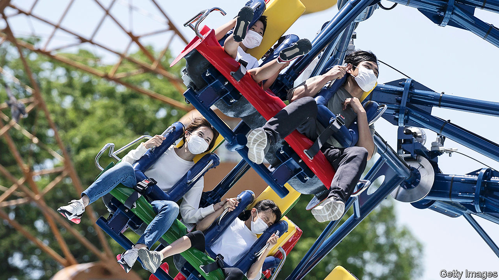
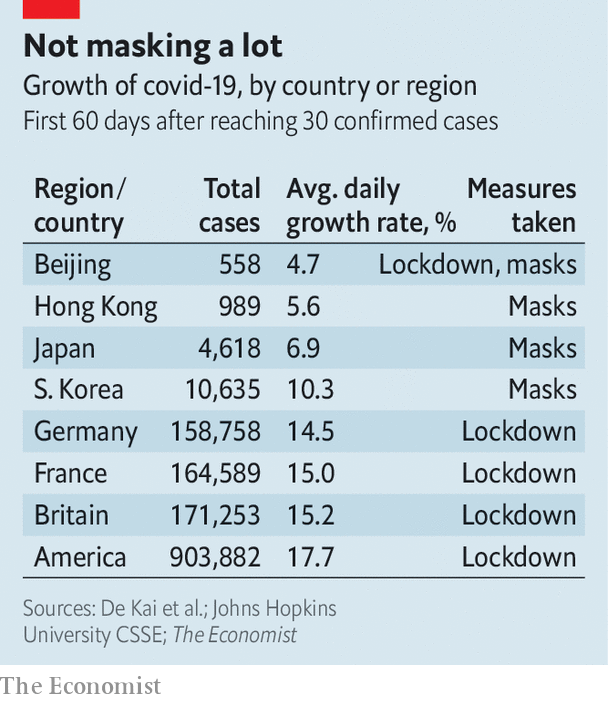

## Face masks and the coronavirus

# Masks probably slow the spread of covid-19

> But wearing one is mainly an act of altruism

> May 28th 2020

Editor’s note: Some of our covid-19 coverage is free for readers of The Economist Today, our daily [newsletter](https://www.economist.com/https://my.economist.com/user#newsletter). For more stories and our pandemic tracker, see our [coronavirus hub](https://www.economist.com//news/2020/03/11/the-economists-coverage-of-the-coronavirus)

“THIS IS A, I would say, senseless dividing line,” said Doug Burgum, governor of North Dakota, his voice catching as he talked of the rows that have broken out in his state over the wearing of face-coverings. There are similar spats elsewhere in America, for masks have become the latest aspect of the culture war that has emerged there over how to deal with covid-19. Some shops refuse entry to maskwearers and Mike DeWine, the governor of Ohio, has rescinded an order requiring people to wear them, saying that he “went too far”.

Elsewhere in the world, by contrast, there is increasing acceptance that mask-wearing is a good thing. On May 5th, for example, the Royal Society, Britain’s top science academy, concluded that masks “could be an important tool for managing community transmission”. This is not so much because they protect the wearer—the normal reason people may put them on in times of pestilence—but rather because they stop the wearer infecting others.

In this context covid-19’s particular peculiarity—that people who test positive for it often do not have symptoms—is important. Research published last month in Nature Medicine, by Xi He of Guangzhou Medical University and Eric Lau of Hong Kong University, suggests that 44% of cases are caused by transmission from people without symptoms at the time of transmission.

Those who do have symptoms should not, of course, be out and about at all. In their case masks are irrelevant. But to break the chain, it behoves even the symptomless to assume that they might be infected. Covid-19 is transmitted, above all, by virus-laden droplets of spit. Experiments show that face-coverings as simple as tea-towels are effective. One study found that a tea-towel worn around the face captured 60% of droplets. At 75%, a surgical mask did better, but not overwhelmingly so.

Governments are beginning to take this on board. As part of the loosening their lockdown, the Dutch are required to wear face-coverings on public transport—but not ones of medical grade, which should be reserved for professionals. This encourages people to make their own.

Neither laboratory studies nor the data on asymptomatic transmission provide watertight evidence of the efficacy of masks. That would need randomised controlled trials, in which one group wore masks and the other did not. This would be ethically tricky, since it might condemn one of the groups to a higher death rate. Hamsters, which are susceptible to covid-19, are the next best thing to people. So researchers at Hong Kong University put cages of healthy hamsters next to cages of infected ones, with a fan in between drawing air from the infected to the healthy cage. They sometimes also placed a stretched-out face mask in the air stream. With no interposed mask, two-thirds of the healthy animals were infected within a week. With a mask interposed close to the healthy hamsters (the equivalent of a healthy person wearing a mask), one-third were. With the mask close to the infected hamsters, only a sixth were.

Although scientists cannot experiment on human beings deliberately, some wonder if the world is now carrying out a natural experiment that tests the value of mask-wearing. In many East Asian countries it was common practice to sport masks, even before covid-19, to protect against respiratory diseases and pollution. A lot of people in these places therefore took immediately to wearing masks when the epidemic started. Countries that adopted masks early on did not, by and large, shut their economies down. Yet they suppressed the disease more effectively than those that locked down but did not wear masks.

There is a correlation between mask-wearing and rapid suppression of covid-19. According to Patricia Greenhalgh, professor of primary health care sciences at Oxford University, “there is not a single country in which mask wearing was introduced early and with high compliance, where the disease wasn’t quickly brought under control.” Sceptics point out that this does not prove masks work, since countries in which they are widely worn also tend to be those which have been threatened by epidemics in the past, and therefore have well-established systems of testing and contact tracing.

In the West nobody normally wears a mask, though the practice is spreading. Universal masking started in the Czech Republic after Petr Ludwig, a Czech YouTube star, posted a video on March 14th recommending the practice, and it went viral. Other social-media influencers posted pictures of themselves wearing masks. “Mask trees”, where people would hang home-made masks for others to use, sprang up on street corners. By March 19th masks were mandatory in the country. Slovakia and Slovenia followed swiftly.

The World Health Organisation has not advocated widespread mask-wearing, and has received some criticism for this. Jeremy Howard, a research scientist at the University of San Francisco and co-founder of Masks4all, a charity, says “they did a good job of recommending handwashing and social distancing, but they have been slow on masks.”

In light of all this, regulations requiring people to wear masks have spread, as an increasing number of governments view the evidence as strong enough to warrant compulsion. India now requires them to be worn in crowded public spaces, as do France, Germany, Italy and Spain. In most of the world, people either wear them in such spaces without being told to, or are required to by their governments.

Among big countries, Britain and America are outliers. In Britain the government advises people to wear masks, but to little effect. On the London Underground around a third of travellers do so. On the Paris metro where people risk a €135 fine if they fail to cover their faces, everybody does. In America the Centres for Disease Control and Prevention, which previously recommended mask-wearing only for health workers, changed its mind in early April. It now recommends that everybody should wear them in places where it is hard for people to stay far enough apart. Several states have passed regulations along those lines, as has New York City. But, as Governor Burgum noted, the rows go on.■

## URL

https://www.economist.com/science-and-technology/2020/05/28/masks-probably-slow-the-spread-of-covid-19
