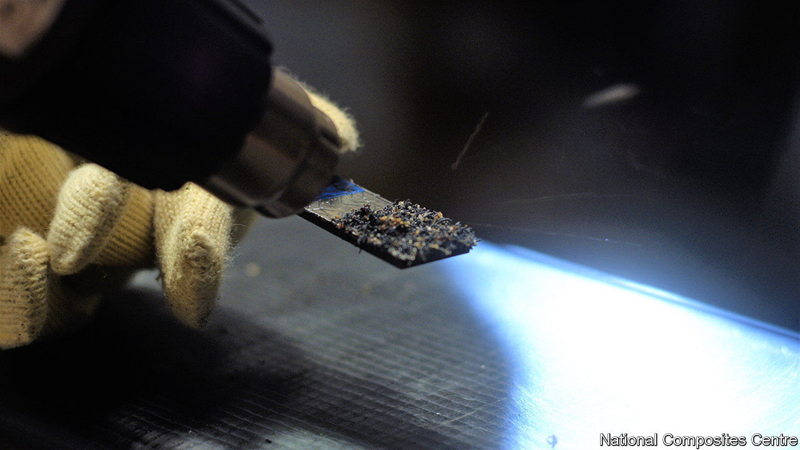

## Crackle, pop, snap

# Self-destructing glue solves a sticky environmental problem

> Superannuated objects can now be taken to pieces more easily

> May 28th 2020

GLUE THAT deliberately comes unstuck sounds like a joke. But it is useful to be able to take things to pieces for recycling once their lives are over, so adhesive that becomes unadhesive on command could be valuable. James Broughton, a chemist at Oxford Brookes University, in Britain, thinks he has just the things. The inventions he and his colleagues have come up with are not new glues, per se, but rather “disbonding” agents that can be put into existing glues to break their grip when it is no longer needed.

In the past, when the components of machines like cars and aircraft were made mainly of metal, welding and soldering were the principal ways of joining them together. But the spread of plastics—and particularly of composites like glass fibre and carbon fibre—means that glued joints are much more common than they used to be. Effective recycling requires materials to be sorted and processed separately. Taking an object to pieces is the first stage of doing that. Recycling things that have been glued thus involves disbonding the glue.

Dr Broughton’s disbonding agents are called expandable graphite and thermally expandable microspheres. Expandable graphite is a powdery substance in which graphite’s famously flat and slippery carbon sheets are interspersed with sulphuric acid. When an adhesive containing this additive is heated appropriately, the acid decomposes into three gases: sulphur dioxide, sulphur trioxide and steam. That forces the graphite layers apart. This expansion, Dr Broughton observes, acts as a crack initiator. It breaks up the glue and frees the joined components.

Thermally expandable microspheres, by contrast, are plastic bubbles, ten microns across, that are filled with a hydrocarbon such as butane, pentane or octane. When solidified glue containing these bubbles is heated appropriately the hydrocarbon expands, inflates the bubbles and, as happens with expandable graphite, cracks the glue.

The crucial phrase in all this is “heated appropriately”. Dr Broughton and his colleagues have had to pick substances that do their stuff at a temperature sufficiently high as not to be encountered during a machine’s normal operation, but sufficiently low that it will not damage the components to be disbonded when they are heated up to disbond them—which may be done either in an oven or by using a hot-air gun that resembles a souped-up hair dryer.

In this context, having two approaches provides flexibility. Expandable graphite’s disruptive effect is triggered at a slightly higher temperature (160°C) than the 125°-150°C which causes the microspheres to inflate. (The exact behaviour of a microsphere depends on which hydrocarbon is inside it.) This process is, moreover, surprisingly quick. Dr Broughton’s colleague Lucy Eggleston, who works at the National Composites Centre, in Bristol, says that after a mere six seconds of heating, “the components just pop apart”.

Disbonding of this sort might have wide application. But one particular prize the team have in sight is the wind-turbine market. Turbine blades typically have glass-fibre skins, balsa-wood cores and metal or carbon-fibre spars. That makes them ideal candidates for disbonding at the ends of their lives. In Europe alone, 14,000 wind-turbine blades will be decommissioned over the next five years. For these, disbonding comes too late. They will, though, need to be replaced—and the green credentials of wind-farm operators would certainly be burnished further if those replacements were designed for easy recycling.■