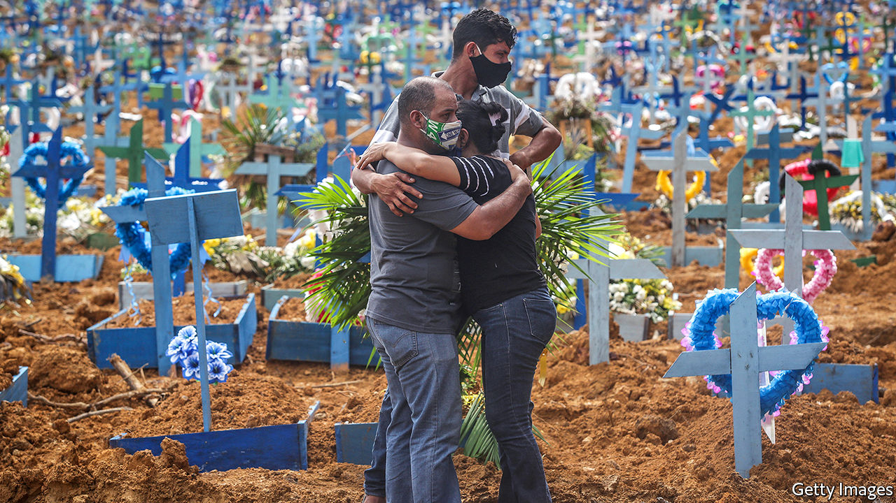

## A tropical tragedy

# Brazil’s losing battle against covid-19

> The country entered the pandemic with some advantages. Because of Jair Bolsonaro it is squandering them

> May 28th 2020SÃO PAULO

Editor’s note: Some of our covid-19 coverage is free for readers of The Economist Today, our daily [newsletter](https://www.economist.com/https://my.economist.com/user#newsletter). For more stories and our pandemic tracker, see our [coronavirus hub](https://www.economist.com//news/2020/03/11/the-economists-coverage-of-the-coronavirus)

ON MAY 18TH Bruno Covas, the mayor of São Paulo, Brazil’s biggest city, announced an unscheduled five-day holiday to discourage people from going out. The residents of Paraisópolis, a favela of perhaps 100,000 people in southern São Paulo, where covid-19 deaths are rising at a faster rate than anywhere else in the city, saw the festive side. A popcorn vendor set up shop to serve the stream of patients entering a clinic. School-aged boys flew kites nearby. “Brazil adapted well to this new reality,” joked one, pointing to crowded rooftops and the dancing diamonds overhead.

Brazil’s covid-19 curve looks like a kite string. On May 28th it had 411,821 confirmed cases and 25,598 deaths. The United States, the only country with more cases, barred Brazilians from entering from May 26th. The World Health Organisation has declared South America “a new epicentre”, with Brazil the worst affected country. A study in 133 cities by the Federal University of Pelotas in the southern state of Rio Grande do Sul concluded that Brazil’s caseload is seven times the official number.

Brazil entered the pandemic with strengths. Like the United States it has a federal system. Governors (and mayors) have the power to declare lockdowns. Brazil’s free Unified Health System (SUS), modelled on Britain’s National Health Service, serves 80% of the population, though poorly in some regions. In earlier crises, such as the H1N1 (“swine flu”) epidemic in 2009 and the mosquito-borne Zika outbreak in 2015, the three levels of government and the SUS co-operated effectively.

More contagious than H1N1, covid-19 exploits Brazil’s weaknesses. Rich travellers brought the virus, but it is now concentrated in poor neighbourhoods like Paraisópolis, where people are packed together and have jobs without contracts or benefits. That makes social distancing hard. A monthly benefit of 600 reais ($110) introduced in April has helped millions of informal workers, but long queues of people unable to obtain it are still forming at banks.

What makes social distancing harder is that Brazil’s populist president, Jair Bolsonaro, scoffs at the medical establishment and its advice. He has quarrelled with and lost two health ministers since the crisis began. His attitude to covid-19 resembles that of President Donald Trump: both tout hydroxychloroquine, a malaria drug that is useless against covid-19 and can be dangerous, according to a new study in the Lancet.

Mr Bolsonaro’s attitude causes more damage, however. Brazil’s federal system is more president-centred than America’s. To work well in a crisis, all levels of government must co-operate. Luiz Henrique Mandetta, Brazil’s health minister when the outbreak began, held daily meetings with state and municipal health secretaries to plan for getting and distributing money, tests and equipment to combat the pandemic. But after Mr Bolsonaro sacked him on April 16th those meetings ended. “The SUS is a three-legged animal,” Mr Mandetta says. “If you cut off one of its legs, it starts to go in circles.”

Rich states with relatively strong health systems are coping better. In the state of São Paulo co-ordination among municipal and state health agencies and the private sector helped open thousands of hospital beds, including in stadiums and convention centres. Even so, in the city more than 90% of intensive-care beds are occupied. Douglas Cardozo, an auxiliary nurse at Hospital do Campo Limpo, south of Paraisópolis, says that staff lack bodysuits and other necessities. At least 50 patients a day check in with covid-19 symptoms, he says. Two colleagues have died from it.

In poorer regions of Brazil the health system is buckling. Less than a month after the first covid case was reported on March 13th in Manaus, a city of 2m in the Amazon rainforest, the mayor said that its system had collapsed. A promised field hospital has failed to materialise and mass graves are being dug for victims, some of whom are dying on boats en route to the city.

The weaker the health system, the more it needs the protection of strict lockdowns. But Mr Bolsonaro has made these a wedge issue. He shows up at weekly protests in Brasília, the capital, against quarantines. Unlike in some European countries, Brazilians do not come to their front doors and windows to applaud health workers. Their covid clamour signals conflict. When Mr Bolsonaro says something incendiary, his fans drive around blasting car horns in approval while his critics bang pots and pans. In municipalities where support for Mr Bolsonaro is strong, adherence to social distancing is correspondingly weak, according to a recent paper by Nicolas Ajzenman, an economist, and two other authors.

This forces governors and mayors to fight on several fronts. Mr Bolsonaro mounted a legal challenge to their quarantine orders, which the Supreme Court rejected on April 15th. João Doria, the centre-right governor of São Paulo state, says that to implement a strict lockdown “would mean a clear confrontation with millions of Brazilians” who support Mr Bolsonaro. (Critics say he wants to avoid angering businessfolk.) Some Brazilians are merely confused. They ask themselves: “whom should I listen to, the governor or the president?” says Mr Doria.

This adds to the economic and cultural forces that jam people together even as the president divides them. Just half in São Paulo are adhering to lockdown rules. To stop the virus’s spread 70% is needed, says the state’s government. On bustling Avenida Senador Teotônio Vilela on the city’s southern periphery more than 20 shoppers browse in a variety store, ducking in and out under half-lowered metal shutters. Reinildo Carneiro, a construction worker, donned a puppy-print mask and popped into a bar in Paraisópolis for a game of snooker. “You’re more vulnerable if you get depressed from staying at home,” he says. Beer kills the virus, he read on WhatsApp.

Mr Bolsonaro will not set him straight. His presidency is consumed by melodrama. In a two-hour video of a cabinet meeting released by the country’s Supreme Court and watched by millions of Brazilians, he gave himself over to unhinged and profanity-filled rants against police investigations of his sons but had little to say about protecting citizens from the pandemic. Widespread testing, a precondition for easing lockdowns safely, is not happening. By May 26th Brazil had processed fewer than 500,000 tests, just a tenth of the number acquired by the health ministry. Its testing rate is far lower than that of European countries and the United States.

Governors are yielding to pressure anyway. Mr Doria announced plans to begin opening parts of his state, including the city of São Paulo. At the city’s São Luis cemetery 3,000 fresh graves await covid-19 victims. Several hundred have been filled. The cemetery’s old average of 11 burials a day has jumped to more than 40, says a gravedigger. Most graves are covered with flowers but unmarked due to a backlog in engraving the plaques. A banner warns about Zika. None is needed for covid-19, says the gravedigger. “Once people lose a family member, they finally believe.”■ 

Editor’s note: This article has been updated to include more information about Mr Doria’s plans to open up parts of São Paulo state.

## URL

https://www.economist.com/the-americas/2020/05/28/brazils-losing-battle-against-covid-19
