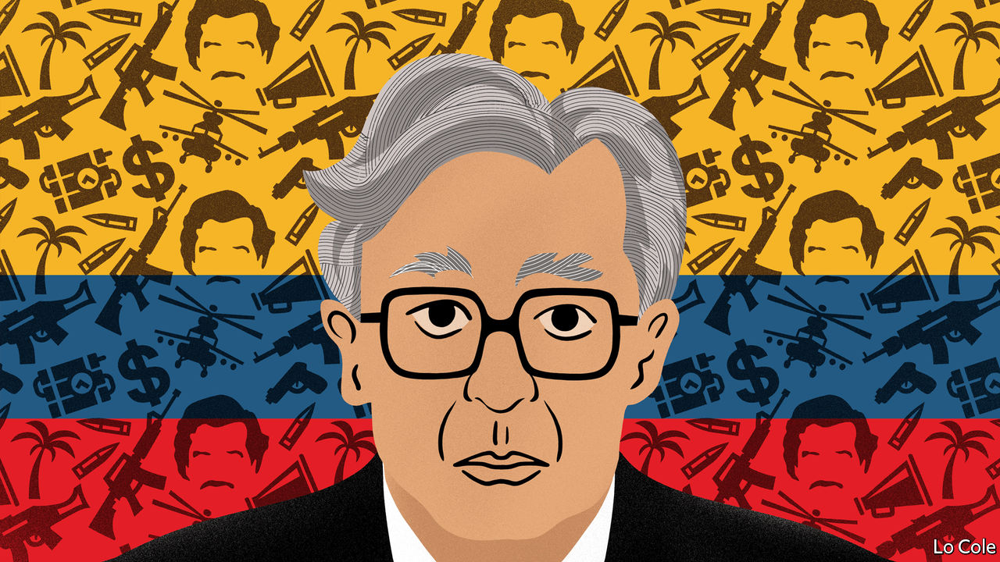

## Bello

# Why a president from the 1980s offers lessons for Colombia today

> What Iván Duque should learn from Virgilio Barco

> May 28th 2020

“IT IS DIFFICULT to find in the recent history of the West a democratic state confronted with such serious threats as Colombia was in the mid-1980s.” So writes Malcolm Deas, a British historian, in a biography published last year of Virgilio Barco, the country’s president from 1986 to 1990. Colombia had the world’s highest murder rate, as Pablo Escobar and his drug-trafficking friends ran amok, slaughtering judges, journalists and ministers. The state’s writ did not run in many rural areas, where the FARC and other left-wing guerrillas battled right-wing paramilitaries, all financing themselves from extortion, kidnapping or cocaine. With Colombian politics suffering from a surfeit of veto players, from ex-presidents to business lobbies, academics began to talk of a “blocked society”.

Barco began the unblocking. He ended a cosy power-sharing arrangement between his Liberal party and the Conservatives and set in motion the writing of a new constitution. He correctly identified the narcos as a more pressing threat than the guerrillas, with some of whom he made peace. He began to strengthen a weak state and launched a development programme for conflict-ridden areas. Several of his successors continued his work. In this century Álvaro Uribe, a right-winger, expanded the army, caused the paramilitaries to disband (formally, at least) and beat back the FARC, allowing Juan Manuel Santos to conclude a peace agreement in 2016.

Outwardly, Colombia is in much better shape today. Violence has fallen steeply. Colombians are less poor, healthier and better educated than they were in the 1980s. Between them the current president, Iván Duque, big-city mayors and the health service have coped well with covid-19. Colombia has recorded 16 deaths per million people, compared with 120 in Peru and 44 in Chile. The hospitals have spare beds, allowing the government to ease its lockdown.

Mr Duque, who is sponsored by Mr Uribe, has seen his approval rating rise from 23% in February to 52% in April. Yet he would be rash to relax. Peace has allowed new aspirations: mass protests last year focused on better education and pensions. But Colombia’s progress has all but halted since the peace agreement, and in some ways before that. Many crucial issues, from judicial reform to tackling corruption, have been shirked.

There are new worries. Partly because it has never managed to raise enough taxes, Colombia has been less ambitious in trying to offset the covid-19 recession than Peru or Chile. With poverty and unemployment surging, discontent is bound to return. This is all the more worrying because the security forces seem to be losing their grip. Earlier this month a dozen officers were fired after it was revealed that army intelligence spied on opposition politicians, journalists, activists and even a senior aide to Mr Duque. The dictatorial regime of Nicolás Maduro in Venezuela claims, plausibly, to have infiltrated Colombian intelligence. Meanwhile, a Mexican drug “cartel” and assorted armed groups are running free on the Pacific coast.

Some of Mr Duque’s opponents accuse him, in part unfairly, of failing to implement the peace agreement. “The big complaint is not peace, it’s security,” says a former defence official. “It’s what they were supposed to be good at.” The peace agreement offered the chance to shrink the army, expand the police and concentrate on bringing the rule of law to rural areas. Instead, Mr Duque’s government has allowed the army to become politicised, and has failed to exercise civilian oversight of it.

Mr Duque is young, personable and a good orator. But Mr Uribe controls his party. The government’s achievements include absorbing 1.8m Venezuelan migrants, a law to get broadband to rural areas and, so far, coping with covid-19. But with more than half his four-year term still to go, they risk being wiped out by recession and, with it, a probable rebound in crime.

As for Barco, he was an unlikely leader. An engineer, educated at MIT when few Colombians studied abroad, he seemed distant, was a poor communicator and, many said, an inept politician. But having worked his way up in the Liberal party, he had much political and government experience. He quietly emancipated himself from his predecessors and his party’s bosses, kept his distance from business lobbies and was his own man with a clear programme, writes Mr Deas. In all those things, Mr Duque would do well to emulate him.

## URL

https://www.economist.com/the-americas/2020/05/28/why-a-president-from-the-1980s-offers-lessons-for-colombia-today
