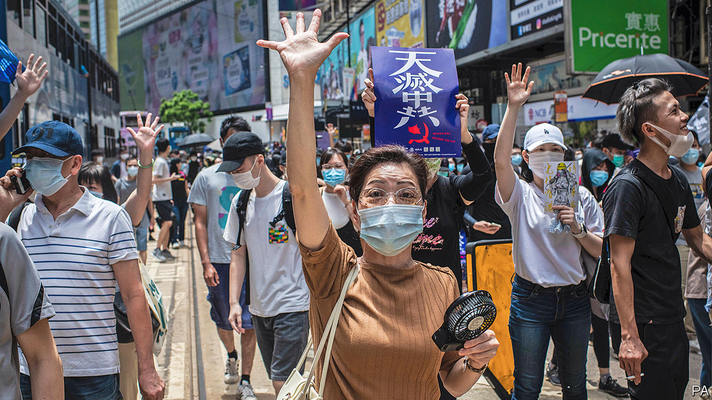
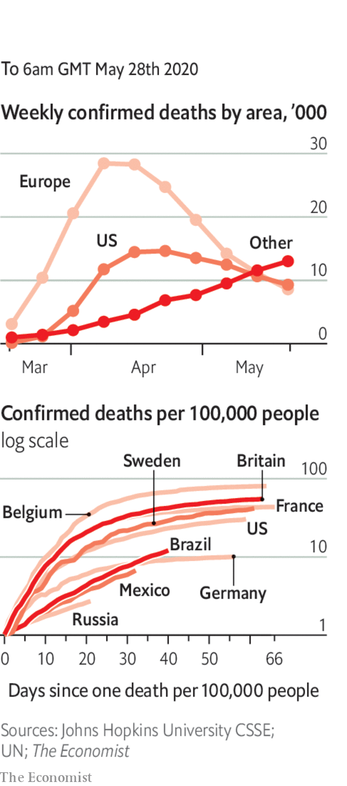

# Politics this week

> May 28th 2020

Protests erupted in Hong Kong after an announcement that the National People’s Congress, China’s rubber-stamp parliament, would impose a national-security law on the territory. The demonstrations were also fuelled by a proposal in the city’s legislature to make insulting China’s national anthem a crime. Mike Pompeo, America’s secretary of state, said that the “facts on the ground” showed that Hong Kong was no longer autonomous. This could pave the way for American action, including possibly treating the territory the same as the rest of China for trade and other purposes. See [leader](https://www.economist.com//leaders/2020/05/28/china-has-launched-rule-by-fear-in-hong-kong). 

At the opening of the National People’s Congress in Beijing, the government abandoned a GDP target for the first time. The economy shrank by 6.8% in the first quarter.

A border dispute between India and China appeared to intensify. China reportedly sent soldiers and military vehicles onto land that India deems Indian, where they dug defensive positions. A Chinese state mouthpiece asserted a new territorial claim. 

The Japanese government lifted restrictions in the last remaining prefectures under lockdown. It also unveiled a second stimulus, worth $1trn.

Rodrigo Duterte, the president of the Philippines, said schools would not reopen until a vaccine for covid-19 is available. That could mean a year or more of subpar education.

Four policemen were sacked in Minneapolis after a black man died while being restrained during an arrest. Video showed one officer kneeling on George Floyd’s neck to keep him on the ground. Protesters later clashed with police.

The University of California, America’s foremost public-college system, said it would phase out the use of SAT scores when deciding whom to admit. A faculty task-force had concluded that the tests were excellent predictors of academic success. But critics say they are unfair on those who cannot afford prepping courses.

Days after he began a new term in office Binyamin Netanyahu, the prime minister of Israel, stood trial on charges of bribery, fraud and breach of trust. He has denied wrongdoing and has called the justice system politically biased. Mr Netanyahu also told members of his Likud party that extending Israeli sovereignty over parts of the occupied West Bank was a priority for his new government.

America accused Russia of sending fighter jets to Libya to support Russian mercenaries fighting on behalf of Khalifa Haftar, a rebellious warlord. General Haftar launched an offensive on the capital, Tripoli, last year but has been pushed back by forces aligned with the internationally recognised Government of National Accord, which is supported by Turkey.

Authorities in Tanzania charged a comedian, Idris Sultan, after a video on social media showed him laughing at a photograph of the president, John Magufuli, in an oversize suit. Mr Sultan was initially charged with “bullying” the president. In court this was changed to using someone else’s mobile-phone SIM card.

Electoral officials in Burundi declared the ruling party’s candidate, Evariste Ndayishimiye, the winner in a presidential vote. Opposition parties say the election was rigged. Many dead people reportedly voted. See [article](https://www.economist.com//middle-east-and-africa/2020/05/28/burundis-rigged-election). 

More lockdown restrictions were eased in England. From mid-June, all shops will be allowed to reopen; outdoor markets from June 1st. The government also announced a UK-wide quarantine on international arrivals from June 8th, including Britons returning from abroad. Ireland, which is in Britain’s common travel area, is exempt.

By contrast, other European countries started to reopen their borders. Germany said it would lift warnings and allow its citizens to travel abroad from June 15th; it is pushing neighbouring countries to agree on common standards for social distancing. Greece and Italy will allow tourism from June, and Spain from July 1st. Cyprus offered to repay some holiday costs to tourists if they contract covid-19 while visiting the country.

The European Commission proposed a new seven-year budget for the EU that includes a €750bn ($825bn) post-covid recovery fund. The fund would distribute to member states €500bn in grants and €250bn in loans, and would be financed by borrowing based on guarantees provided by national governments. The plan builds on ideas proposed by France and Germany, but Austria, Denmark, the Netherlands and Sweden, the “frugal four”, are sceptical.

A judge on British Columbia’s Supreme Court ruled that extradition proceedings brought by the United States against Meng Wanzhou, the chief financial officer of Huawei, a Chinese telecoms giant, could continue. The decision means she cannot go home. Her arrest in Vancouver in December 2018 provoked a diplomatic row between Canada and China.

Two women became the first same-sex couple to marry in Costa Rica, immediately after it became legal. The ceremony was shown on a three-hour television broadcast about marriage equality.

Countries in the Americas are the new centre of the pandemic, according to the WHO. Infections and deaths in Mexico have doubled over the past two weeks. Brazil now has the world’s second-highest number of cases, prompting the United States (more than 100,000 deaths) to ban non-American travellers who have been to the country.

Russia has also reported sharp increases in confirmed cases and deaths over two weeks; the actual numbers are thought to be much higher.

Spain revised its death toll down by more than 1,900 because of “duplicates” and wrongly attributed deaths.

A test-and-trace system was introduced in England.

India resumed domestic flights, amid much confusion at airports about whether planes would be allowed to land in certain states.

## URL

https://www.economist.com/the-world-this-week/2020/05/28/politics-this-week
