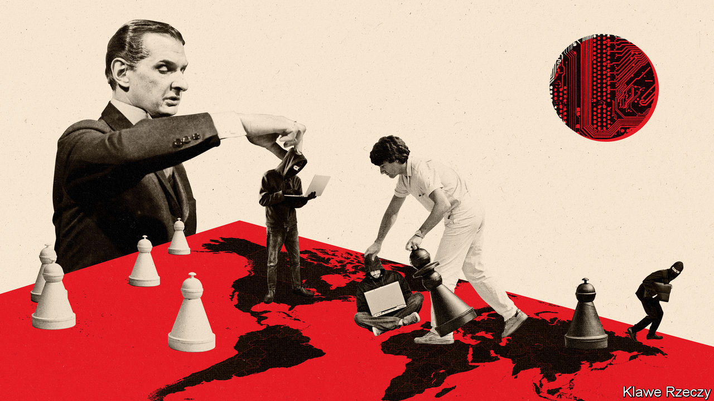
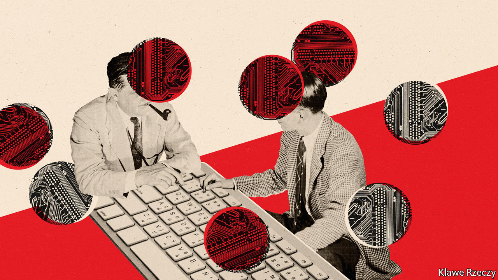

## Cyber-defence

# America rethinks its strategy in the Wild West of cyberspace

> The challenge of defence in the world’s most lawless battlefield

> May 28th 2020WASHINGTON, DC

COVID-19 HAS been a phisherman’s friend. Millions of professionals are at home and online, adjusting to new routines and anxious about their jobs. That makes them perfect marks: apt to click on an email that purports to be from their boss or a supplier asking for payment. Law-enforcement officials in many countries have reported a rise in cybercrime since the pandemic started.

But according to the FBI and Department of Homeland Security, not all such attacks come from gangs or individuals looking to make a quick buck. On May 13th those agencies warned that cyber-actors affiliated with China were trying to steal covid-related data and intellectual property. China is not the only worry. Russian hackers may probe for weaknesses in American electoral systems; Iranians have targeted an American drugmaker; North Koreans have gone after cryptocurrency stores.

Just as the attacks of September 11th 2001 spurred America to change its counterterrorism strategy, repeated intrusions are doing the same for its cyber-security. Yet it first has to define the problem. Terrorist attacks tend to involve carnage, a political motive and an attribution. Cyber-assaults have a range of motives, including theft (North Korea’s raids on banks), digital disruption (Russia’s NotPetya strikes on Ukrainian and other infrastructure), sabotage (the Stuxnet attacks on Iran’s nuclear programme, probably by America and Israel) and political warfare (Russia’s interference in America’s election in 2016). Sometimes states use non-state actors to carry out cyber-attacks, much as some use terrorist proxies. Attackers may target private-sector networks in banks, hospitals or payment systems, which often appeal to the government for protection.

Defence is difficult. Potential targets are many and diffuse. Attackers’ identities are often obscure. They make use of vulnerabilities often unknown until exploited.

The National Defence Authorisation Act of 2019, which sets the Pentagon’s budget, set up a commission to rethink cyber-defence. The Cyberspace Solarium Commission, named after Project Solarium, Dwight Eisenhower’s effort in 1953 to create a durable cold-war strategy, and headed by Angus King, an independent senator from Maine, and Mike Gallagher, a Republican congressman from Wisconsin, had the misfortune to release its recommendations on March 11th, just before America went into lockdown. The commission made its first public presentation to lawmakers via video conference on May 13th.

America’s cyber-defence, it argues, is hobbled by jurisdictional boundaries. Intruders are nimble; America’s defence is ponderous. Responsibilities are scattered among the FBI, the National Security Agency (NSA, America’s signals-intelligence agency), the Pentagon’s Cyber Command, the Department for Homeland Security, the Cyber-security and Infrastructure Security Agency (CISA), and others.

The commission recommends creating a national cyber-director within the White House, a co-ordinating role much like that of director of national intelligence, which emerged from the 9/11 Commission’s report. It also recommends permanent congressional cyber-security committees and a beefed-up CISA. Yet the White House is cool on a new Senate-confirmed cyber-security post, and creating new congressional committees would mean convincing current ones to surrender jurisdiction.

More important than government structure, however, is working closely with the private sector. The commission recommends declaring some private servers, such as those for the energy, financial and telecoms industries, critical infrastructure. They would receive enhanced government monitoring in exchange for meeting more stringent security standards.

It also recommends building a platform, managed by CISA with help from other agencies including the NSA, where government bodies and private firms can share information about threats. The NSA’s British counterpart, GCHQ, has a similar system. Some companies may be reluctant to let an agency that has engaged in widespread, warrantless surveillance monitor their security, but Mr King believes the proposal “will have support from industry”.

If one way to halt cyber-attacks is to parry the blows, another is to punch back. After Russian electoral intervention in 2016, American officials grew convinced that their country was seen as a soft touch because it had not done so hard enough. “They don’t fear us,” lamented General Paul Nakasone, head of both the NSA and Cyber Command, in early 2018. The commission accordingly urges American hackers to “strike back with speed and agility”.

In practice, though, America’s approach has already shifted from punishment to pre-emption—not so much striking back as striking first. In April 2018 Cyber Command and the NSA announced a strategy built around “persistent engagement” and “defend forward”. The first of these reflects the belief that competition in cyberspace is not a series of set-piece battles, but a constant digital mêlée. The second embodies the principle that to prevent an attack, you should go to its source. Just as “our naval forces do not defend by staying in port,” says General Nakasone, “our forces must operate against our enemies on their virtual territory as well.” In August 2018 President Donald Trump rescinded Obama-era guidance and made it easier for Cyber Command to operate beyond Pentagon networks without presidential authorisation.

The more aggressive posture was road-tested during America’s mid-term elections. Cyber Command attacked servers belonging to Russia’s Internet Research Agency, the company that sowed social-media discord in 2016, and sent text and email messages to Russian operatives warning them that America was tracking them—the digital equivalent of a horse’s head in the bed. “We’re now opening the aperture, broadening the areas we’re prepared to act in,” noted John Bolton, then national security adviser, last summer.

Yet taking the fight to rivals presents challenges. The internet has no clean front lines. Attacks from enemy-held cyberspace can be routed through the networks of allies, says Max Smeets of the Centre for Security Studies in Zurich. In 2016 Cyber Command irritated Germany by wiping Islamic State propaganda on German servers without asking for permission. Mr Smeets says adversaries might route attacks via particular countries in the hope of driving wedges between America and its friends.

Another problem is that if one defends far enough forward, it can look an awful lot like attacking. America is said to have secreted malicious code deep into Russian and Iranian infrastructure networks. The practice is akin to burying arms caches behind enemy lines for use in wartime: it makes it easier to strike back if Russia, which has probed America’s own power grids, crosses a line. But the same access can be used for unprovoked attack.

An alternative is to punch back by other means. America and several like-minded allies have grown bolder in publicly attributing major cyber-attacks to China, Russia, Iran and North Korea. In 2014 the Obama administration indicted five members of China’s armed forces for hacking into American companies. The Trump administration has brought similar charges against Iranian, Russian and North Korean hackers, including a dozen officers of the GRU, Russia’s military-intelligence agency, who intervened in the 2016 election. Though few American officials expect that foreign hackers will turn up in the dock, legal tools are still seen as useful for several reasons.

One is shame. Most countries do not like getting caught in the act. Second, Russian intelligence officers would rather avoid a sanctions listing that would cut off shopping trips to Paris and boarding schools in Britain. Third, the forensic evidence laid out within these indictments—even down to Google searches conducted by individual GRU officers—is a powerful way for America to hint at its reach.

Exposure also helps establish norms, defining what is considered beyond the pale in cyberspace. America and its allies argue that the existing laws of war, including ideas such as proportionality and distinctions between combatants and civilians, apply in the digital world (how this squares with suspected American attacks like Stuxnet is less clear). Russia, China, Cuba and others fear that this line of thinking might legitimise American retaliation.

Double standards abound. America indicted Russian officers for hacking the Organisation for the Prohibition of Chemical Weapons, but the NSA has itself run riot in international institutions. And practical deals have not survived contact with reality. An agreement in 2015 between Barack Obama and Xi Jinping, China’s president, to ban commercial espionage is widely deemed to have fallen apart.

These divisions play out at the United Nations, where one group of experts, favoured by America and its allies, works parallel to a larger, Russian-dominated group. “What we’ve really seen is a kind of a fracturing of the process,” says Adam Segal of the Council on Foreign Relations. “There are some interesting ideas percolating through, but they will never be formalised or centralised in any important way.” So cyberspace remains a Wild West. ■

## URL

https://www.economist.com/united-states/2020/05/28/america-rethinks-its-strategy-in-the-wild-west-of-cyberspace
