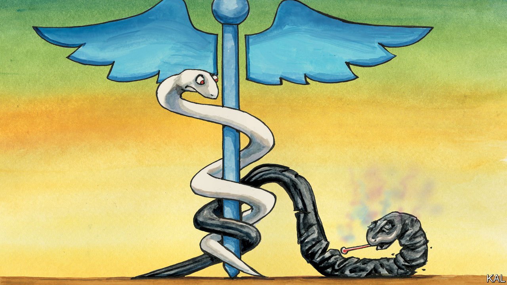

## Lexington

# The vulnerability of African Americans to the coronavirus is a national emergency

> It is past time to fix a glaring disparity

> May 28th 2020

“THE MOST difficult social problem in the matter of Negro health”, wrote the sociologist W.E.B. Du Bois in 1899, was to understand why so few white Americans were bothered by it. The poor black lives Du Bois described in his pioneering study, “The Philadelphia Negro”, were spent “in the most unhealthy parts of the city and in the worst houses”, with minimal medical attention. They tended to be sickly and short. Yet he could think of “few other cases in the history of civilised peoples where human suffering has been viewed with such peculiar indifference.”

Modern medicine has since transformed the life expectancy of all Americans. But many of the disparities Du Bois observed remain. African-Americans are still the country’s poorest, poorest- housed and unhealthiest large group, with high incidences of asthma, diabetes, hypertension, cancer and obesity. In 1899 infant mortality was almost twice as high among blacks as among whites; now it is 2.2 times higher. If anything, African-American diets are unhealthier now than the rations of milk, bread and fried pork Du Bois described. So-called “food deserts” are a modern phenomenon. The 160,000 people who live in the District of Columbia’s two poorest and overwhelmingly black wards, 7 and 8, east of the polluted Anacostia river, have only three supermarkets. They also have the sparsest health care in the city, with no major hospital.

Little wonder blacks have been so stricken by covid-19. The disease kills in tandem with the ailments they suffer from the most. The latest data suggest one in 2,000 African-Americans has died of it, even though the southern states, where over half live, have been relatively spared. Partly for that reason, black Americans are not unusually likely to catch the virus. Yet those who do are 2.4 times likelier to die than whites and 2.2 times likelier than Asians and Latinos. In Washington, DC, blacks are less than 47% of the population, but account for 80% of its 445 coronavirus deaths.

A visit to a makeshift testing facility in Ward 7, across the river from the Washington Redskins’ crumbling and abandoned former stadium, provides a snapshot of this calamity. Bertina, a 64-year-old teacher wearing sweatpants and a Redskins’ bandanna (“Don’t photograph me, I look like a bum”) said her aunt had died of the virus in Atlanta after three hospitals had refused to admit her. Seventeen-year-old M’Kya said she had heard her brother, incarcerated in New York, had the virus. Overweight and sweating heavily, she was visibly unwell; she hoped it might be her allergies.

The facility, where both women had come to have their nostrils swabbed for the virus, is another symptom of a general failure. It was launched three weeks ago as a philanthropic endeavour by Howard University—America’s first black medical school—to address a shortage of testing in the part of Washington that needs it most. “You can tell things are bad when a dermatologist is running covid-19 tests!” said Ginette Okoye, a Howard professor wrapped in a mask, goggles and layers of protective clothing.

Though there are many causes of black ill-health, the solution probably starts with improving blacks’ access to health care. There have been three significant efforts to do so since slavery, which all to varying degrees spluttered in the face of a backlash from whites.

The first, during Reconstruction, was a decade-long effort on behalf of freed slaves, which constituted the first government intervention in health care. The second, in 1964-65, was a bundle of laws and edicts, including the passage of the civil-rights and Medicaid acts and court rulings to desegregate hospitals. It gave African-Americans access to the regular health-care system for the first time. Yet the legacy of Jim Crow remained, as Wards 7 and 8 illustrate, in a patchy extension of services to black areas—and sometimes worse. Doctors in Macon County, Alabama, continued their 40-year “study of untreated syphilis in the Negro male” until 1972. (They didn’t tell the 400 sharecroppers under observation that they had syphilis. They told them they had “bad blood”.)

The advances of the civil-rights period led to a big improvement in black health, which by the mid-70s had levelled off. Barack Obama’s Affordable Care Act, which followed the example of Medicaid in trying to improve the health care of all poor Americans, can be viewed as the third major effort to correct the disparity. The 20m Americans who received health insurance under the act were likeliest to be black or Latino. Yet the fury this elicited among some whites—fuelled by a vague feeling that their tax dollars were being squandered on the undeserving—helped get Donald Trump elected. Having failed to repeal the act, as he had promised to, the president has since sought to shrink it through technical changes.

Some dare hope the pandemic may lead to a fourth push to close the gap. “I’m always optimistic—especially when there are trillions of dollars circulating,” said Muriel Bowser, Washington’s mayor. African-Americans’ electoral heft might help. Even Mr Trump has been courting their votes; Joe Biden’s health-care plan was aimed at blacks even before the pandemic struck.

Covid-19 has also made clear that such an intervention should not be considered ideological. Perhaps government action is not the best way to raise blacks economically, as conservatives argue; but their poor health cannot be improved otherwise. The virus afflicts the industrious and work-shy alike—a point made by Mr Trump’s trim African-American surgeon-general, Jerome Adams, when he acknowledged his own asthma, high blood pressure and heart disease. Indeed the most industrious blacks—such as Bertina’s son, labouring in harm’s way at Costco—are likeliest to expose themselves and succumb to the virus. Poor black health is a disincentive to work that work alone cannot fix.

It only remains to be seen, to revert to Du Bois’s difficult problem, whether a majority of Americans can be mobilised behind the issue. That must surely be possible, after the vulnerability of millions has been so cruelly exposed. If not now, indeed, when?■

Editor’s note: Some of our covid-19 coverage is free for readers of The Economist Today, our daily [newsletter](https://www.economist.com/https://my.economist.com/user#newsletter). For more stories and our pandemic tracker, see our [coronavirus hub](https://www.economist.com//news/2020/03/11/the-economists-coverage-of-the-coronavirus)

## URL

https://www.economist.com/united-states/2020/05/28/the-vulnerability-of-african-americans-to-the-coronavirus-is-a-national-emergency
