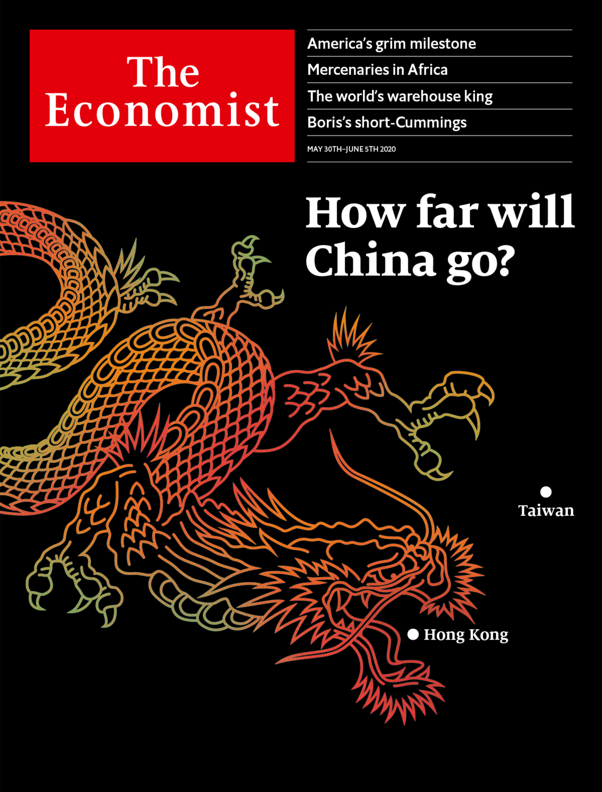

## China has launched rule by fear in Hong Kong

### The world this week
#### [Politics this week](./The%20world%20this%20week/politics-this-week.md)
#### [Business this week](./The%20world%20this%20week/business-this-week.md)
#### [Kals cartoon](./The%20world%20this%20week/kals-cartoon.md)
### Leaders
#### [How the worlds most powerful country is handling covid 19](./Leaders/how-the-worlds-most-powerful-country-is-handling-covid-19.md)
#### [China has launched rule by fear in hong kong](./Leaders/china-has-launched-rule-by-fear-in-hong-kong.md)
#### [Government handouts threaten europes single market](./Leaders/government-handouts-threaten-europes-single-market.md)
#### [How tourism will survive the pandemic](./Leaders/how-tourism-will-survive-the-pandemic.md)
#### [The case for mandatory masks](./Leaders/the-case-for-mandatory-masks.md)
### Letters
#### [Letters to the editor](./Letters/letters-to-the-editor.md)
### Briefing
#### [Americas covid 19 experience is tragic but not that exceptional](./Briefing/americas-covid-19-experience-is-tragic-but-not-that-exceptional.md)
### Asia
#### [Standoffish north korea discovers the limits of self reliance](./Asia/standoffish-north-korea-discovers-the-limits-of-self-reliance.md)
#### [Australias foreign student bubble has burst](./Asia/australias-foreign-student-bubble-has-burst.md)
#### [A border dispute between india and china is getting more serious](./Asia/a-border-dispute-between-india-and-china-is-getting-more-serious.md)
#### [Gay people in myanmar have adopted a secret language](./Asia/gay-people-in-myanmar-have-adopted-a-secret-language.md)
#### [Asian countries try to build travel bubbles](./Asia/asian-countries-try-to-build-travel-bubbles.md)
### United States
#### [America rethinks its strategy in the wild west of cyberspace](./United%20States/america-rethinks-its-strategy-in-the-wild-west-of-cyberspace.md)
#### [What connects casinos the first thanksgiving and the trump administration](./United%20States/what-connects-casinos-the-first-thanksgiving-and-the-trump-administration.md)
#### [Googles removal of anti beijing comments raises political eyebrows](./United%20States/googles-removal-of-anti-beijing-comments-raises-political-eyebrows.md)
#### [Could a fifth of americas colleges really face the chop](./United%20States/could-a-fifth-of-americas-colleges-really-face-the-chop.md)
#### [The vulnerability of african americans to the coronavirus is a national emergency](./United%20States/the-vulnerability-of-african-americans-to-the-coronavirus-is-a-national-emergency.md)
### China
#### [Chinas national security bill for hong kong is an attempt to terrify](./China/chinas-national-security-bill-for-hong-kong-is-an-attempt-to-terrify.md)
#### [Chinas wolf warrior diplomacy gamble](./China/chinas-wolf-warrior-diplomacy-gamble.md)
### The Americas
#### [Brazils losing battle against covid 19](./The%20Americas/brazils-losing-battle-against-covid-19.md)
#### [Mexicos missing mummy mystery](./The%20Americas/mexicos-missing-mummy-mystery.md)
#### [Why a president from the 1980s offers lessons for colombia today](./The%20Americas/why-a-president-from-the-1980s-offers-lessons-for-colombia-today.md)
### Middle East & Africa
#### [Why african governments still hire mercenaries](./Middle%20East%20&%20Africa/why-african-governments-still-hire-mercenaries.md)
#### [Burundis rigged election](./Middle%20East%20&%20Africa/burundis-rigged-election.md)
#### [The covid 19 crisis is boosting mobile money](./Middle%20East%20&%20Africa/the-covid-19-crisis-is-boosting-mobile-money.md)
#### [Hobbyists hope to halt hunger in lebanon by growing their own crops](./Middle%20East%20&%20Africa/hobbyists-hope-to-halt-hunger-in-lebanon-by-growing-their-own-crops.md)
#### [The battle over state tv in iran](./Middle%20East%20&%20Africa/the-battle-over-state-tv-in-iran.md)
### Europe
#### [Europes habit of propping up firms may outlast the pandemic](./Europe/europes-habit-of-propping-up-firms-may-outlast-the-pandemic.md)
#### [Germanys contact tracers try to block a second covid 19 wave](./Europe/germanys-contact-tracers-try-to-block-a-second-covid-19-wave.md)
#### [A beery european spy club is revealed](./Europe/a-beery-european-spy-club-is-revealed.md)
#### [Covid masks give the french a new way to be chic](./Europe/covid-masks-give-the-french-a-new-way-to-be-chic.md)
#### [Eastern europes covid 19 recession could match its post communist one](./Europe/eastern-europes-covid-19-recession-could-match-its-post-communist-one.md)
#### [The eus recovery fund is a benefit of brexit](./Europe/the-eus-recovery-fund-is-a-benefit-of-brexit.md)
### Britain
#### [Deadlock looms at brexit talks next week](./Britain/deadlock-looms-at-brexit-talks-next-week.md)
#### [Rising puppy prices](./Britain/rising-puppy-prices.md)
#### [The damage dominic cummings has done to boris johnson](./Britain/the-damage-dominic-cummings-has-done-to-boris-johnson.md)
#### [English schools reopen but not without a fight](./Britain/english-schools-reopen-but-not-without-a-fight.md)
#### [Lotus benefits from its chinese connection](./Britain/lotus-benefits-from-its-chinese-connection.md)
#### [How covid 19 is changing carmaking](./Britain/how-covid-19-is-changing-carmaking.md)
#### [Holiday resorts need tourists but dont want them](./Britain/holiday-resorts-need-tourists-but-dont-want-them.md)
#### [Dominic cummings and boris johnson united by a shared contempt for rules](./Britain/dominic-cummings-and-boris-johnson-united-by-a-shared-contempt-for-rules.md)
### International
#### [What awaits tourists when they re emerge from lockdown](./International/what-awaits-tourists-when-they-re-emerge-from-lockdown.md)
#### [How china emerges from lockdown will affect global tourism](./International/how-china-emerges-from-lockdown-will-affect-global-tourism.md)
### Business
#### [South east asian tycoons high wire act](./Business/south-east-asian-tycoons-high-wire-act.md)
#### [Why asian business dynasties struggle with succession](./Business/why-asian-business-dynasties-struggle-with-succession.md)
#### [Business lessons from the pentagon](./Business/business-lessons-from-the-pentagon.md)
#### [How big oil is trying to win back investors](./Business/how-big-oil-is-trying-to-win-back-investors.md)
#### [Working life has entered a new era](./Business/working-life-has-entered-a-new-era.md)
#### [The renault nissan alliance hunkers down](./Business/the-renault-nissan-alliance-hunkers-down.md)
#### [The global grooming industry gets cut down to size](./Business/the-global-grooming-industry-gets-cut-down-to-size.md)
#### [The e commerce boom makes warehouses hot property](./Business/the-e-commerce-boom-makes-warehouses-hot-property.md)
### Finance & economics
#### [Can private equity firms turn a crisis into an opportunity](./Finance%20&%20economics/can-private-equity-firms-turn-a-crisis-into-an-opportunity.md)
#### [Will covid 19 halt the rise of private equity in europe](./Finance%20&%20economics/will-covid-19-halt-the-rise-of-private-equity-in-europe.md)
#### [Chinas economists debate deficit monetisation](./Finance%20&%20economics/chinas-economists-debate-deficit-monetisation.md)
#### [What is the link between inflation and equity returns](./Finance%20&%20economics/what-is-the-link-between-inflation-and-equity-returns.md)
#### [For the first time in 30 years china has no gdp target](./Finance%20&%20economics/for-the-first-time-in-30-years-china-has-no-gdp-target.md)
#### [The world bank lands carmen reinhart as chief economist](./Finance%20&%20economics/the-world-bank-lands-carmen-reinhart-as-chief-economist.md)
#### [The pandemic could lead statisticians to change how they estimate gdp](./Finance%20&%20economics/the-pandemic-could-lead-statisticians-to-change-how-they-estimate-gdp.md)
#### [The legacy of alberto alesina](./Finance%20&%20economics/the-legacy-of-alberto-alesina.md)
### Schools brief
#### [Climate adaptation policies are needed more than ever](./Schools%20brief/climate-adaptation-policies-are-needed-more-than-ever.md)
### Science & technology
#### [Masks probably slow the spread of covid 19](./Science%20&%20technology/masks-probably-slow-the-spread-of-covid-19.md)
#### [A new robot may help keep ships bottoms clean](./Science%20&%20technology/a-new-robot-may-help-keep-ships-bottoms-clean.md)
#### [Crew dragons launch is postponed](./Science%20&%20technology/crew-dragons-launch-is-postponed.md)
#### [Self destructing glue solves a sticky environmental problem](./Science%20&%20technology/self-destructing-glue-solves-a-sticky-environmental-problem.md)
### Books & arts
#### [It takes planning not just talent to be remembered as a great artist](./Books%20&%20arts/it-takes-planning-not-just-talent-to-be-remembered-as-a-great-artist.md)
#### [When theodore roosevelt took on john pierpont morgan](./Books%20&%20arts/when-theodore-roosevelt-took-on-john-pierpont-morgan.md)
#### [The habsburgs marriages consolidated lands as well as faulty genes](./Books%20&%20arts/the-habsburgs-marriages-consolidated-lands-as-well-as-faulty-genes.md)
#### [Behind the scenes of a confederacy of dunces](./Books%20&%20arts/behind-the-scenes-of-a-confederacy-of-dunces.md)
#### [Is music a language as stevie wonder sang](./Books%20&%20arts/is-music-a-language-as-stevie-wonder-sang.md)
#### [The world of twin peaks chimes eerily with the mood of the lockdown](./Books%20&%20arts/the-world-of-twin-peaks-chimes-eerily-with-the-mood-of-the-lockdown.md)
#### [Take over the world in civilization](./Books%20&%20arts/take-over-the-world-in-civilization.md)
### Economic & financial indicators
#### [Economic data commodities and markets](./Economic%20&%20financial%20indicators/economic-data-commodities-and-markets.md)
### Graphic detail
#### [How to spot dodgy academic journals](./Graphic%20detail/how-to-spot-dodgy-academic-journals.md)
### Obituary
#### [Antonio bolivar died on april 30th](./Obituary/antonio-bolivar-died-on-april-30th.md)
