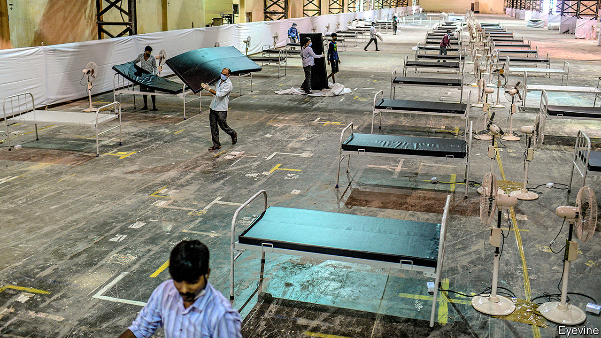
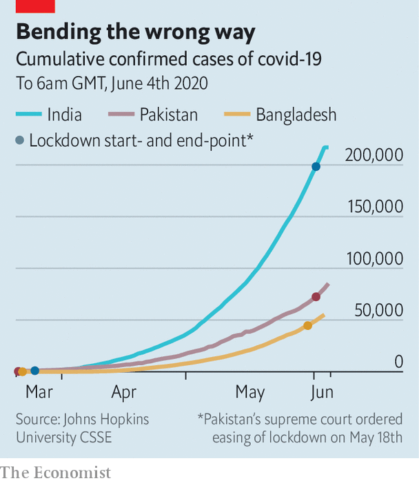

## Deadly tide

# Covid-19 infections are rising fast in Bangladesh, India and Pakistan

> Hospitals are already struggling to cope

> Jun 6th 2020DELHI AND ISLAMABAD

OVER THE past week Bangladesh, India and Pakistan have largely lifted nationwide lockdowns intended to curb the spread of covid-19. The freeing of 1.7bn people—more than a fifth of humanity—from varied restrictions will bring relief to the region’s battered economies. Alas, it promises no relief from the pandemic itself. In luckier countries, stay-at-home rules reduced the number of new infections. In South Asia they managed only to moderate the disease’s acceleration, but not to halt it (see chart). The lifting of the lockdowns, in turn, is likely to hasten its spread again.

With some 350,000 confirmed cases and fewer than 9,000 deaths so far, the region’s toll looks relatively modest. Yet those numbers disguise both widespread undercounting and a rate of growth that was frightening even before the lifting of restrictions. At the current pace, the numbers are doubling every two weeks, suggesting that by the end of July, when some models predict the outbreak will peak, the official number infected may reach 5m and the death toll could approach 150,000.

Low levels of testing mean that the real numbers could be far worse. One foreign health official in Pakistan reckons the death toll is between two and three times the government’s count. John Clemens of ICDDR,B (formerly the International Centre for Diarrhoeal Disease Research, Bangladesh), estimates that Dhaka, Bangladesh’s capital, may already have as many as 750,000 cases, even though the official national tally is less than 60,000.

In harder-hit parts of the region, health services are under severe strain. Madhuri, a 46-year-old nurse in Thane, a suburb of Mumbai, had been working 12-hour shifts with no days off from April 1st until she herself caught covid-19 from a patient in May. The government hospital where she works does not treat the disease, passing positive cases to designated covid hospitals. But Madhuri (not her real name) says her colleagues must instead cope with the patients those places no longer treat. “We now do 60-70 deliveries a day, up from 40-50 in normal times, in addition to stab wounds, accidents and so on.” Her hospital’s 20-bed intensive care unit is staffed by just two nurses and its 16-bed isolation ward by just one, she says.

Her experience is far from unusual. Three medical interns at another hospital in the centre of Mumbai recently released a video claiming that they had been left for hours in sole charge of 35 seriously ill covid-19 patients, with no doctors, nursing or cleaning staff to help. Another viral video revealed that corpses wrapped in plastic had been left in a covid ward full of patients, owing to lack of space in a hospital morgue. Staff at hospitals across India have repeatedly protested against unsafe conditions, poor equipment and long working hours. In Delhi, the capital, some 600 health workers have tested positive for covid-19—including 329 at the All-India Institute of Medical Sciences, the country’s grandest government hospital. Overall, India has a ratio of doctors and nurses to population that is half China’s and a quarter of Europe’s. And the virus has now spread from better-served cities to poor rural states such as Jharkhand, where there is one doctor for every 6,000 people.

Doctors in Pakistan say the government’s claim that there are adequate hospital beds is nonsense. “The situation is very, very unsatisfactory,” says Qaisar Sajjad of the Pakistan Medical Association, predicting a surge in cases stemming from the recent holiday marking the end of Ramadan. Zubair Zahir, head of a local doctors’ association in Khyber Pakhtunkhwa province, fears its hospitals could run out of intensive-care beds and ventilators within the next two weeks. The crisis has already squeezed other services: despite a resurgence of polio, an immunisation campaign in the province has been suspended. In India treatment of endemic diseases such as tuberculosis, which kills some 400,000 people a year, has also been impeded.

In normal times, the region’s rich can largely insulate themselves from the implications of decades of puny public spending on health. “If they so much as sneeze they flee to Thailand, Singapore or India,” says a doctor at a private hospital in Dhaka. Now, she says, it is “almost impossible” to gain admission to Bangladesh’s elite hospitals, whether for covid-19 or other illnesses.

Finding places in morgues, cemeteries and crematoria is also becoming a challenge. At the municipal graveyard of Narayanganj, an area with lots of garment factories on the outskirts of Dhaka, a typical month sees fewer than 250 burials. Last month it jumped to 575, only 70 of which were officially recorded as victims of covid-19. Jawahar Baug, the biggest crematorium in Thane outside Mumbai, has seen a similar jump in custom. It has boosted its staff from 30 to 50 men working three shifts a day, while the volume of bodies they manage has grown from four to six a day to sometimes as many as 20. Delhi has relaxed a ban on traditional funeral pyres made of wood, instituted to reduce pollution, because there are too few gas-fired ovens to meet the spurt in demand.

Inevitably, the failure of all three countries to control the pandemic has led to soul-searching and blame-casting. Imran Khan, Pakistan’s prime minister, has loudly pointed out that he was never a fan of the lockdown, which he had warned would hit the poor unduly hard, and could only slow the disease. His detractors respond that a big reason for failure was precisely the half-hearted and inept way Pakistan’s lockdown was enforced. In Bangladesh, inconsistent rulemaking, a collapse in average income in slum areas of an estimated 75% and the mass return to villages of hundreds of thousands of garment-workers undermined any gains from the lockdown.

Perhaps the most egregious errors were made by India’s government. Despite imposing the most stringent and heavily policed restrictions in the region, the government failed to foresee that its measures might prompt a mass exodus from cities of tens of millions of migrant workers made suddenly destitute. The authorities first tried to block the movement, bottling migrants in urban slums with the highest infection rates, and then allowed perhaps 20m workers to leave, spreading the disease across the country. In Bihar, a state whose 110m people are among India’s poorest, more than two-thirds of covid cases identified so far have been among returning migrant workers.

Whatever the cause, the damage is now done. Farid Uddin, a gravedigger in the Bangladeshi port city of Chattogram (formerly Chittagong), comes close to tears as he explains that he and his team have scarcely slept in four days. “There are so many deaths,” he gulps. “We are overwhelmed. Please pray for us so Allah forgives us and takes back this disease.” ■

## URL

https://www.economist.com/asia/2020/06/06/covid-19-infections-are-rising-fast-in-bangladesh-india-and-pakistan
