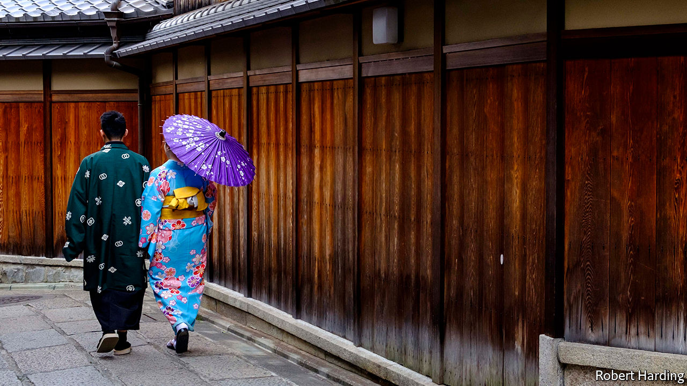

## Knot happy

# Covid-19 spurs single Japanese to look for love

> Match-making agencies have received a surge of inquiries

> Jun 4th 2020SUZUKA, MIE PREFECTURE

HE HAD ALWAYS imagined he would get married someday. Then covid-19 hit. Yuto (not his real name), a 31-year-old hotel employee from the southern city of Kumamoto, found himself confined to his home, alone. He decided to accelerate his wedding plans, and signed up for an online match-making service to find the love of his life—fast.

Yuto is not alone. Since the pandemic broke out, more Japanese singles have been on the hunt for spouses. Sunmarie, a match-making agency, reported a 30% rise in inquiries in April compared with the year before. Both Sunmarie and O-net, a rival agency, have tried to adapt to the times, offering an online rendez-vous service since early April, when the government began curbing gatherings in much of the country. LMO, another firm, offers drive-through meetings, in which singletons can introduce themselves from their cars, in the empty car parks of wedding halls.

Cooped up in their homes alone for an extended period, singles are getting lonely—hence the surge in business for match-makers, explains Amano Kanako of NLI Research Institute, a think-tank. With covid-19 dominating the news, lonely hearts are also increasingly anxious about the future: they want a partner with whom to face the unknown. “Those who vaguely thought about getting married one day are realising that the time is now,” says Kobayashi Jun of Seikei University.

This marks the reversal of a long trend. Marriage has been in decline for decades. More than 1m couples tied the knot each year in the early 1970s, but only 583,000 did last year. This is not just because the proportion of Japanese in their 20s and 30s (the age at which people most commonly wed) has fallen sharply. In 1970 only 2% of men and 3% of women had never married by 50. By 2015 those shares had climbed to 23% and 14%, respectively.

Interest in matrimony also surged after a terrible earthquake, tsunami and nuclear disaster in 2011. Memberships at match-making agencies soared. The steady decline in weddings was interrupted in 2012, when there were 7,000 more than the year before. The nature and scale of the earthquake and pandemic may differ, but their effect on the unmarried has been comparable, says Nagaoka Masamitsu of O-net. “People are stuck at home and have a lot of time to think about their future.”

Yuto from Kumamoto is already thinking about settling down with a 43-year-old Tokyoite he met online two months ago. Yet the rush to the altar (or shrine) may be short-lived. After the spike of 2012, there were 8,200 fewer weddings in 2013.

## URL

https://www.economist.com/asia/2020/06/04/covid-19-spurs-single-japanese-to-look-for-love
