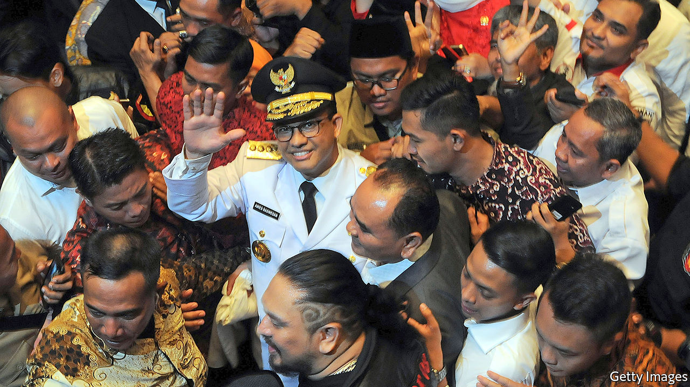

## Viral marketing

# Indonesia’s president has a new rival

> Jakarta’s governor has exploited the pandemic to his advantage

> Jun 6th 2020SINGAPORE

ANIES BASWEDAN was spoiling for a fight. Indonesia’s first case of covid-19 had been confirmed on March 2nd, and for weeks the governor of Jakarta, the capital, had been imploring the central government to act. Yet the government dithered as the virus made inroads, first through Jakarta, then throughout the country. Finally, on March 31st, the president declared a national emergency. Even then, local authorities were told to ask permission before instituting lockdowns—a process festooned in red tape. Mr Anies trumpeted his scorn. “[It’s] as if we are proposing a project that needed a feasibility study,” he told the Jakarta Post. “Can’t the [health] ministry see that we are facing a rising death toll? Is it not enough?”

It was one shot in a salvo of recent attacks that Mr Anies (pictured) has launched against Joko Widodo, Indonesia’s president, better known as Jokowi. He criticised Jokowi’s administration for not acting swiftly and robustly, and repeatedly disputed government data on the number of covid-19 cases. It was “a slap in the face” for Jokowi and his lieutenants, a foreign diplomat says. The complaints clearly nettled the president. When Mr Anies attempted to lock Jakarta down after Jokowi had spent weeks refusing to do the same to the whole country, Jokowi declared that the governor had no authority to do so. The following day he announced the onerous procedures required before local governments could limit people’s movement.

Jokowi had not been hectored in that way for a while. In October he appointed as minister of defence Prabowo Subianto, his opponent during his two presidential campaigns. Since then Mr Prabowo has largely toed the government line, leaving the post of chief adversary to the president vacant. Mr Anies seems to have decided to take up the job.

Relations between the two have not always been so fraught. When Jokowi began his first term as president in 2014, he appointed Mr Anies minister of education and culture. But the latter’s expansive political ambition curdled relations, says a former adviser to Jokowi. The president dumped Mr Anies two years later in a cabinet reshuffle.

Mr Anies would get his own back in 2017, when he ran for governor of Jakarta against a protégé of Jokowi, Basuki Tjahaja Purnama or Ahok, as he is better known. Ahok, who is Christian, had been leading in the polls but was accused of blasphemy after he cited the Koran in one of his stump speeches. Mr Anies seized on the ensuing uproar by allying with the Islamic Defenders Front (FPI), a vigilante group that had been organising big protests against Ahok. A wave of sectarian indignation carried Mr Anies to the governor’s mansion, in an embarrassing setback for Jokowi.

Even so Mr Anies initially avoided directly criticising Jokowi, who remained popular, says Alexander Arifianto of the S. Rajaratnam School of International Studies in Singapore. That changed this year, when torrential rains inundated Jakarta in January. Mr Anies tried to deflect criticism of his handling of the disaster by knocking the central government’s response. When covid-19 arrived, Mr Anies turned the full force of his ire against the president.

Edward Aspinall of Australian National University thinks it likely that Mr Anies was genuinely concerned about the impact of covid-19 on his constituents. He also cares about his image as “a public-policy person who thinks seriously about major issues”, Mr Aspinall adds. His efforts to adopt a rigorous, data-driven response to the outbreak enhance that image.

But Mr Anies also understands how to exploit Jokowi’s weaknesses. Many devout Muslims consider Jokowi too secular in his outlook and of dubious piety. They long for a champion to take on his government and seize the presidency in 2024, when Jokowi completes his second and final term. Such voters underpinned Mr Prabowo’s two runs for president, and Mr Anies is already known to many of them because of the Ahok affair. The governor of Jakarta is often in the news, which will help Mr Anies build a national profile. Jokowi himself used the job as a springboard to the presidency. And the easiest way for Mr Anies to define himself is in opposition to Jokowi.

Mr Anies has probably calculated that the pandemic provides a good opportunity to show off qualities many feel Jokowi lacks, such as decisiveness and empathy, says the foreign diplomat. The gambit may work. Most presidential candidates will not start their campaigns for another two years. Mr Anies is already courting opposition MPs. Nasdem, one of the parties in Jokowi’s coalition, is getting closer to Mr Anies, says the former aide to Jokowi. It’s a long road to election day. But as Mr Arifianto says, “Anies is just making a head start.” ■

## URL

https://www.economist.com/asia/2020/06/06/indonesias-president-has-a-new-rival
