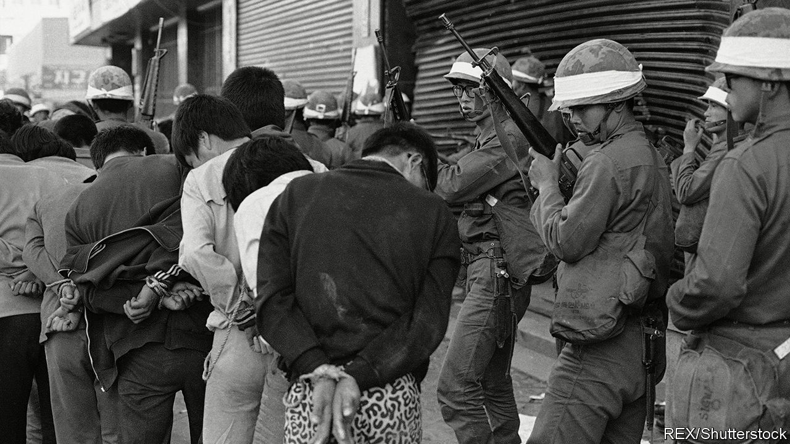

## Haunted by Gwangju

# South Korea debates a massacre of 40 years ago

> Many on the left want to gag those who dismiss the victims as rioters

> Jun 4th 2020GWANGJU

NEARLY HALF of today’s South Koreans were not yet born when it happened. In May 1980 citizens of the south-western city of Gwangju began to protest against an expansion of martial law by the country’s military dictatorship. When security forces tried to suppress the protests, they evolved into an uprising. Civilian militias took control of the city. On May 27th the government sent in helicopters, tanks and soldiers to crush them. Over the course of the uprising, hundreds were killed.

Three months later Chun Doo-hwan, the general who had ordered the crackdown, became president. He remained in power for seven years before pro-democracy protesters forced him to call an election, which another general won after promising democratic reforms. Abroad, many reckon the uprising and its suppression sowed the seeds of South Korean democracy. “It was the first time students, labour activists and regular people got together and said enough is enough,” says Alexis Dudden of the University of Connecticut.

Within South Korea, however, things are less clear-cut. The Chun regime justified the crackdown by presenting the uprising as a riot stoked by North Korean agents and led by local Communists. Support for this version of events endures to this day in some right-wing circles, even though no evidence has ever been found for it. Popular prejudice against people from the south-west, though weaker than it was 40 years ago, complicates matters.

Chun Doo-hwan, now 89, is on trial for slandering an eyewitness to the massacre, and denies he gave the order to shoot at protesters. The army did not apologise for massacring civilians until 2018. It is still unclear how many were killed. Last year lawmakers from the main conservative opposition party repeated the conspiracy theory about North Korean involvement.

Left-wingers, meanwhile, are so incensed by this distortion of history that they are trying to legislate it away. The Democratic party, which the president, Moon Jae-in, led until taking office, wants to criminalise the claim that the uprising was a “riot” stoked by North Korean agitators. Mr Moon, who was himself active in the democracy movement, would like to enshrine the “spirit” of the uprising in the constitution. He has launched a commission to write an authoritative version of the event. In a speech during the annual commemoration of the victims, which has been moved from a cemetery outside Gwangju to the centre of the city, he urged those involved in the crackdown to tell the truth, assuring them that the “path of reconciliation and forgiveness” was open.

Most South Koreans seem to have accepted that the massacre was just that. A majority now believe it deserves a mention in the country’s constitution. Young people are particularly keen. “We should all be grateful for the protesters’ sacrifices,” says Park Ye-eun, a 26-year-old from Seoul. “It’s the reason we’re a democracy today,” says Lee Dong-min, a 26-year-old from Gwangju, before bursting into tears.

Right-wingers seem to be taking note. The leadership of the main opposition party, possibly chastened by a resounding defeat in April’s legislative election, displayed rare contrition about the massacre at this year’s commemoration. They said they were sorry that some of their party’s members had “denigrated” the victims. Some commentators noted approvingly that the right-wing party leader sang loudly along to “March for the beloved”, the unofficial anthem of South Korea’s democracy movement. Members who peddle conspiracy theories about the uprising have been disciplined; one was expelled.

Many in Gwangju, however, will need more convincing. “They killed hundreds of students right in front of our eyes and we couldn’t even talk about it for years, or we would get kidnapped and disappear,” laments an elderly lady who introduces herself as Ms Ji. She says that things have improved since the advent of democracy, but she still does not trust politicians. “They only take our taxes but they don’t really care about us.” ■