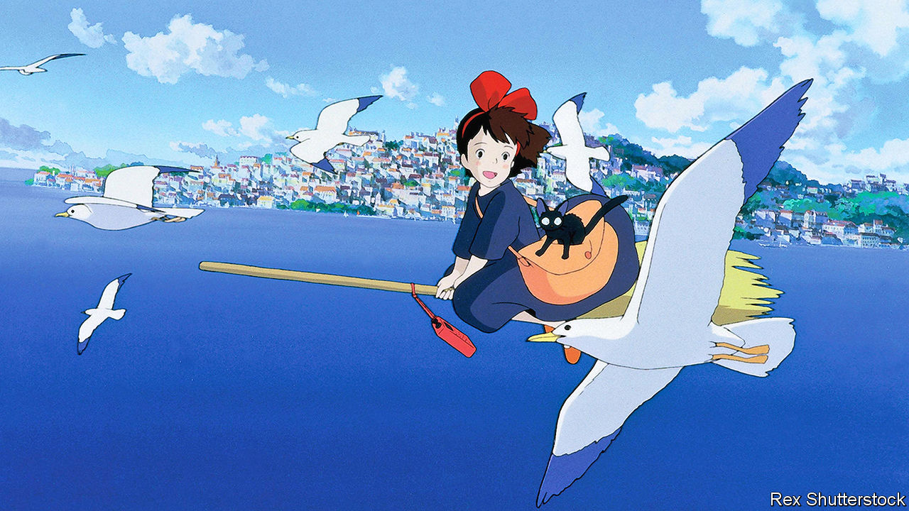

## Home Entertainment

# For Hayao Miyazaki, flight is a metaphor for freedom

> Discover the consoling imagination of a star Japanese animator

> Jun 4th 2020

HAYAO MIYAZAKI has spent his career conjuring up fantastical worlds full of outlandish creatures. “Spirited Away” (2001), which won an Oscar for best animated film, is set in a magical realm ruled by a bejewelled witch and populated by talking frogs, gremlins made of soot and a vaporous creature who emits gold nuggets from his fingertips. Amid today’s pandemic, one feature of Mr Miyazaki’s escapist movies is particularly intoxicating: his obsession with flying.

Flight is in Mr Miyazaki’s blood. He was born in 1941 in Tokyo, where his father ran a firm that manufactured parts for Japanese fighter planes during the second world war. He whiled away boyhood hours inventing his own aircraft; at night he dreamed of gliding above the city. Most imaginations become more earthbound with age, but as an adult Mr Miyazaki thought up a squadron of wondrous flying machines with designs that embody their pilots’ personalities. “Castle in the Sky” (1986) features a rag-tag family of pirates who buzz around in “flaptors”, contraptions with transparent, flapping wings that resemble giant mosquitoes.

He is a connoisseur of the sensory thrill of flight. His characters swoop over mountainous landscapes and arc through cerulean skies full of billowing white cumulus, leaving vapour trails twisting like ribbons in the air. When they dive into the clouds for cover, they make a splash as though sinking into clots of heavy cream.

In these animations, flying is about more than ingenious designs and sumptuous images. It also provides Mr Miyazaki’s deepest metaphors, standing for confidence, independence, the power of the imagination itself. Most of his protagonists are children undergoing rites of passage—the dislocation of moving house or trouble in the family. Take Mei and Satsuki, the young sisters in “My Neighbour Totoro” (1988) who have just relocated with their father to rural Japan. Exploring their new home, they discover a tubby woodland spirit in the roots of a camphor tree. A benevolent presence, Totoro soars above the countryside on a spinning top and takes the girls along for the ride. Gradually, as it emerges that their mother is gravely ill, these adventures seem more than mere flights of fancy. They are a form of solace.

That is what Mr Miyazaki’s enchanting stories offer as the world waits for borders to reopen and planes to take off again. His most resonant film is “Kiki’s Delivery Service” (1989), which follows a charmingly wilful 13-year-old witch who rides around on a broom. Determined to find her way in the world, she sets up a courier company to profit from her ability to fly. But when business slows and she suffers her first bout of boy trouble, she loses heart and her powers of levitation, too. “We fly with our spirit,” she says as she tries to restore her confidence, take to the skies and get her life going again. Sound familiar? ■

## URL

https://www.economist.com/books-and-arts/2020/06/04/for-hayao-miyazaki-flight-is-a-metaphor-for-freedom
