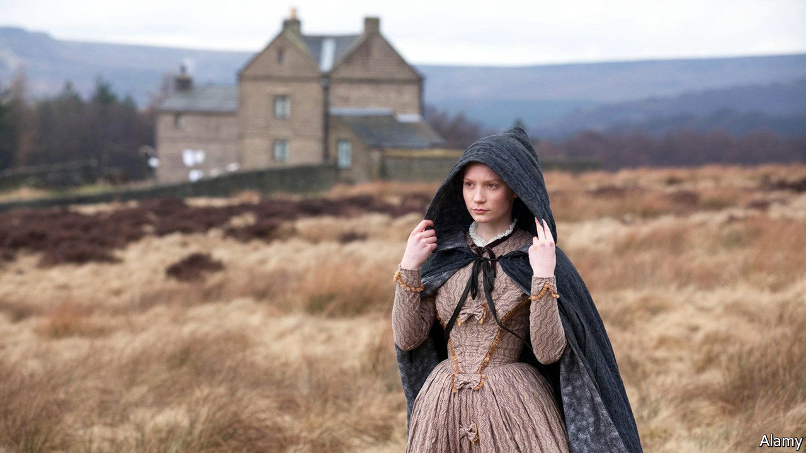

## Home Entertainment

# Jane Eyre, like many people, is at her best alone

> “The more friendless, the more unsustained I am,” says Charlotte Brontë’s heroine, “the more I will respect myself”

> Jun 4th 2020

ONE OF THE great thrills of reading is encountering a situation that is familiar in feeling yet alien in context. So it is on reaching chapter nine of “Jane Eyre”, in which the narrator, a malnourished orphan in a grim Victorian charity school, describes how life is upended by a typhus epidemic. Liberated from the classroom, she is left to her own company and the outdoors, as millions of others have been in the age of covid-19. The school is set in glorious countryside, and it is May: “All this I enjoyed often and fully, free, unwatched, and almost alone.”

All Charlotte Brontë’s protagonists are solitary to some degree, and her habit of addressing the reader directly heightens that sense: it is as if her characters have no one else to confide in. But whereas in “Villette”, another great novel about an outsider, solitude is mostly a source of misery, in “Jane Eyre” (first published in 1847) it is often a positive state, or at least a productive one.

It forges Jane’s character. Bullied by her guardian aunt, excluded by her horrible cousins and friendless until she is sent to school at the age of ten, she turns inward for direction. Though she often speaks in the language of the Bible, her sense of moral purpose, which drives the plot, is entirely her own and often explicitly connected to her loneliness.

At key moments she is by herself. When, after becoming a teacher, she leaves the school to work as a governess for Edward Rochester, a rich landowner, she is “quite alone in the world”, though “the charm of adventure sweetens that sensation” and “the glow of pride warms it”. Later, when she realises she must leave Rochester, with whom she has fallen in love, because he is already married, she makes isolation, even of the most dreadful sort, sound revivifying: “I care for myself. The more solitary, the more friendless, the more unsustained I am, the more I will respect myself.”

True, in the course of the novel, Jane has intense relationships with others: first with Helen Burns, a saintly and consumptive school friend who dies in her arms, and later with Rochester, with whom she engages in implausibly polished repartee. The portrayal of their affair—and especially of their reunion—is superlatively moving. But it is as a person alone in a hazardous world that Brontë’s heroine offers readers her most important lessons, as well as some of the book’s most enjoyable passages.

Though she wishes to escape it, solitude gives her a licence to observe. She has a habit of detaching herself from others so that she is free to watch them. When Rochester entertains his wealthy friends and asks her to join them, she sits half-hidden by a curtain so that she “might gaze without being observed”. Her solitude makes for great passages of introspective analysis as well as peerless descriptions of solo walking. Her most acute reflections are made, not to her beloved Rochester, but to the reader. Jane Eyre, like many people, is at her best when she is alone. ■