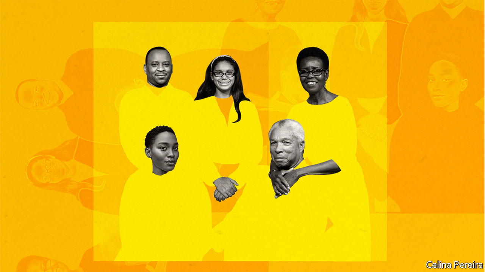

## Perspectives

# The family unit has shaped people’s experience of covid-19

> In turn, the pandemic may affect the future of the family unit

> Jun 4th 2020

Editor’s note: Some of our covid-19 coverage is free for readers of The Economist Today, our daily [newsletter](https://www.economist.com/https://my.economist.com/user#newsletter). For more stories and our pandemic tracker, see our [coronavirus hub](https://www.economist.com//news/2020/03/11/the-economists-coverage-of-the-coronavirus)

IF ONE HALLMARK of the covid-19 pandemic has been social distancing, another has been enforced intimacy. More than half of humanity has been confined to their homes at one time or another since the start of the outbreak. Many children have seen more of their parents and siblings than ever before; partners have had to negotiate new ways of juggling work and household chores; older, vulnerable relatives have been cut off. An assessment of the virus’s early spread in China, looking at outbreaks involving three or more cases, found that 80% of these clusters occurred in the home.

If covid-19 had struck a century ago, even more people in rich countries (the focus of this article) would have been sharing lockdown. In the early part of the 20th century, quarantines forced many more people together within the walls of the family home. The number of people in an average American household stood at 4.6 in 1900 and 4 in 1930; the figure is around 2.6 now. Many fewer people lived alone, too. In 1940 single-person households accounted for more than 10% of the total in only nine American states; now no state has less than 20% of such households. Only 12.2% of Swedish households had one person in them in 1930; the majority do today.

These changes unfolded over decades. As countries got richer, fertility rates dropped. Welfare states expanded, eroding the importance of the family as a safety-net. The rise of the services sector and the spread of time-saving technologies, among other things, helped more and more women into the labour force. Women began to have children later. Divorce rates rose, as did cohabitation between unmarried couples.

Yet even though families have been moulded by long-run forces, big external shocks have the power to alter their path. Pandemics, wars and particularly deep recessions have all left a lasting mark on the family unit. Might this one do the same?

External shocks can bring about change in several ways. Demography is one. The flu pandemic of 1918 killed at least 50m people, more than were killed in combat in the two world wars combined. A disproportionate number of victims were young adults. The pool of orphans in search of someone to care for them after the pandemic is thought to have led several countries to enact legislation on child adoption, including France in 1923 and England and Wales in 1926.

Consider this entry in the New York Times list of the city’s “100 Neediest Cases” in 1918. As in prior years, a series of pen-portraits catalogued the situations of destitute households in need of help. But this list highlighted the devastation being wrought on families by the flu. Case 69, titled “Widowed and Ill”, begins:

Decades later another plague struck. The majority of AIDS victims were in sub-Saharan Africa. According to the UN, the number of children to have lost one or both parents to AIDS peaked in 2009 at 15m, most of them in that region. The extended family took on the burden, creating legions of “skipped generation” households. In a paper in 2009 Sheung-Tak Cheng of City University of Hong Kong and Benjamin Siankam of Vanderbilt University found that 13.5% of the over-60s in 23 sub-Saharan countries were living with their grandchildren but not with their adult children.

Big external shocks can cause births to spike as well as deaths. According to “Pale Rider”, Laura Spinney’s book on the flu of 1918, a big rebound in fertility which took place across Europe in 1920 was attributed by many to soldiers returning home from the first world war. But a baby boom in neutral Norway points to a different explanation—that the pandemic both delayed pregnancies and left a healthier child-rearing population in its wake.

The second world war also precipitated a marked, if temporary, rise in fertility. During the baby boom, American women went from having an average of roughly two children in 1940 to an average of almost four in 1957. The reason why points to the enduring impact that external shocks can have on family behaviour. The second world war prompted a large-scale mobilisation of female workers into the labour force, to substitute for men in the armed forces. Only 28% of American women over the age of 15 participated in the workforce in 1940; that figure was 34% by 1945.

Many of these women exited the workforce again after the war ended, but plenty stayed. A paper from Matthias Doepke of Northwestern University and his co-authors in 2015, seeking to explain why the baby boom happened, argued that this cohort of experienced workers crowded younger women out of the labour market in the years after the conflict, causing them to have children earlier instead.

The wartime surge in female labour rippled down the generations in other ways. Sexism remained rife, of course. Years after female workers kept America’s munitions factories running, an advertisement for Alcoa Aluminum in 1953 marvelled, above a picture of an astonished woman holding a ketchup bottle: “You mean a woman can open it?”

But within individual families, norms shifted. Using data from that period, Raquel Fernandez of New York University, Alessandra Fogli of University of Minnesota Twin Cities and Claudia Olivetti of Boston College have shown that the wives of men whose mothers worked are themselves much more likely to be in the labour force. Rosie the Riveter did not just change the wartime workforce, but the attitudes of her sons, too.

Economic shocks can also have profound effects on the composition of households. According to the Pew Research Centre, the 2010s were likely to have been the first decade since the 1850s in which the number of people in the average American household went up, albeit marginally. That was owing, at least in part, to the rising share of Americans living with their parents (or “boomeranging”) after the financial crisis of 2007-09.

The proportion of 18- to 32-year-olds living at home went from 36% in 2007 to 41% in 2012, and has remained elevated since, despite the rebound in employment throughout the course of the past decade, in part because of the persistent effects on income of graduating in a recession. However depressing it is for youngsters to move back into their childhood bedrooms, it doesn’t seem to do much for Mum and Dad either. A study into European families by Marco Tosi of the London School of Economics and Emily Grundy of the University of Essex found that, for parents aged 75 and below, their quality of life generally declined when an empty nest started to refill.

The covid-19 pandemic will not chime exactly with these earlier episodes. Unlike AIDS and the flu of 1918, older people are more vulnerable to the virus than younger ones. A post-covid baby boom looks unlikely for that reason alone.

Optimists hope that covid-19 will lead to a more equitable distribution of household chores, as a result of men taking on more of the burden at home during lockdowns (see [article](https://www.economist.com//finance-and-economics/2020/06/04/downturns-tend-to-reduce-gender-inequality-not-under-covid-19)). Even limited increases in men’s involvement in child care can affect attitudes. A paper by Lídia Farré of the University of Barcelona and Libertad González of Universitat Pompeo Fabra showed that the introduction of two weeks’ paternity leave in Spain in 2007 lengthened the time it took for couples to have an additional child, partly because men did not want another baby. The risk is that the pandemic does as much to cement conventional roles within families as to dissolve them. As Ms González warns: “If more women are working from home, they are more likely to do both work and chores.”

Historically, technology has helped women into the workforce. Medical advances reduced infant mortality and thus the number of pregnancies that individual women had. The spread of household appliances after the second world war had a salutary effect, as time saved by washing machines and freezers enabled more women to work. The post-pandemic era might lead to faster broadband. A working paper in 2013 by Lisa Dettling, an economist at the Federal Reserve, found that the availability of high-speed residential broadband in America led to a marked increase in the labour-force participation rate of married women.

The numbers of multi-generational households may increase as another burst of boomeranging begins. With universities and workplaces closed, many adult children have already moved back to be with their families. Even if family members don’t actually move in together, they may want to be closer to each other. Diseases do not always unite families. In his introduction to “The Decameron”, a set of stories about the 14th-century Black Death, Giovanni Boccaccio describes how the plague snapped familial bonds:

This pandemic has not been without its own trials on family relations, or even worse—as the reports of increased domestic violence attest to. But it has also raised a kinder set of questions. Arrangements for care of the elderly and the very young are under the microscope. Adult children may take on more caring for their parents in future rather than countenance a care home; they may also be more aware of the value of having grandparents or other relatives nearby for child care. The family unit can be a source of danger for some and of irritation to many. Yet its role as a safety-net has also been thrown into sharper relief by the events of the past five months. ■

## URL

https://www.economist.com/books-and-arts/2020/06/04/the-family-unit-has-shaped-peoples-experience-of-covid-19
