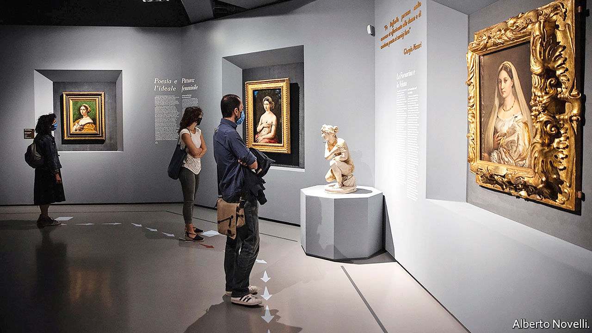

## The floor lines of beauty

# The first big art show of the covid era is a vision of the future

> The Raphael exhibition in Rome is stunning. But how many people will see it?

> Jun 4th 2020ROME

“WE EXPECT A lot of discipline,” says Mario De Simoni, president of the Scuderie del Quirinale, as he points to the disinfectant mat on which visitors are obliged to step as they enter the exhibition centre in Rome. The first prominent art show since covid-19 shut galleries around the world reopened at the Scuderie on June 2nd (it had managed three days in March before the pandemic intervened). A celebration of the Renaissance master Raphael, it aims to burnish the reputation of an artist once seen as greater even than Leonardo da Vinci or Michelangelo. But it is also a test for art in an era of social distancing.

Visitors are being admitted in parties of six every five minutes, and the aim is to keep them two metres apart throughout. The Duomo (cathedral) in Florence has introduced necklaces that flash and vibrate if wearers get too close, but the Scuderie rejected those as unacceptably intrusive. Instead, attendants will accompany, and supervise, every group. As they arrive in each space, people will be asked to take up positions marked on the floor—which is where difficulties could arise. Will a scholar wanting to linger over the so-called Tempi Madonna and Raphael’s cartoon version of it (displayed together for the first time) be content to move on after a brief inspection?

Playfully entitled “Raffaello 1520-1483”, the show begins with its subject’s death 500 years ago, aged 37, and ends with his earliest known work. The first exhibit is a replica of his tomb in the Pantheon, the last an exquisite drawing the 14-year-old Raffaello Sanzio made of his hand, accompanied by what is probably a self-portrait.

The curators aim to demonstrate how Raphael generated his distinctive style. “He was able to fuse influences from other painters in a way very few artists have managed to do,” says Eike Schmidt, director of the Uffizi gallery, which reopened its own doors in Florence on June 3rd. Mr Schmidt loaned about a quarter of the works on display, including Raphael’s portrait of his papal patron, Leo X—which prompted the resignation of the Uffizi’s entire scientific committee. Its members thought that painting too fragile to move.

Raphael’s artistic alchemy mingled and transmuted the emotion in da Vinci’s glances, the athleticism of Michelangelo’s nudes and the softness of Perugino’s Madonnas into an oeuvre that, until late in the 19th century, was widely seen as greater than those of his High Renaissance contemporaries. It was only with the advent of Impressionism and, later, the 20th-century avant-gardes that Raphael’s representational mastery lost a little of its lustre. This show, running until August 30th, proves that his genius still has the power to astound. Raphael was the Mozart of art, capable at the age of 22 or less of producing a work as mature and accomplished as his “Young Woman with Unicorn”.

As Italy emerges from lockdown, said Dario Franceschini, the culture minister, at the reopening, the country is “looking to its strengths: art, beauty and history”. Appetite for those is undimmed. Around 900 visitors were ushered through the show on the first day, the maximum now allowed. But far fewer will get to see this revealing exhibition than if the pandemic had not struck. In 2010 the Scuderie’s Caravaggio show clocked up almost 6,000 a day.

That raises the question of how galleries and museums can survive financially on such small numbers. The publicly owned Scuderie has big reserves, but Mr De Simoni acknowledges that other institutions might respond with sharply increased entrance charges. In the age of covid-19, art, like air travel, could once more become a privilege of wealth. ■

## URL

https://www.economist.com/books-and-arts/2020/06/04/the-first-big-art-show-of-the-covid-era-is-a-vision-of-the-future
