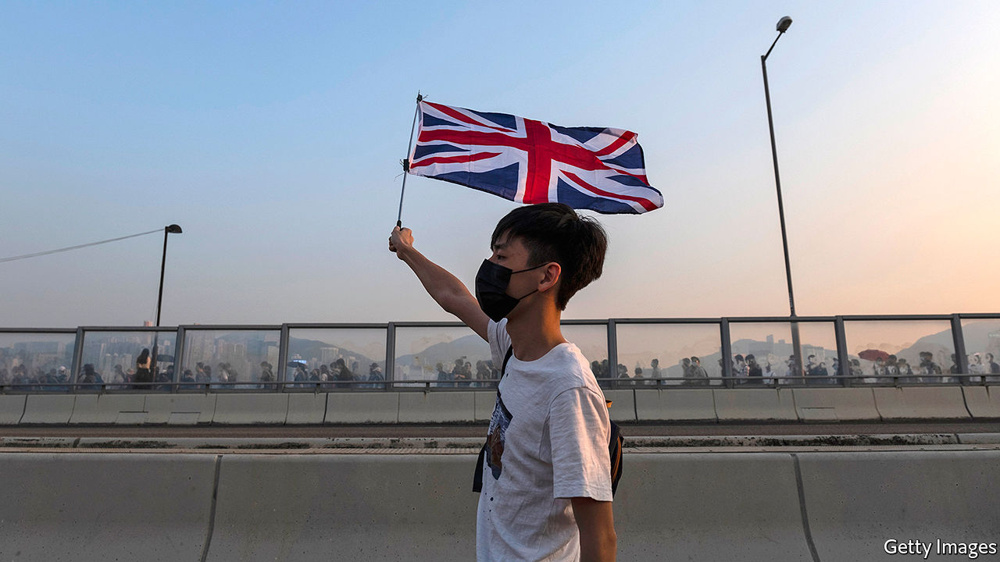

## A warm(ish) welcome

# Britain opens its doors to Hong Kongers

> But it is unclear how wide

> Jun 6th 2020HONG KONG AND LONDON

ON JUNE 3RD Hong Kongers woke to an article by Britain’s prime minister Boris Johnson in the South China Morning Post. It carried a threat to Beijing: if China imposed its national-security law, tightening its grip on the city, Britain would change its immigration rules. British Nationals (Overseas) (BNOs), a category created for those born in the British colony before it was returned to China in 1997, would gain additional rights, including one to work, “which could place them on a route to citizenship”. The Home Office has said the offer would extend not just to the 350,000 holders of BNO passports, but to all 2.9m who qualify for one. According to Mr Johnson, “This would amount to one of the biggest changes to our visa system in history.”

The offer was a bold gesture, destined to upset China (whose foreign ministry fired off an angry memo). Pro-democracy Hong Kongers celebrated. Craig Choy, a lawyer and campaigner, says he drew comfort from the fact “that we actually have the UK backing us up”. Watching British lawmakers offer their support was “very touching,” he adds. Yet locals will not be packing their bags soon, for the kind words bely a lack of detail about exactly what is on offer.

Britain is one of the few countries that makes a distinction between citizens and nationals. The passports held by British nationals look identical to those belonging to citizens, but carry fewer benefits. BNOs can ask for support from British embassies (except in China). They can also visit Britain for six months without a visa. There is not much more on offer. BNOs have no automatic right to live, work or study in Britain. They are subject to immigration controls upon entering. Just like Indians or Nigerians, they must apply for work authorisation, as well as pay hefty fees and a health surcharge. For its part, Beijing considers those who also hold Hong Kong passports to be Chinese citizens only.

Mr Johnson’s offer is to extend the period for which BNOs can come to Britain from six to 12 months, and to give arrivals the right to work. Yet it is unclear whether they would need a job offer, a sponsor and to meet a minimum-salary threshold, as most migrants do, or if they would be able to arrive and look for work like EU citizens. “If it requires sponsorship it actually means nothing,” says Mr Choy.

Nor is it clear how long BNOs would need to live and work in Britain before applying for settlement. Most migrants must spend five years in Britain on an eligible visa before doing so. Hong Kongers will want some security that, if an extension is denied after 12 months, they will not be deported back. One immigration lawyer says the current offer is “respite” not “refuge”.

Moreover, only Hong Kongers born before the handover in 1997 are eligible for BNO status. That leaves out younger people, who are the most vocal opponents of China. Jimmy Lai, a billionaire supporter of the pro-democracy movement, tweeted that Hong Kong’s youth “should be given the priority, over old people like me”. Seen from mainland China, this dulls the force of Britain’s threat.

Even if the finer points of immigration law were ironed out, Hong Kongers would be unlikely to move to Britain en masse. British nationality is best thought of as a “lifeboat”, says Emily Lau, a former legislator. “If things go wrong, you have a place to go to. But if things are okay...nobody wants to up sticks and move.” For now, Mr Johnson’s offer looks more like a geopolitical gambit than detailed immigration policy. ■

Correction (June 6th 2020): An earlier version of this piece named Emily Lau as a legislator. In fact she stepped down from Legco in 2016. This has been updated.