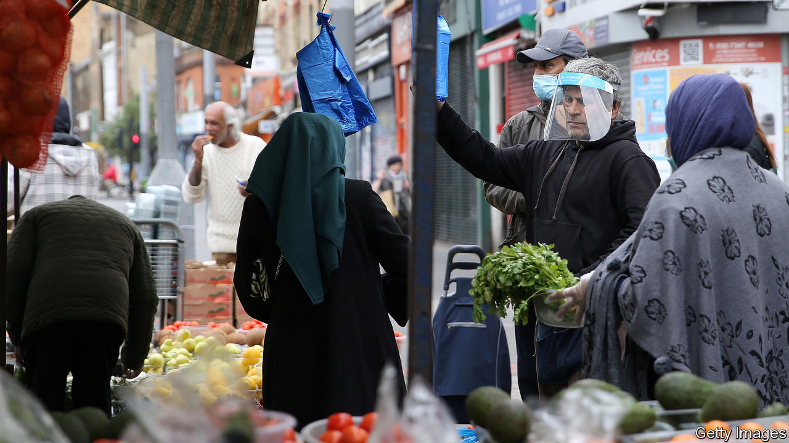

## Doubly unlucky

# British Pakistanis and Bangladeshis have been hit hard by covid-19

> Cramped homes and self-employment are a bad combination

> Jun 6th 2020LUTON

THREE TAXIS wait outside Luton railway station. All are driven by middle-aged Pakistani men; all have been idle for hours. “There’s no work,” says Ash. “Honestly, I’m just here to pass the time.” Over the last week, he reckons, he has earned just enough money to pay for cigarettes.

Covid-19 has not been a walk in the park for anybody, but it has hit Britain’s ethnic minorities harder than whites. In particular, it seems to have singled out ethnic Pakistanis and Bangladeshis (who may be British-born or immigrants). They make up just 3% of the population of England and Wales, but more than half of all Muslims.

It has been known for a while that Pakistanis and Bangladeshis are unusually susceptible to the coronavirus. On June 2nd Public Health England added more detail. Controlling for age, poverty and other factors, Bangladeshis who are diagnosed with covid-19 are twice as likely to die of it than others. Pakistanis are 1.4 times as likely to die. No other ethnic group faces a higher risk than those two.

Pakistanis and Bangladeshis tend to have worse health to begin with, making them more vulnerable to the new disease. They also have less personal space than other ethnic groups, raising their risk of exposure. Fully 30% of Bangladeshis and 16% of Pakistanis live in overcrowded homes, compared with a national average of 3%. And, as Alyas Karmani, an imam, points out, many live in three-generation households—a dangerous arrangement.

Those who have dodged the bug appear to have been struck badly by the economic downturn. Few Pakistanis and Bangladeshis hold the sort of well-paid, computer-oriented jobs that can be done remotely. Nor do they commonly work in the public-sector roles that tend to fare better in a crisis. Only 25% of Pakistani and Bangladeshi workers are employed in public administration, education and health, compared with 30% of whites and 44% of blacks. Instead they are highly concentrated in two trades: taxi driving (for Pakistanis) and restaurants (for Bangladeshis). Both of these have slumped.

Many women do not work at all, especially if they are married. In the first three months of this year, 43% of working-age Bangladeshi women and 44% of Pakistani women were economically active—much higher than two decades ago, but less than white, black or Indian women, all of whom scored above 70%. The Institute for Fiscal Studies, a think-tank, estimates that nearly a third of Bangladeshi men work in a shut-down industry and have a partner who does not work, compared with 1% of white British men.

Many are being kept afloat by the state or by relatives. Some, though, have turned to their fellow Muslims. Iqbal Nasim, who runs the National Zakat Foundation, says that applications for zakat (a form of Islamic aid that is more like welfare than charity) have quadrupled in the past two months. Before Ramadan, he says, the organisation hit up previous donors, asking if they might contribute again. Some not only said they could not, but admitted that they would be asking for help this year. ■

Editor’s note: Some of our covid-19 coverage is free for readers of The Economist Today, our daily [newsletter](https://www.economist.com/https://my.economist.com/user#newsletter). For more stories and our pandemic tracker, see our [coronavirus hub](https://www.economist.com//news/2020/03/11/the-economists-coverage-of-the-coronavirus)

## URL

https://www.economist.com/britain/2020/06/06/british-pakistanis-and-bangladeshis-have-been-hit-hard-by-covid-19
