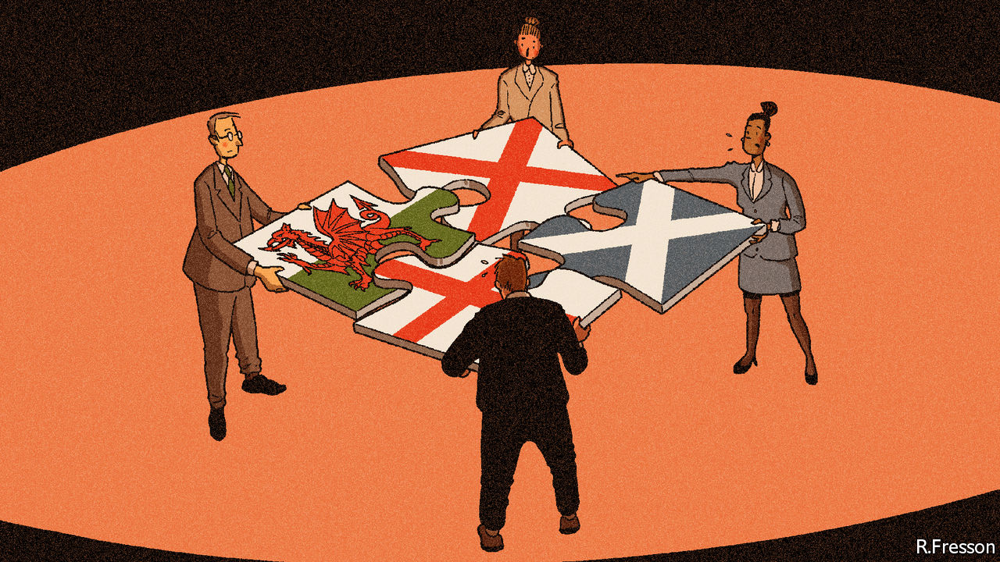

## Ignore the squabbling

# Devolution has become less dysfunctional during the pandemic

> The four nations of the United Kingdom are working surprisingly well together

> Jun 6th 2020

Editor’s note: Some of our covid-19 coverage is free for readers of The Economist Today, our daily [newsletter](https://www.economist.com/https://my.economist.com/user#newsletter). For more stories and our pandemic tracker, see our [coronavirus hub](https://www.economist.com//news/2020/03/11/the-economists-coverage-of-the-coronavirus)

OVER THE past fortnight, Britons fired up their barbecues, as fine weather coincided with a loosening of the covid-19 quarantine. But the etiquette of lockdown cook-offs varied by geography. In England six people have been able to gather in gardens since June 1st. In Scotland rules introduced three days earlier permit eight people from two households to meet, although they are urged to bring their own food and refrain from using the host’s toilet. There are no restrictions on the distance travelled by guests in England, but in Wales they should not go more than five miles. Schools in England have begun to open, but they will stay shut for longer elsewhere. Masks are endorsed in Scotland and England, but not in Wales.

Much of the United Kingdom has been governed from Edinburgh, Cardiff and Belfast since 1998. Yet some still struggle with a patchwork of laws. English day-trippers, unaware of Wales’s stricter travel rules, have been turned away by local police. Simon Hart, the Welsh secretary, blames journalists for the confusion: “I sit in front of my television at five o’clock and yell ‘England only!’ at the screen.” More seriously, Boris Johnson failed to tell leaders of the devolved administrations that he was dropping the “stay home” slogan they shared. Some in Westminster suspect the divergence in rules is mere posturing. Nervous union-watchers think rifts over coronavirus indicate a coming break-up.

The pandemic came at a difficult time. Devolution was built when Labour ruled in London, Edinburgh and Cardiff, and problems could be fixed with a phone call between comrades. Today relations are more fraught. The British government has ignored Scottish and Welsh protests over Brexit. The Northern Irish executive remains fragile. Mr Johnson asserts the indivisible sovereignty of the Westminster Parliament, which sits uneasily with the claim of shared sovereignty in the devolved nations, says Philip Rycroft, formerly the civil servant overseeing devolution.

Yet, though much of Britain’s response to the pandemic has been poor, devolution has become less dysfunctional under the stress. The four nations have been able to adopt distinct policies, which enjoy public support because they are backed by their elected leaders. But they have also drawn on the cash, muscle and expertise of the British government.

The result has been unexpectedly coherent. A joint action plan drawn up in early March looked like “something you’d see more often in more mature federal or multilevel systems,” says Akash Paun of the Institute for Government, a think-tank. The Coronavirus Act, which created emergency powers and was passed on March 25th, required deep collaboration, with clauses tailored to each administration.

One reason for this coherence is the new machinery of government. Devolution contains structural weaknesses. Most powers engaged in a crisis—national security, foreign policy, borders and the currency—sit in London. But the pandemic strikes at health services and local government, which are run by the devolved administrations. Britain lacks counterparts to American federal agencies such as FEMA and the CDC, which support state governments during crises. The Joint Ministerial Council (JMC), where the four nations talk, meets irregularly, cannot take decisions and is usually fractious.

It has been sidelined. The First Ministers of Scotland, Wales and Northern Ireland sit with Mr Johnson on COBRA, the national emergencies committee. Four more committees dedicated to the pandemic include devolved ministers and meet several times a day. “We’ve made our way through the coronavirus crisis patching together arrangements as we go along, rather than have a set of routine arrangements that we are all used to,” says Mark Drakeford, the first minister of Wales. “There has been a fleetness about it that you wouldn’t have seen in normal circumstances.” Ministers in Dublin, London and Belfast meet in a forum known as “the quad” to manage the response across the Irish border.

Whitehall departments with little exposure to devolution are on a steep learning curve. The differences between national strategies are small, which reflects the tight relationship of the four chief medical officers. Boffins from each nation sit on the Scientific Advisory Group for Emergencies (SAGE), the government’s expert panel. Scotland and Wales also run their own committees, which fine-tune but do not duplicate SAGE’s modelling.

The crisis has pushed the British government into devolved terrain. The army is running mobile testing units, booked through a British government website. (The policy upset Northern Irish republicans, but even ardent Scottish and Welsh nationalists do not object.) Whitehall has taken charge of procuring antibody tests, and the Joint Biosecurity Centre, an outbreak-monitoring unit, will cover the whole country.

The errors have been shared, too. Nicola Sturgeon’s administration in Edinburgh was no more alert to the looming risk than London. Outbreaks have hit care homes across Britain. It is not obvious why an independent Northern Ireland, Scotland or Wales would have responded much better.

Coronavirus is only one force pushing the union together. Scotland has run its own welfare since 2018, which needs co-ordination with London. Brexit will bring new powers over fisheries and chemicals to Britain, which will require joint decision-making. Edinburgh and Cardiff want to give the JMC more clout. Andrew Dunlop, who has prepared a report on the future of the union for Mr Johnson, says a change of culture could make it a “front-footed” forum to deal with shared problems.

But politics pushes the other way. The economic recovery will be more contentious than the medical emergency. The Treasury will effectively call the shots on when lockdowns end, as it funds the furlough scheme. A plan to restrict English students going to universities in other nations to mitigate a drop in foreign students doesn’t look neighbourly. And Ms Sturgeon hopes to use Scotland’s elections next year to secure a second independence vote. The new age of collaboration may survive the pandemic, but it will take political will. ■