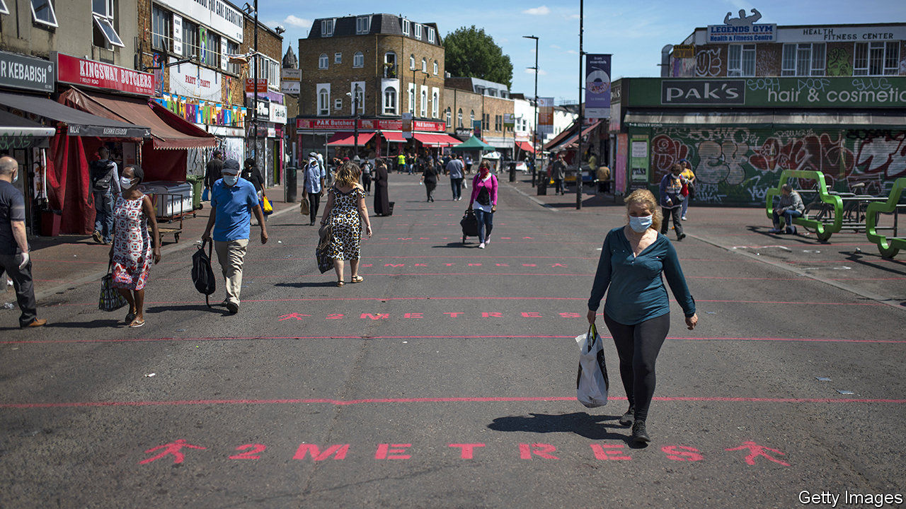
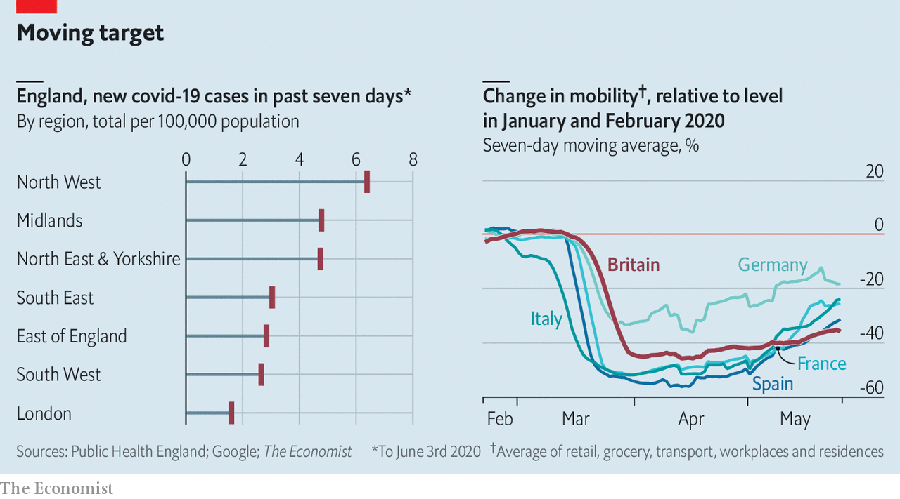

## A risky reopening

# England emerges from lockdown

> But experts and public worry it is too much, too soon

> Jun 6th 2020

Editor’s note: Some of our covid-19 coverage is free for readers of The Economist Today, our daily [newsletter](https://www.economist.com/https://my.economist.com/user#newsletter). For more stories and our pandemic tracker, see our [coronavirus hub](https://www.economist.com//news/2020/03/11/the-economists-coverage-of-the-coronavirus)

A  LOT CHANGED in England on June 1st. After more than two months, people could sit outdoors in groups of no more than six, primary schools began to reopen (at least for some year groups), and government advice for vulnerable people changed, allowing them to step out of their front doors. A day later Parliament ended its experiment with virtual voting. High-street shops will soon welcome customers. Weeks after the rest of Europe, the country is emerging from confinement.

When Boris Johnson laid out his plans for leaving lockdown, he promised to be guided at all times by “the science”. Now that restrictions are being lifted, what science dictates is unclear. In the days running up to England’s reopening, several members of the government’s Scientific Advisory Group for Emergencies (SAGE) warned that things were moving too quickly. The Association of Directors of Public Health and Sir David King, the country’s former chief scientific adviser, agreed. Observers suspect the government’s focus has switched from protecting health to protecting the economy.

The decision is ultimately a political one about risk. In parts of England the virus appears under control; elsewhere it is more widespread (see chart). Before the government lifted restrictions, SAGE advised that the reproduction number was below one, which means cases would have been expected to continue to decline. But estimating the spread of the virus is an inexact science, and there may have been little wriggle room. The lockdown was looser than in other countries, with people out and about more than in places like Italy and Spain.

As John Edmunds, an epidemiologist and one of the dissenting SAGE members, has noted, much now rests on the country’s track-and-trace infrastructure. That consists of a mobile app, as well as some 25,000 human contact tracers charged with finding people who have been in contact with infected patients. Along with widespread testing, it is supposed to allow health authorities to monitor and quickly suppress outbreaks. Mr Johnson promised a “world-beating” system by June 1st.

Yet the app has still not been released, with no word on when it is due. John Newton, the testing chief, admitted on June 1st that the contact tracers were “not fully occupied”. Promises to turn all tests around in less than 24 hours are yet to be fulfilled. On June 3rd Dido Harding, who is in charge of the track-and-trace programme, was unable to provide the health and social care select committee with crucial information on tests or tracing. Not surprisingly, Britons appear nervous. A poll by YouGov found that almost two-thirds thought ministers were not being cautious enough in easing measures. Still, the government marches on. ■