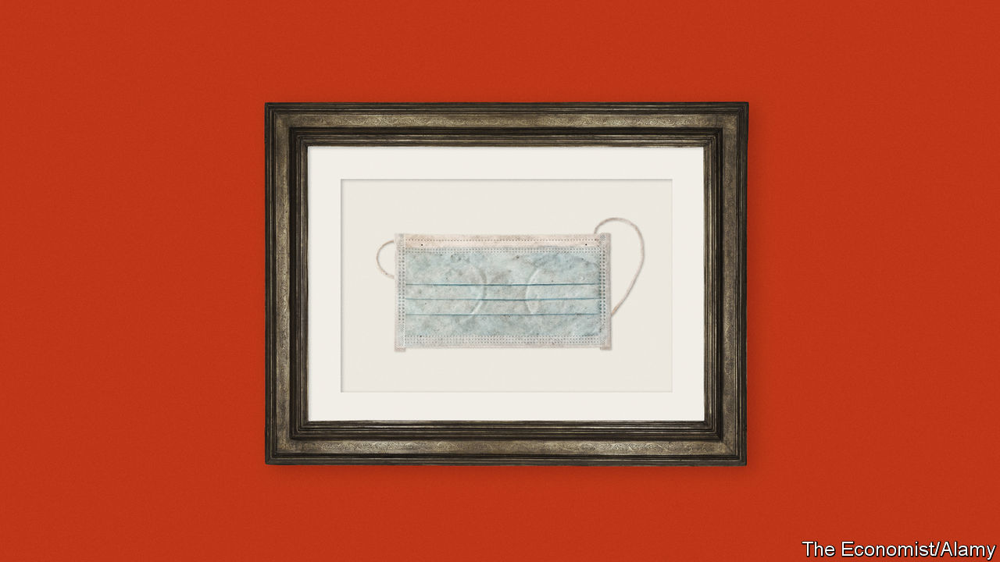

## Making history

# How British museums are documenting the pandemic

> The buildings may be closed, but curators are hard at work

> Jun 4th 2020

AT THE END of March, the prime minister sent a letter to every household in Britain. Printed on headed paper and signed by Boris Johnson, 30m of them went out, telling Britons “you must stay at home”. One of them is now in the collection of London’s Science Museum in South Kensington. Tilly Blyth, the museum’s principal curator, explains that her job is about “making sure we bring a personal experience to the science”. At the other end of central London, in Euston, Mel Grant of the Wellcome Collection, which focuses on health and medicine, says the letter is something “we wouldn’t actively go out and take”. The difference in approach between two museums whose subjects are at the heart of the crisis raises a question that institutions across the country are grappling with: How do you document history that you are living through?

There are three ways of thinking about an answer. The first is speed. The Victoria and Albert Museum (V&A), an engraved gemstone’s throw away from the Science Museum, has had a “rapid response collecting” strategy since 2014. Its collection includes a “pussyhat” of the sort worn by women in a protest the day after Donald Trump’s inauguration in January 2017. The aim is to ensure that everyday items are retained along with more uncommon ones. “It’s very easy for things we might consider mundane to get thrown away at times like this,” says Ms Blyth.

A related problem is that digital materials, while seemingly eternal, often disappear. “The nature of digital collecting means that information is frequently published, amended and removed quickly. If material is not captured at the time, it may be lost forever,” says Jason Webber of the UK Web Archive, a joint project of Britain’s six legal deposit libraries that aims to archive all British websites annually. The archive does not gather most social-media posts or any personal collections, however, which falls to other curators. For example, people take lots of pictures on their phones but don’t necessarily save them. They cannot be rediscovered in a dusty attic years later, says Matt Brosnan, the head curator at the London Transport Museum, so must be gathered now.

Understandably, “there’s a real temptation to come running in and grab everything that you possibly can,” says Ms Blyth. That is a non-starter. Museums have limited space to stash stuff. Digital materials require storage and maintenance, too. All that costs money, and museums are accountable to the public, whose funds they draw upon, or to donors. They must also be mindful of the ethics of collecting things—such as face masks—that are in short supply. And once something has formally entered a public collection, “you can’t get rid of it,” says Tristam Hunt, director of the V&A, as the paperwork is horrendous.

That points to the second way of thinking about what to collect, which is focus. The pandemic has touched every sector, industry and region in Britain. It has also spurred all sorts of museums into action. The National Army Museum is documenting the army’s role in the crisis. The Florence Nightingale Museum is looking at the emergency Nightingale hospitals. The London Transport Museum is collecting stories from key workers still using the Underground, as well as contemporary signage from the Tube, in buses and elsewhere. Local museums from Ulster to Cardiff to Leeds are documenting the experiences of their communities. But any new material must fit with the existing collection, says Sharon Heal of the Museums Association, an umbrella group. That is why what counts as significant for Ms Blyth at the Science Museum does not for Ms Grant at the Wellcome Collection.

Some museums, such as the National Football Museum in Manchester, have a particularly tricky task: they must document the absence of something. Wiebke Cullen, the collections manager, says she is interested in what people are doing instead of watching or playing football. Stevenage FC, for example, sent pictures of the squad delivering sandwiches and activity packs to their local areas. She is also collecting things like programmes from cancelled games, kit from the postponed Euro 2020 tournament and minutes of meetings from the Football Association. “We want objects to evoke some kind of emotion when people see it,” she says. “We’re also looking at it if it is a good story. If it’s an image and we don’t know who the people are, we’re probably not collecting it, because you can’t tell a story.”

That is the third and most important way of thinking about what to collect. The V&A promises treasures of design, the Wellcome Collection offers histories of health and the National Football Museum is a soccer stocker, but at their core, like every other museum in the world, they are in fact places where societies store their stories. “We tend to think of the 3D objects that museums acquire, but the strong way of acquiring is to think about the stories that come around a subject,” says Ms Blyth. “So rather than just acquiring a ventilator, wouldn’t it be interesting to talk to a medical team about where that ventilator was based, or maybe to talk to a patient about what it felt like to need a ventilator?” Every Briton who comes out of the pandemic will do so with their own personal stories, based on their unique histories, experiences and ideas of themselves. The same is true of the country’s museums. That is how history is made. ■