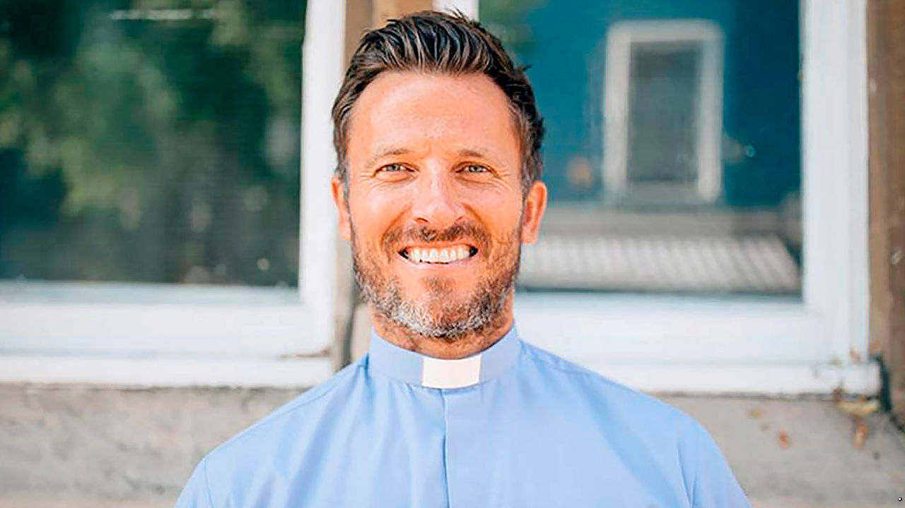

## Your own personal Jesus

# Online services swell the Church of England’s congregations

> But conservatives worry they undermine church worship

> Jun 4th 2020

“WHEN I HEADED out to Portobello Road, I didn’t know if I was going to get told to get lost or have rotten tomatoes thrown at me,” says Pat Allerton (pictured), vicar of St Peter’s church in west London. But the muscular, chisel-jawed man of the cloth has become an unlikely lockdown celebrity, turning heads for more than just his sermons. Thousands follow online as he goes from street to street playing “Amazing Grace” on a sound system. His looks, he insists, are irrelevant. “You can have the best-looking people in front of a camera, but if they don’t have God’s anointing, then they will only touch a few people.”

Many vicars were reluctant to close their churches when covid-19 began to spread in Britain. But empty pews in the Church of England have been replaced by packed-out virtual congregations. A quarter of Britons have attended an online religious service since lockdown began, providing a boost to a faith that has seen dwindling church attendance. “The Holy Spirit can work through Zoom,” explains Rev Nicky Gumbel of Holy Trinity Brompton, a group of four churches. Its total weekly congregation has doubled to nearly 10,000. He draws a parallel with the early days of the church, noting that pandemics during the Roman empire boosted the faith’s power as worshippers’ networks of mutual aid left them with fewer casualties.

This newfound popularity is exposing a gulf between clergy who think of online services as a necessary (and temporary) evil and those who want to innovate. The government has said churches should remain closed until at least July, but liberal vicars are keen for change to outlast the crisis. Some even think churches, with their fussy hierarchies, get in the way of spreading the Lord’s message. “In the New Testament, Peter talks about every Christian as a living stone,” says Mr Allerton. “God is building his house out of living stones.”

Several clergy are having fun finding new ways to connect with their parishioners. Helen-Ann Hartley, the Bishop of Ripon, has been blessing pets online. “My screen was filled with cats being entertained, there was a lady Zooming in from a horse she was riding, and there was a sofa full of chickens,” she laughs. “I was like, ‘Woah, there’s something in this.’”

Yet conservatives fear their liberal peers are exploiting the crisis to challenge the dominance of church worship in the Christian faith. “This is a drum some have been beating for a long time,” says Rev Marcus Walker. Conservatives cite scripture from the Old Testament: “Don’t forsake the gathering of the brethren.” Some have taken this message further than Mr Walker thinks necessary. A group of religious leaders are taking the government to court for keeping churches closed.

Polls suggest the flock agree. One found two-thirds of regular churchgoers want churches open before July. That is more proof, say conservatives, of a gulf between liberal clergy and their congregation. Some liberals seem to have doubts about how sensible their parishioners are, says Mr Walker. “The arguments have been: ‘Well, we can’t trust them not to come to church if they’re supposed to be shielding.’”

Liberal priests are having none of it. If churches reopen, and innovations keep going, they believe they can attract more people to the faith. “My friends from the gym don’t ever come to church with me,” admits Mr Gumbel. “But I ran past one of them and he said, ‘I’ve been watching all your services online’—that is amazing.” ■

## URL

https://www.economist.com/britain/2020/06/04/online-services-swell-the-church-of-englands-congregations
