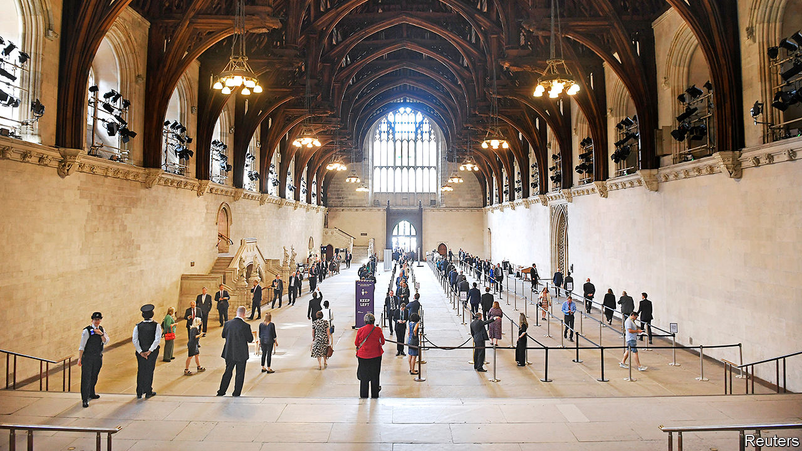

## Parliamentary procedure

# The British government shows how not to return to work

> In-person voting is cumbersome when MPs must remain two metres apart

> Jun 6th 2020

Editor’s note: Some of our covid-19 coverage is free for readers of The Economist Today, our daily [newsletter](https://www.economist.com/https://my.economist.com/user#newsletter). For more stories and our pandemic tracker, see our [coronavirus hub](https://www.economist.com//news/2020/03/11/the-economists-coverage-of-the-coronavirus)

AT A TIME of upheaval, a jittery government under assault from a reinvigorated opposition calls a vote. MPs rush back from all over the country. So unwell is one that a paramedic wheels him in to have his vote “nodded through”. “Is he even alive?” asks a Tory whip. “Doesn’t matter,” replies his Labour counterpart. “There’s the bell, and he’s here.”

So concludes one scene in “This House”, an account of government in the 1970s. The play’s revival, streamed online on May 28th, was timely. A few days later, antediluvian parliamentary procedures were back in the spotlight. The government ditched the online voting system for MPs that was introduced in April. Since social-distancing measures are still necessary, the queue for the first vote snaked for 1,421 yards, leaving the House of Commons. Voting lasted 45 minutes. It was, at least, sunny.

Jacob Rees-Mogg, the leader of the House of Commons, was concerned that the new online approach, which is seen to have worked well, could become permanent. That would be a problem. “Voting while enjoying a sunny walk or watching television does democracy an injustice,” he explained. “The solemn decisions we take together affect the lives of millions of people in this country.” No matter that his preferred method would force MPs who are vulnerable to covid-19 to choose between shielding from the virus and representing voters. Or that it is an absurd waste of time.

Boris Johnson conceded on June 3rd that vulnerable MPs should be able to vote by proxy. Later that day, the business secretary came down with symptoms of covid-19. Observers expect further U-turns. Parliament has a history of silliness. Indeed, the Habeas Corpus Act of 1679 passed only when a chubby peer was put down for ten votes. Even so, the current mess is probably too much for MPs to bear.

## URL

https://www.economist.com/britain/2020/06/06/the-british-government-shows-how-not-to-return-to-work
