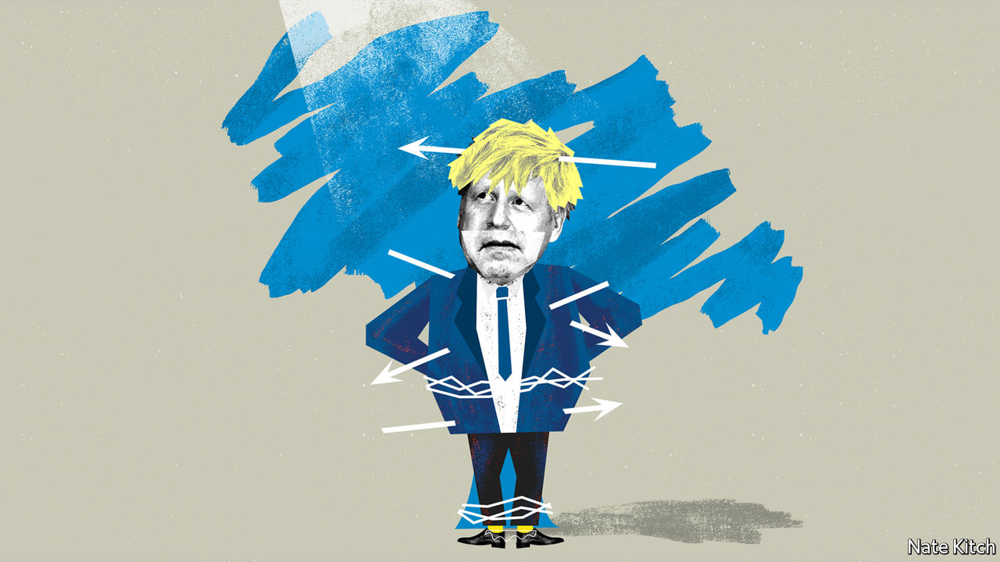

## Bagehot

# Why Conservatives have embraced victimhood

> It offers a means of turning failure into electoral success

> Jun 4th 2020

IN HIS “LIFE OF THESEUS” Plutarch tells the story of the ship which carried Theseus and his crew back to Athens from their adventures in Crete. Awed by their heroism, the Athenians preserved the ship for several centuries by removing the old planks as they decayed and replacing them with new ones. Eventually the ship consisted entirely of new material. This led to a great debate among the philosophers: did the restored ship remain the same ship? Or was it a new one?

The current Conservative Party poses Theseus’s paradox in even starker form. The Conservatives have not only replaced the old planks. They have frequently refashioned them entirely. A party that was once a party of pragmatism is now a party of ideology. A party that was once a party of tradition is now a party of radical upheaval. Is this really the Conservative Party we have before us? Or a new party that simply has the same name?

One of the most striking changes concerns the subject of victimhood. Conservatives used to relish accusing radicals of “playing the victim card”—hunting down victims to champion and treating British history as a history of oppression. But today they can’t resist playing the victim card themselves, even as they celebrate a decade in government. They present themselves as champions of the left-behind and looked-down upon. They rail against “entitled” elites. They do battle with forces of history that are intent on hurling them into the abyss.

The Dominic Cummings affair provided a perfect illustration of this attitude. For many people (including, to be fair, lots of Tory MPs) this was a story of an entitled official breaking the rules. But to many Conservatives it was a story of a Brexit martyr being persecuted by the media establishment who wouldn’t shut up about the subject and by street protesters who gathered outside his house. Downing Street turned itself into a bunker to defend Mr Cummings. Seven out of ten party members backed him against his critics, according to a poll by ConservativeHome, a Tory blog.

The sense of embattlement reached new levels when Emily Maitlis, a BBC presenter, delivered an on-air sermon against Mr Cummings. Thousands of people wrote to the BBC complaining (with some justice) that Ms Maitlis had broken the public broadcaster’s impartiality rules. Right-leaning publications bristled. Tony Parsons wrote in the Sun that his “fury, contempt and anger” burned at a corporation that “pockets £4bn a year from the Brexit-voting, Tory-supporting nation who they loathe”. Tom Slater of Spiked, an internet magazine that is close to the outraged spirit of modern conservatism, complained about a “metropolitan media class that has become so self-important that it is blind to its own biases, confused about the difference between opinion and facts, and increasingly hysterical when it doesn’t get its way”.

A new book on conservatism, Ed West’s “Small Men on the Wrong Side of History”, gives a good sense of this state of mind. Mr West tells the story of how he became “conserve-curious” as a young man and eventually forged his career as a conservative journalist. An amusing writer, Mr West eschews the ranting and whingeing that has become the hallmark of too many young conservatives. But his is nevertheless a story of defeat and marginalisation.

Conservatives have lost all the big cultural wars in his lifetime, he notes, quoting Bridget Jones’s aphorism: “Labour stands for sharing, kindness, gays, single mothers and Nelson Mandela”. They have also become a figure of fun in his age group of people in their late thirties. Mr West predicts that this pattern of defeat will intensify as his peers take an already leftish establishment further to the left. Conservatives will become like the practitioners of the Old Catholic faith in Protestant England: marginalised people living in remote provinces while the future of the country is forged in liberal entrepots.

This might sound a bit far-fetched. The right has pulled off two big victories in recent years, the Brexit referendum in 2016 and the general election of 2019. Social innovations such as gay marriage might well be classified as the extension of the conservative institution of marriage to a once marginalised population. Yet there is enough truth in the argument to give it some bite.

The Conservative Party is increasingly winning votes from lower social classes. Since the early 2010s it has enjoyed consistently stronger support among the lower-middle and working classes than among the higher ones. It is also losing support from the administrative and even corporate establishment. Look at the balance of power from the perspective of Antonio Gramsci—an Italian Marxist who argued that what matters is control of the culture rather than parliamentary majorities—and Conservatives are clearly on the wrong side of history. A poll in 2019 by Times Higher Education found that 54% of university employees planned to vote Labour, 23% Liberal Democrat and only 7% Conservative, just two percentage points above the Greens. In 1964 35% of academics voted Conservative. When the Reuters Institute at the University of Oxford conducted a survey of journalists in 2016, just 23% said they were “right of centre”.

This turn to victimhood makes one yearn for the old Disraelian Tory party where the greatest virtue was to make people laugh and the greatest sin to appear earnest. But it may nevertheless be a significant electoral asset in a world in which everybody has an axe to grind and a wrong to right. Playing the victim card allows the party to forge links with two disparate groups: older voters who feel marginalised by the leftward drift of the culture and poorer ones who feel left behind by a global economy. The past couple of months look as if they’ve been disastrous for the Tories’ re-election chances. But consider another paradox to go along with Theseus’s: the more the Conservative Party appears to fail the more it may be storing up political capital for another electoral success. ■

## URL

https://www.economist.com/britain/2020/06/04/why-conservatives-have-embraced-victimhood
