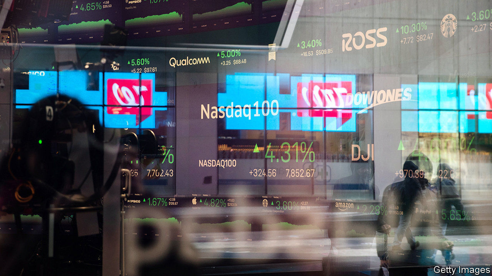
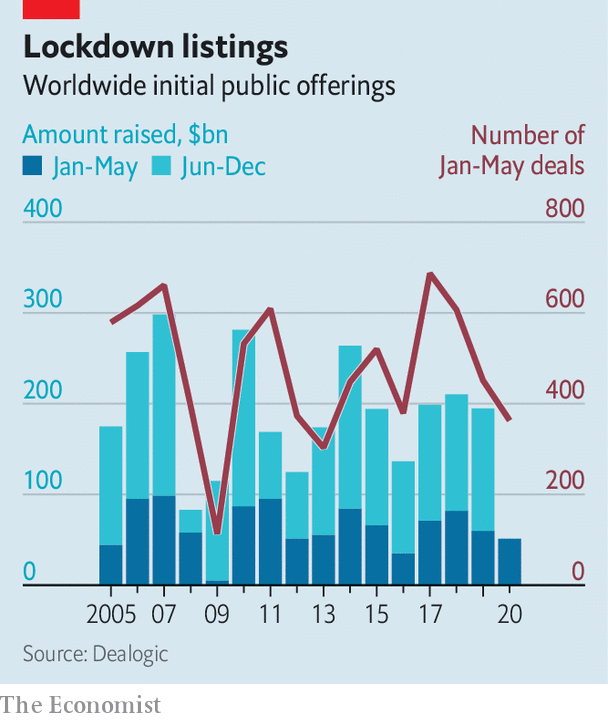

## Floating not drowning

# Companies are still raising cash by floating

> And more may join in when the pandemic recedes

> Jun 4th 2020

A  GLOBAL PANDEMIC would not seem like the best time to bring a business to the stockmarket. But several initial public offerings (IPOs) are afoot. On June 3rd Warner Music started trading in New York having raised $1.9bn—a healthy wodge even in good times. IPOs have had a slow but hardly catastrophic start to the year, according to data from Dealogic. The $51bn raised by the end of May is about a quarter lower than the average over the past decade and nothing like the cratering of 2009. Some are predicting a bumper year as firms pile in after holding off as markets convulsed. Soon to join stock exchanges are an Italian mask-maker and a Korean K-pop impresario.