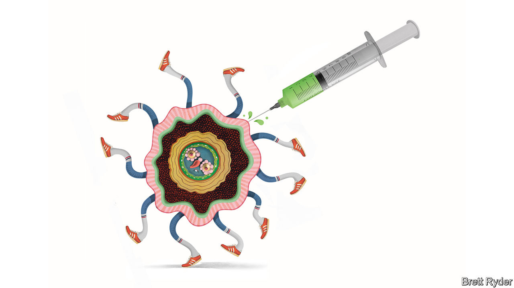

## Schumpeter

# The quest for a vaccine could restore faith in big pharma

> The boffins of AstraZeneca are showing the way forward

> Jun 4th 2020

UNPRECEDENTED IS AN overused word. But to find a parallel for the response of the pharmaceutical industry to the covid-19 pandemic, it is necessary to go back to the start of the second world war, another time when countries were desperate for miracle cures. Back then big pharmaceutical companies, especially in America, were as unproductive and unloved as they are today. People were appalled at the mis-selling of addictive narcotics, as they have been during the opioid crisis. And in pre-war Britain, scientists had discovered what they believed could be a wonder antibiotic—penicillin. Yet they could not find any firm, even in America, prepared to take the risk of producing it at scale.

Then came Pearl Harbour and everything changed. As Gerald Posner writes in a new book, “Pharma: Greed, Lies, and the Poisoning of America”, the war effort led American firms like Merck, Squibb and Pfizer to pool their research on penicillin. Mass-producing the antibiotic became as much of a national-security priority as building an atom bomb. By D-Day in 1944, there was enough penicillin to treat 40,000 troops. It was a turning point. The pharma industry emerged from the war revelling “in the glow of its collaborative wartime penicillin programme”.

As the title of his book suggests, Mr Posner is no fan of the industry as it exists 75 years later. Yet even he would have noticed the return of a halo-like glow, albeit via Zoom, as the bosses of some of the world’s best-known pharmaceutical firms gathered on May 28th to recount their collaborative efforts to find a covid-19 vaccine. The talk was of “racing against the virus, not against each other”, of altruism, and of pride in a mission that is critical for saving lives and livelihoods. One of the bigwigs was Pascal Soriot, the 61-year-old French chief executive of AstraZeneca, an Anglo-Swedish firm. His presence was telling. Until the coronavirus, the company barely dabbled in the $60bn-a-year vaccine business. Yet now he is leading the effort not just to create a vaccine, but also to bring big pharma back in from the cold.

Under Mr Soriot, a trained veterinarian who took over at AstraZeneca in 2012, the firm is bucking a decade-long trend of drugmaking fatigue in the industry, in which acquisitions have often made up for a lack of innovation. He credits its success to a faith in science. His pride and joy is AstraZeneca’s research-and-development centre under construction in Cambridge, which he displays on his Zoom wall. The address, he enthuses, is Number One Francis Crick Avenue, named after the molecular biologist and Nobel laureate. In 2014 he used science as a justification to fend off a $118bn takeover bid by Pfizer, arguing it would derail cancer treatments the firm had in development. On May 28th AstraZeneca’s booming oncology business further vindicated that conviction when it revealed that new data from tests of its bestselling drug, Tagrisso, showed that it reduced the risk of relapse in some early-stage lung cancers by a staggering 83%. Though its returns are still below the industry average, such successes have made AstraZeneca Britain’s biggest listed company, now worth £112bn ($141bn).

Yet it is in the quest for the vaccine that Mr Soriot’s faith in innovation could be most consequential. In April the firm struck a landmark deal with Oxford University to distribute a potential jab. Within three weeks it had secured manufacturing capacity for 1bn doses, with the aim of beginning deliveries in September. It received $1bn from BARDA, an American drug-development authority, to gain access to supplies by the autumn. Such funds help it pay in advance for access to the vats and vials it needs to make and ship the vaccine in vast quantities. It is building parallel supply chains around the world to ensure the vaccine is available everywhere. For an industry that usually takes a decade to launch a new vaccine, this is remarkable speed.

Other companies are also building supply chains, but in clinical trials, vital for regulatory approval, AstraZeneca is ahead. After early trials of AZD1222, as the vaccine is known, the firm has started testing it on 10,000 people in Britain to see whether it prevents covid-19. It will expand this to 30,000 people in America. In this effort, the bigger the headstart the better. In Britain, as the number of infections fades, the chances of getting conclusive results on the vaccine’s efficacy are only 50%, says Adrian Hill, director of Oxford’s Jenner Institute, AstraZeneca’s partner. That may mean conducting trials in countries where the disease is still rampant.

It is a nerve-racking challenge. The biggest risk, Mr Soriot says, is politics. Vaccine nationalism means countries will bully drugmakers to secure supplies, though AstraZeneca, like its peers, says it is determined to distribute the vaccine equitably. Whatever that means, there are several other hurdles. The speed of development means the risks of mishaps are high. Initially there will only be enough jabs to treat the most exposed people, such as health-care workers, which may breed resentment. Firms like AstraZeneca hope to forestall criticism by producing the vaccine without profit for the time being. But investors will eventually want to reap rewards. The firms are pushing back against an initiative by the World Health Organisation to pool intellectual property on covid-19 to make sure poor countries have access.

For now, such hindrances seem like a price worth paying. As Mr Soriot says, “there are times in life when you need to stand up and say it’s time to help.” There are already pay-offs. The race for the vaccine has galvanised staff, he says. It answers those who criticise the industry for high prices and profits. “This is what a successful, healthy pharmaceutical industry can do,” he insists. Expect that point to be rammed home in the future when governments again turn their wrath on big pharma over high prices. But hope that the industry develops a new thirst for innovation, as happened with penicillin. The post-war years were golden ones for drug discovery. It would be laudable if a post-covid-19 age were, too. ■

## URL

https://www.economist.com/business/2020/06/04/the-quest-for-a-vaccine-could-restore-faith-in-big-pharma
