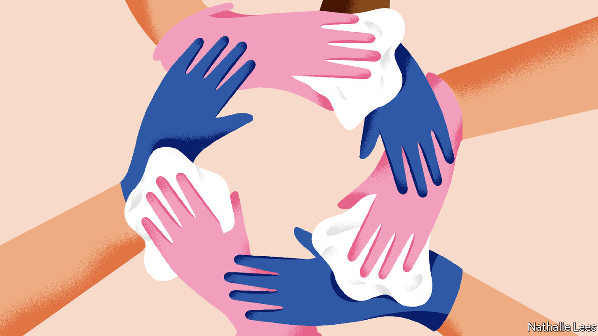
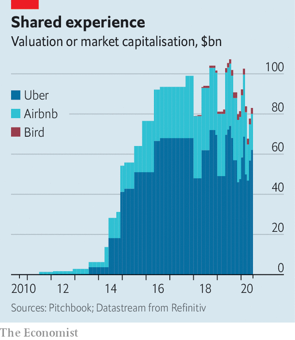

## What’s mine is yours

# The sharing economy will have to change

> But that will help it survive the pandemic and thrive afterwards

> Jun 4th 2020SAN FRANCISCO

“I THOUGHT WE were dead.” Emmanuel Bamfo, the boss of Globe, a six-person startup founded a year ago, began thinking about what job to do next when the coronavirus hit in March. His firm acted like a short-term Airbnb: its app let people rent out their homes or even only parts of them, such as the bedroom or the bathroom, for a few hours. This became an unattractive proposition during a pandemic.

Mr Bamfo quickly adapted his service instead. Now the app’s users can buy time in empty flats that would in normal circumstances be rented out for longer periods on other sites. It costs between $25 and $125 an hour to rent a flat in San Francisco, offering an escape for those who want to work for a while without children underfoot or need a change of scenery. Demand appears high, though supply less so. The company’s app shows a worldwide waiting list of more than 113,000 (the firm needs to check potential renters’ identities) and it claims to have 10,000 hosts.

Globe’s ultimate success remains uncertain. Officials in San Francisco wrote to the company pointing out that its service violates the city’s shelter-in-place order. But Globe’s early achievements after adapting show that predictions of a covid-induced demise for the “sharing economy” may turn out to be exaggerated. Rather than putting an end to it, the virus is forcing the sector to reinvent itself. That may even involve a return to its socialist roots.

The Great Recession in the wake of the financial crisis of 2007-09 did much to create the ideological impetus to use technology to build an economy in which consumption would be more social, frugal and sustainable. Instead of owning things, the thinking went, people should share access to them using apps and other online services. “I don’t want stuff, I want the ... experiences it fulfils,” said Rachel Botsman, one of the champions of the trend.

Using peer-to-peer services to share and barter things, from books and CDs to power tools and cars, never took off. Most of these businesses did not generate enough cash to sustain themselves. But they paved the way for another sharing economy that seeks to make money by creating online marketplaces to match supply and demand. Startups of that sort could, in the lingo, be “blitz-scaled” into large global businesses. Such size promised big profits, attracting oodles of venture capital.

Airbnb, Uber and Bird were the poster children of the new sharing economy. Together the world’s biggest providers of holiday rentals, taxi rides and e-scooters, respectively, raised over $30bn in funding and their valuations added up to more than $100bn at their peak. Airbnb and Uber had at one time been expected to stage some of the most lucrative ever public listings of technology startups. Yet even before the virus hit, the stars of the sharing economy had started to lose their shine.

Making money proved to be harder than expected. Uber’s rides required heavy subsidies. Maintaining a fleet of e-scooters turned out to be more expensive than Bird had imagined. Flush with venture capital, these companies also moved into other markets. Uber sought to develop autonomous cars and to deliver food. Airbnb considered producing television programmes as well as running hotels.

By the time Uber went public in May last year, it had lost a total of $16.6bn between 2016 and 2019. It said that it would lose more cash before turning a profit, a big reason why its initial public offering was not as successful as many had predicted. Even Airbnb, whose business model of taking a cut of rental fees meant that it had made profits for some time, began losing money—$322m in the first nine months of 2019. The pandemic has interrupted its plans for a flotation, which had been expected to take place in April or May.

A focus on profitability with an emphasis on cutting costs was already in the air when the pandemic brought businesses almost to a halt. Airbnb faced 1m cancellations and $1bn in refunds. The number of Uber rides plummeted by as much as 80% in April compared with a year ago. Bird, feeling a similar pinch, reacted in late March by laying off over 400 employees, a third of its workforce. Airbnb followed in early May, sacking 1,900 staff, a quarter of its workforce. Uber also dismissed a quarter of its staff, around 6,700 workers. Lyft, its main rival in America, made cuts that were only slightly less savage.

Aside from lay-offs, these firms are attempting to rejig their businesses to restore the confidence of customers. Increased cleanliness is the main focus. Airbnb advises hosts on how to clean rooms and has introduced a 24-hour vacancy period between bookings. (It is not mandatory, but guests will be able to see online which hosts are following it.) Bird’s scooters get a regular “bath”. Uber is checking whether drivers wear a mask by having them take a selfie (its app can automatically detect whether they have one on).

Firms have also used the crisis as an opportunity “to go back to basics”, in the words of Brian Chesky, Airbnb’s boss. His firm is now concentrating on hosts who rent out their private homes rather than professional ones with several properties, which had been a growing part of the firm’s business. Uber has ditched several businesses, including a planned credit card for drivers and its e-bike service. It wants to concentrate on being the firm that “moves people and things in cities”, Dara Khosrowshahi, its chief executive, said recently.

The big question is whether being cleaner and leaner will be sufficient for these firms to bounce back when the lockdowns are lifted or whether the “isolation economy” will change habits to an extent that sharing is pushed to the margins. Is ownership destined to make a comeback?

All three firms expect demand to rebound, but in different places and for different reasons. Mr Chesky predicts that instead of making short trips to the world’s bigger cities, people will stay closer to home for longer. The average length of stay in an Airbnb has nearly doubled, to a week. The share of domestic reservations has more than doubled, to over 80%, and stays less than 200 miles (320km) from home, which used to account for 33% of bookings, now generate 56%. Mr Chesky also expects to benefit if working from home remains widespread, allowing people to relocate for a while. “A lot of people are saying: ‘Well, in that case, maybe I don’t need to live in the city right now’.”

Uber and Bird expect a move from public transport to cars and scooters. People may feel nervous about taking buses and trains—if they are available, given the future budget constraints in many cities. There is already some evidence of that. Rides on Bird’s scooters are now on average 50% longer than before the pandemic.

Uber also intends to gobble up competitors. Despite getting out of e-bikes it has invested in Lime, Bird’s biggest e-scooter rival. It also wants to buy Grubhub to boost an existing food-delivery business that it hopes will thrive. “In difficult times consolidation makes sense,” says Mr Khosrowshahi, who excelled at this task during his previous job as boss of Expedia, an online travel site that hoovered up rivals.

Smaller sharing-economy firms are surprisingly optimistic, too. In places which have already lifted some lockdown restrictions, such as Germany, activity has quickly picked up again, reports Nicolas Brusson, who runs BlaBlaCar, which offers long-distance peer-to-peer ride-sharing in 22 countries. The coronavirus recession, he reckons, will increase demand for cheap rides further. The pandemic has also forced his company “to look at its assets in new ways”, he says. In future it wants to offer more services to its community of drivers and riders. It has already developed a new app, called BlaBlaHelp, which lets people ask others to do grocery shopping for them.

If there is one example of how the pandemic may push the sharing economy back to its roots, it is Olio. Motivated by a mission to reduce food waste, the London-based service lets its users share groceries and other items they no longer need with neighbours. “We first had a moment of panic: can a neighbour-to-neighbour sharing app continue to exist?” explains Tessa Clark, who runs the firm. But after changing the service to no-contact pickup, sharing surged by about 50% for food and 200% for other things.

Firms building on activity that existed before the internet, such as sharing food with neighbours, will fare better after the crisis than online marketplaces that are more artificial new creations, predicts Sonali De Rycker, a partner at the European arm of Accel, a venture-capital firm, which has invested in both BlaBlaCar and Olio. If anything, she says, after the pandemic consumers will be even keener to save money or to make some on the side by renting things out. Expect more of yours to be mine and mine to be yours, even if it has to be thoroughly cleaned in between.■

## URL

https://www.economist.com/business/2020/06/04/the-sharing-economy-will-have-to-change
