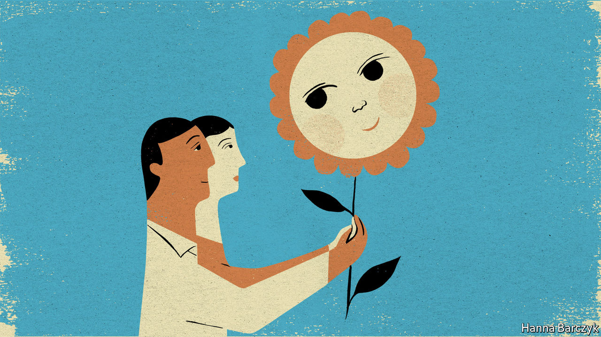

## Chaguan

# For people in China, adopting Chinese children is getting easier

> No longer are foundlings given the surnames “Party” or “State”

> Jun 4th 2020

BACK IN 1991, when China passed its first stand-alone adoption law, state-run orphanages routinely gave foundlings the surnames “Dang” (meaning Party) or “Guo” (meaning Country). These unusual names marked children for life and were meant to. That way foundlings would not forget what they owed the Communist Party. Such names were banned in all orphanages only in 2012.

It is a mark of how China has changed that its first-ever Civil Code, a fat volume of laws covering everything from marriage to property rights, approved on May 28th, revises adoption rules to make it easier for children to be raised in private homes. A big change eliminates the rule that—except in special cases, for instance involving adoptions of disabled children from orphanages—only childless Chinese may adopt. From next year, the childless will be allowed to adopt two children, whereas parents with one biological child may adopt another. Those changes reflect a broader easing of laws that, from 1980 to 2016, restricted most urban families to a single child. A further amendment raises the maximum age for being adopted from 14 to 18.

To be sure, the Civil Code is rooted in a conservative vision of family life. The new rule-book has sparked controversy by imposing a 30-day cooling-off period on many couples seeking to end marriages, to prevent “rash” divorces. The code’s approach to adoption is no exception. Fang Yan, a lawyer and member of the National People’s Congress, China’s parliament, backed the clause allowing older teenagers to be adopted. Her not-very-sentimental argument to state media was that parental supervision may prevent “social instability” caused by “rebellious” youths.

Still, it is revealing that China’s rulers, a control-obsessed bunch, are willing to outsource a delicate social problem—the care of abandoned children—to Chinese parents. For three decades officials hid foundlings away in bleak institutions. From the late 1990s onwards, they entrusted thousands of children each year to foreigners not constrained by family-planning laws, most of them Americans. The government’s distrust of its own citizens helps explain that approach. Officials knew that informal adoptions were rampant, especially in rural areas, as a way to get rid of unwanted girls, allowing parents to try again for a son and heir.

Social changes explain why the government is more willing to promote domestic adoption, says a doctor who has spent years bringing ill and disabled orphans to Beijing for treatment. On the one hand, as China becomes more prosperous and educated, urban couples are marrying and trying to start families later, only to find that they cannot. As a result, when healthy babies reach orphanages, perhaps abandoned by young unwed mothers, they are adopted “right away”. Sometimes, such children may never be told that they were adopted, she adds. Other Chinese are more willing to adopt children with treatable conditions like cleft palates.

On the other hand, says the doctor, there are many fewer abandoned children to adopt. Because even remote villages have access to ultrasound scans, disabled children are more likely to be aborted. More cheerfully, younger Chinese are not as superstitious, and so are less likely to believe that a baby born without an anal opening, for example, must be cursed and fit only for abandonment.

Official statistics bear the doctor out. They show that there were 343,000 children in orphanages in 2018, down from 570,000 in 2012. Registered adoptions peaked 20 years ago, with over 52,000 in 2000. That number fell to just over 15,000 in 2018. Today, just one-eighth of adoptions are by foreigners, who may take only disabled or older children. Yet child welfare remains sensitive, which is why so many in the field decline to speak on the record, from the Beijing doctor to lawyers who handle adoption cases.

Zhuang Ju, a therapist who works with autistic children in Beijing, is an exception. Traditionally, the Chinese have been cautious about formally adopting non-relatives, he explains. But informal versions of the practice have ancient roots. Before China urbanised, many households in the same village might collectively feed, clothe and care for an orphan. That said, to take a boy with no blood ties into a family, giving him that family’s surname, was a major commitment, creating an heir with inheritance rights. “In China the first and foremost connection is by blood,” he says.

Mr Zhuang, who is 49, is not so traditional. Some 14 years ago he and his wife, another therapist, adopted a two-and-a-half year old, Lele, with symptoms of autism. They believed, correctly, that the boy was still young enough to respond to therapy. His mother, a nurse, scanned Lele’s medical records and spotted that he had a heart condition, possibly explaining his abandonment in the poor, mountainous province of Qinghai. Then Lele (the name means “happy”) was diagnosed with hepatitis. Undismayed, the Zhuangs, helped by a charity, paid for months of hospital treatment. Then they forked out the extra fees demanded by schools in Beijing to educate someone without a local hukou, or residence permit. Being adopted does not earn provincial children a Beijing hukou.

Mr Zhuang concedes that his father is a bit more conservative. But the old man was mollified by the fact that he has a biological grandson, Lele’s older brother (and doting protector, growing up). As for Mr Zhuang’s friends, they had already watched him quit the safe government job he earned after graduating from Beijing Normal University, one of China’s best, to become a therapist. That career change was such a “completely odd and unreasonable decision” that adopting a child barely startled them, he laughs.

Today, Lele is 16 and sometimes helps his father give therapy to autistic children. Not once does Mr Zhuang suggest that he and his wife deserve praise. Instead, he calls adopting his son an opportunity which they could not miss. The Zhuangs may be an uncommonly brave and open-hearted family. The public response to China’s new adoption laws will show if they have company.■