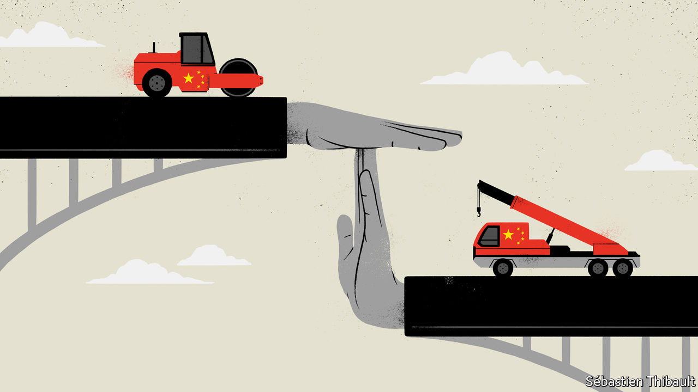
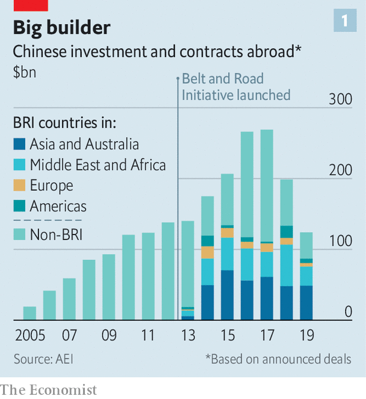
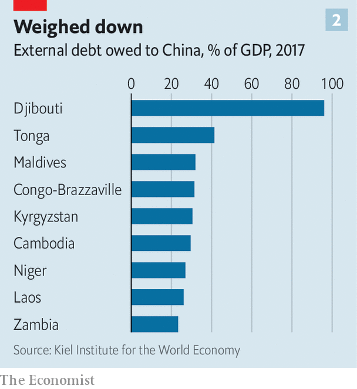

## Break time

# The pandemic is hurting China’s Belt and Road Initiative

> How will Xi Jinping’s biggest project survive?

> Jun 4th 2020

Editor’s note: Some of our covid-19 coverage is free for readers of The Economist Today, our daily [newsletter](https://www.economist.com/https://my.economist.com/user#newsletter). For more stories and our pandemic tracker, see our [coronavirus hub](https://www.economist.com//news/2020/03/11/the-economists-coverage-of-the-coronavirus)

JUST OVER a year ago, at a gathering in Beijing of world leaders who had signed up to his Belt and Road Initiative (BRI), China’s president, Xi Jinping, peppered his speech with proverbs. “The ceaseless inflow of rivers makes the ocean deep,” was one—a reference to how his scheme, involving huge spending on infrastructure in other countries, would promote the global flow of goods, capital and technology and with them, economic growth. Amid the pandemic, many countries may be wishing this were so. But some BRI projects are stalling as countries struggle to repay related debts. China’s own economy is faltering, too. Silk roads are getting bumpier.

The BRI is the centrepiece of Mr Xi’s foreign policy. In 2017 he gave it hallowed political status by having it written into the Communist Party’s constitution. Lauding it thereby became obligatory. China’s state-owned media are duly doing so. “BRI co-operation is entering a stage of high-quality development,” said a headline in Global Times, a party-owned tabloid. “The BRI will become a catalyst for global economic recovery,” said another on the website of the party’s mouthpiece, the People’s Daily.

But the going is rough along the Silk Road Economic Belt and the 21st-Century Maritime Silk Road, to give the scheme its full name. Since 2013, when Mr Xi first began talking about these new silk roads, China has given or promised hundreds of billions of dollars in loans and grants for power plants, ports, railways, roads and other infrastructure in Africa, Latin America, South-East Asia, Central Asia and Europe (see chart 1). But as a result of covid-19, work on some projects has come to a halt. A few have been scrapped. Several that seemed of dubious worth even before the pandemic now look like white elephants. Many of the loans are on the brink of technical default, as debtor countries—hammered by covid-19—seek to defer payments that are coming due.

In February Egypt postponed indefinitely China-funded construction of what was to be the world’s second-largest coal-fired power plant, at Hamrawein. The following month Bangladesh cancelled plans for a coal plant at Gazaria. In April Pakistan asked China for easier repayment terms on $30bn-worth of power projects. In April Tanzania’s president, John Magufuli, said he would cancel a $10bn port project at Bagamoyo because it was signed (by his predecessor) with conditions that “only a drunkard” would accept—chiefly, that China would gain full control of the port with a 99-year lease. And in May, Nigerian legislators voted for a review of all of China’s loans for Chinese projects amid concerns that financing may have been agreed on unfavourable terms. African leaders have called for emergency debt-forgiveness from sovereign creditors including China, which is owed about $8bn this year in payments on about $145bn in loans to African countries, many involving BRI projects (see [article](https://www.economist.com//middle-east-and-africa/2020/06/06/african-governments-face-a-wall-of-debt-repayments)).

Work has also been delayed by quarantine and safety measures related to the pandemic, including restrictions imposed by some countries on the return of Chinese workers who had gone back to China for the lunar new-year holiday in January. In Vietnam such impediments have delayed a 20-day test of a new metro line in Hanoi—more than 100 Chinese experts involved in building it have been unable to re-enter the country. The project was already at least four years behind schedule and, at a cost of nearly $800m for eight miles of track, massively over budget.

This presents problems for China’s leaders in the realms of economics, diplomacy and politics at home, where the BRI is closely linked with the prestige of Mr Xi. First, there will be financial losses. Many countries raise the cash for BRI projects by exporting commodities. But the pandemic has hit demand for them. Should China reduce the amount owed, as sovereign lenders sometimes do in response to a financial crisis? Or should it try to preserve as many loans and BRI projects as it can by delaying payments and extending terms (its typical approach)? Either way, experts say, a wave of defaults is inevitable.

In April, amid debtors’ growing calls for help, the G20, which includes China, broadly agreed to allow up to 73 countries to suspend debt-service payments totalling about $12bn-14bn until the end of the year. But the devil is in the details. The G20 warns that applying for a suspension of debt-service payments could breach other terms to which a country may have agreed. Unlike members of the Paris Club of big sovereign lenders, who do not require collateral for their development loans, China’s banks do for about 60% of their lending to developing countries, says Carmen Reinhart, the World Bank’s incoming chief economist. In theory a country could apply for debt relief only to find that China could claim the rights to a mine, a port or money held in escrow. This is one reason why China’s banks prefer to renegotiate sovereign loans bilaterally, and in secret. They have leverage, and can choose how to apply it.

But this is where diplomatic risk will loom large for China. Claiming assets from defaulting countries would create a furore. It would damage China’s image in countries that the BRI was intended to help, and strengthen suspicions among Western hawks that China is using the BRI to saddle countries with debt (see chart 2) and thereby gain control of infrastructure that could help it strategically. “If they thought they were facing a backlash now, it would be really severe for them” if they were to seize collateral, says Scott Morris of the Centre for Global Development, a think-tank in Washington. China may decide to tread warily. Until the global economy recovers, there will certainly be fewer new BRI projects. “It feels hard to imagine the initiative maintaining the level of ambition that it had,” says Mr Morris.

However, given the political importance China attaches to the BRI at home, and the effort it has made to persuade countries to sign documents endorsing it (more than 130 have, most of them non-Western), it is unlikely to let the idea drop. Fortunately for China’s propagandists, the BRI is a shape-shifting concept that allows them to adapt it to changing circumstances. Hitherto its focus has been on building hard infrastructure. But the term is often applied to almost any activity abroad involving big Chinese firms that can be touted as helping to create a “Silk Road of Peace”—in other words, it means anything the Chinese government likes. Amid the pandemic, officials can easily play down the pouring of concrete and stress other kinds of Chinese largesse.

Under the banner of the BRI, officials are now lauding the idea of a “Health Silk Road” to help distribute medical support and food aid. The idea harks back to the first speech Mr Xi gave, in 2013, about his plans for a Maritime Silk Road. In it he recalled at length how, nine years earlier, China had responded to the Indian Ocean tsunami by mounting its biggest-ever relief operation overseas. In Indonesia, he said, many local people had learned to speak Chinese and hailed members of the Chinese rescue team with the words: “China, Beijing, I love you.” China expects that the BRI-branded medical supplies which it is now showering on covid-struck countries will prompt similar expressions of gratitude. Focusing on such assistance makes political sense for China. It can make a big difference to recipients’ efforts to fight the disease, and requires far less cash than a port or railway.

Also gaining more prominence is the vaguely defined idea of a “Digital Silk Road”. It has been adapted for pandemic use to include helping other countries replicate China’s successes with app-based approaches to tracking the coronavirus.

Chinese officials may take advantage of the lull in building-work to think again about which projects are necessary. They have been stung by Western criticism of the social and environmental costs of BRI infrastructure and of the opaque deals involved. At last year’s meeting with world leaders, Mr Xi stressed that the BRI should be “open, green and clean”. The pandemic offers a chance quietly to nix unpopular dams, which can suffer costly delays due to protests, and dirty coal plants, which are not a sound investment anyway. “Nobody on Wall Street will tell you that a coal plant will be affordable 40 years from now,” says Kevin Gallagher at Boston University. Instead, China may push the expansion of solar and wind energy. Mr Gallagher notes that in Pakistan, Chinese firms have built multiple wind farms under the auspices of BRI. “If you ask for that stuff, China has it.”

If done right, without drowning countries in debt, BRI projects may yet provide a welcome boost to the global economy. Before the pandemic the World Bank estimated that BRI transport projects in Asia, including high-speed railways, would boost the GDP of participating countries by up to 3.4% overall. Some of those rail projects have stalled, and China is now preoccupied with its own hard-hit economy. But Daniel Rosen of Rhodium Group, a research firm, argues that China’s policy banks have ample capacity to maintain the present level of BRI lending. It just is not economically prudent for them do so, especially before a global recovery is on track.

When that happens, the BRI may revert to its original focus. And many countries in desperate need of better infrastructure will welcome this. They have few other options. In November America, Japan and Australia announced an alternative to the BRI called the “Blue Dot Network” to fund infrastructure projects in the developing world. But, as with multilateral lenders such as the World Bank, the financial muscle behind it looks puny in comparison. “The BRI has the best promise of meeting the glaring infrastructure gaps in the global economy,” Mr Gallagher says. “There’s no global infrastructure surge without the BRI.” But for the moment, that boost will have to wait. ■

## URL

https://www.economist.com/china/2020/06/04/the-pandemic-is-hurting-chinas-belt-and-road-initiative
