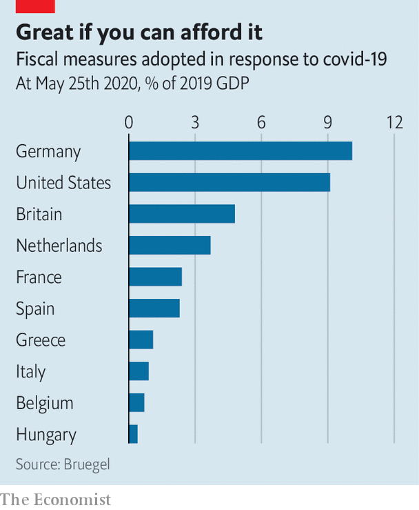
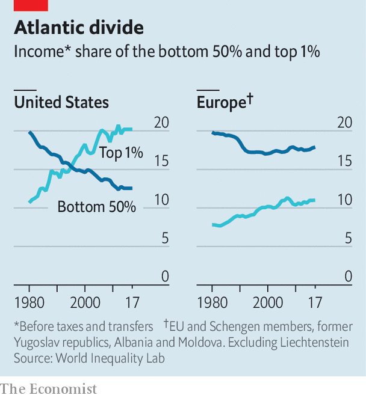

## Disparate impact

# Covid-19 threatens Europe’s success at fighting inequality

> Only the richer countries can do much about it

> Jun 6th 2020AMSTERDAM

Editor’s note: Some of our covid-19 coverage is free for readers of The Economist Today, our daily [newsletter](https://www.economist.com/https://my.economist.com/user#newsletter). For more stories and our pandemic tracker, see our [coronavirus hub](https://www.economist.com//news/2020/03/11/the-economists-coverage-of-the-coronavirus)

CARNIVAL SEASON in the southern Netherlands is a week-long spectacle of Rabelaisian debauchery. On February 28th Leon Elsjan of Wipper, a freelance sound technician, was running the sound system at the carnival-ending dance party in the town of Uden, watching costumed revellers consume vast amounts of beer. It would be his last gig for some time. This year’s carnivals were super-spreader events that introduced covid-19 to the Netherlands. In Uden, the death toll rivalled those in northern Italy, and the national government cancelled all public festivals until September.

Mr Elsjan of Wipper did not fall ill, but as a freelance, he was vulnerable in another way. To cope with the economic fallout from covid-19, the Netherlands introduced a wage-support programme similar to Germany’s Kurzarbeit system. The state pays 90% of the salaries of workers at hard-hit firms. But self-employed workers (12.5% of the labour force) are not covered. For them, the government created a bare-bones programme. Mr Elsjan of Wipper gets the maximum: €1,050 ($1,170) per month.

For decades, Europe’s vaunted welfare states have kept inequality relatively low. The covid-19 recession threatens that success in three ways. First, it hits badly paid workers harder than well-paid ones. Second, lockdowns create new forms of inequality. Some sectors stay open while others shut down, and some people can work from home while others cannot. Third, the severity of the downturn has revealed holes in Europe’s welfare systems. Some countries are patching them, but others are having trouble.

Quantifying inequality is hard, but Europe is clearly relatively egalitarian. One metric is the Gini coefficient, measured from zero (perfect equality) to one (perfect inequality). For income after taxes and transfers in 2017 (the most recent year available for comparison), the Gini coefficient of the EU was about 0.30. In America it was 0.39, while east Asian countries like Japan and South Korea fell in between.

Before taxes and transfers, the picture is different: on this basis Germany’s Gini, for example, is roughly the same as America’s. Europe’s tax systems are not particularly progressive, so economists have long put its success in fighting inequality down to large transfer programmes. But scholars at the World Inequality Lab (WIL), an academic project, argue that this is a mistake. European transfers look so generous partly because European pensions are mostly public, while in other countries they are mostly private. Treat pensions as earned income and the apparent size of European welfare states shrinks—yet the transatlantic inequality gap remains.

Other analysts dispute the WIL’s data, especially on America. But according to the lab, in 1980 the income shares of the bottom half and the top 1% of earners in America and Europe were similar. By 2017 America’s rich and poor had flipped, whereas in Europe the bottom half still earned more. “The European social model is mostly effective through ‘predistribution’: investments in education, universal health care, and regulations of labour markets that compress the wage scale,” argues Lucas Chancel of the WIL. In many countries unions strike wage bargains covering entire sectors of the economy. The Nordics are the most equal. Western European countries like France, and southern ones like Italy, rely more on redistribution. Eastern Europe does little predistribution or redistribution, and its inequality levels are higher.

In some countries inequality was rising before covid-19, partly because labour regulations have been liberalised. In Germany, the income shares of the top tenth and the bottom half of earners were equal when labour reforms passed in 2004; by 2017 the top decile earned more. Other countries, such as the Netherlands and Italy, had rising numbers of part-time or gig workers, who enjoy fewer protections and benefits.

Covid-19 has made such gaps painfully visible. Spain’s government realised it had no mechanism to support the incomes of the large percentage of the population that works informally. That prodded the country’s Socialist-led government to introduce a guaranteed minimum income law, which was issued as a decree last week (see [article](https://www.economist.com//europe/2020/06/04/spains-embattled-government-proposes-a-new-anti-poverty-scheme)). In Italy, workers in the country’s huge informal sector may have trouble accessing its emergency covid-19 benefits.

Italy’s central bank thinks the country’s Gini coefficient rose from 0.35 to 0.37 in the first quarter. This was partly because of lockdowns, a problem that will certainly have become worse in the second quarter as the lockdown continued. Among the top income quintile, only about half of employees were in occupations hard to pursue from home; in the bottom quintile almost 90% were. Other inequalities are geographical. “Southern Italy has barely any covid-19 deaths, but because it is reliant on tourism it is being hit much harder,” says Carlo Bastasin, an economist at the LUISS university in Rome.

Three-quarters of Europe’s income inequality, measured at a continental level, is caused by differences within individual countries. The gap between poor Sicily and wealthy Milan is more important than that between Milan and Paris. But that could change. The covid-19 recession opens up a split between countries that have the fiscal capacity to rein in inequality and those that do not—notably in central and eastern Europe. Germany’s government intervention has amounted to almost 10% of GDP. Italy and Spain, constrained by debt, have done much less. Hungary has barely raised spending; Poland has done so mainly to prop up companies, not to subsidise workers or the unemployed.

In recent years, some economists have argued that wars and pandemics can lower inequality by destroying the wealth of the rich and creating opportunities for the masses. In a paper last month, economists from the IMF found that for epidemics, this did not hold: the big ones of the past century raised inequality. Mr Elsjan of Wipper does not count on his industry coming back: “When I talk to younger guys, I tell them to think about another career.” ■

## URL

https://www.economist.com/europe/2020/06/06/covid-19-threatens-europes-success-at-fighting-inequality
