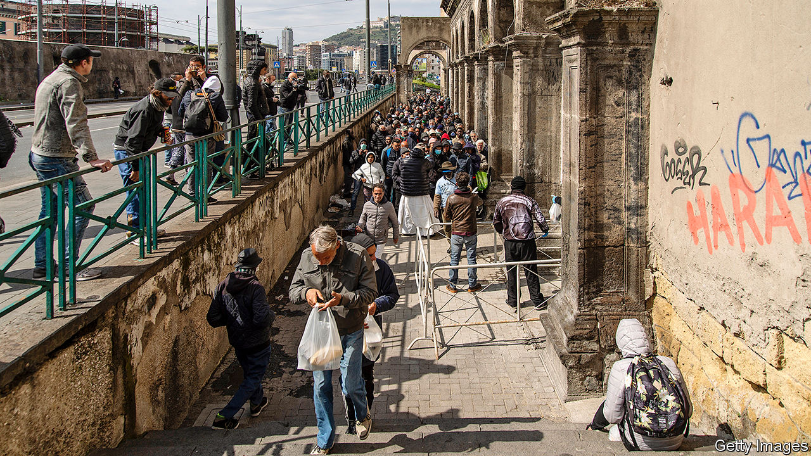

## Hitting the poorest hardest

# Italy’s informal workers fall back on charity

> When covid-19 kills their jobs, they cannot expect much state help

> Jun 6th 2020LIVORNO

UNDER ITALY’S stringent lockdown, Chiara Bosi spent almost three months with her husband and four children in a flat of only 45 square metres. (“More of a hole than an apartment,” she says.) On June 3rd the last restrictions were lifted. Italians were freed to travel abroad and between regions. But Ms Bosi and her family no longer have enough to live on.

She was working without a contract in Italy’s vast “informal” economy, as a cook in beachside bars and restaurants. Now, she says, her former employers have so few customers they can get by with just two or three staff. Her husband is a casual worker in the port of Livorno. Last month, he got only one shift.

“I had four children, expecting to lead a comfortable life. I didn’t expect to be rich,” says Ms Bosi. “But this? This is humiliating.” She has come to the entrance of their rundown apartment block to receive a food parcel from a local NGO, Amici della Zizzi.

Amici was founded to take care of children from poor families, helping 30 to 40 families in normal times. But as the virus spread, says Riccardo Ripoli, its president, it was inundated with appeals. His volunteers began collecting donations of food outside supermarkets. At one point, Amici della Zizzi was distributing food to around 500 families.

“But now people are getting a bit fed up with donating,” says Mr Ripoli. “A lot are frightened that they too could soon be on the breadline.” The pandemic may be petering out in Italy, which is now recording daily covid-19 deaths in only double figures. But the poverty crisis has only just begun in a country that is by one measure the most unequal in the euro zone. (The persistent economic weakness of southern Italy compared with the north is the main reason for this.)

At first glance, Italy is well placed. Furloughing, a novelty in a number of countries, has long been standard practice in Italy for companies in temporary difficulty. Thanks to the anti-establishment Five Star Movement, part of Giuseppe Conte’s left-leaning coalition government, many of the poorest in society can claim a “citizenship income” to top up their earnings or pensions. And the government has introduced numerous measures to deal specifically with the coronavirus crisis. These include emergency payments to the neediest, mortgage freezes and a ban on evictions from homes.

But in other ways Italy is acutely vulnerable. Its informal economy is vast, accounting for around 14% of total output. Those who work in it often have no claim to state welfare. The rest of the labour market depends heavily on short-term contracts. One of the categories most at risk in the current situation comprises workers whose contracts expired during lockdown. A large number of irregular immigrants are also vulnerable. On June 1st the authorities launched a process that is expected eventually to regularise around 220,000 people. But some estimates of the total number of irregular immigrants currently in Italy exceed half a million.

Italy has generally been able to withstand periodic crises because of its high level of savings. But even though many Italians continue to believe they belong to a nation of savers, the truth is markedly different. According to the OECD, an organisation of mainly rich nations, Italian households set aside only 2.5% of their disposable incomes—less than half of the euro-zone average of 5.7%.

Federica De Lauso, a researcher at Caritas, a Catholic charity, says a further handicap has been delay. Furlough payments to workers on contract have had to go through a tortuous bureaucratic procedure that has only recently been simplified. “But there are people who have not received anything since March, and they include many who have turned to us,” she says. ■

Editor’s note: Some of our covid-19 coverage is free for readers of The Economist Today, our daily [newsletter](https://www.economist.com/https://my.economist.com/user#newsletter). For more stories and our pandemic tracker, see our [coronavirus hub](https://www.economist.com//news/2020/03/11/the-economists-coverage-of-the-coronavirus)