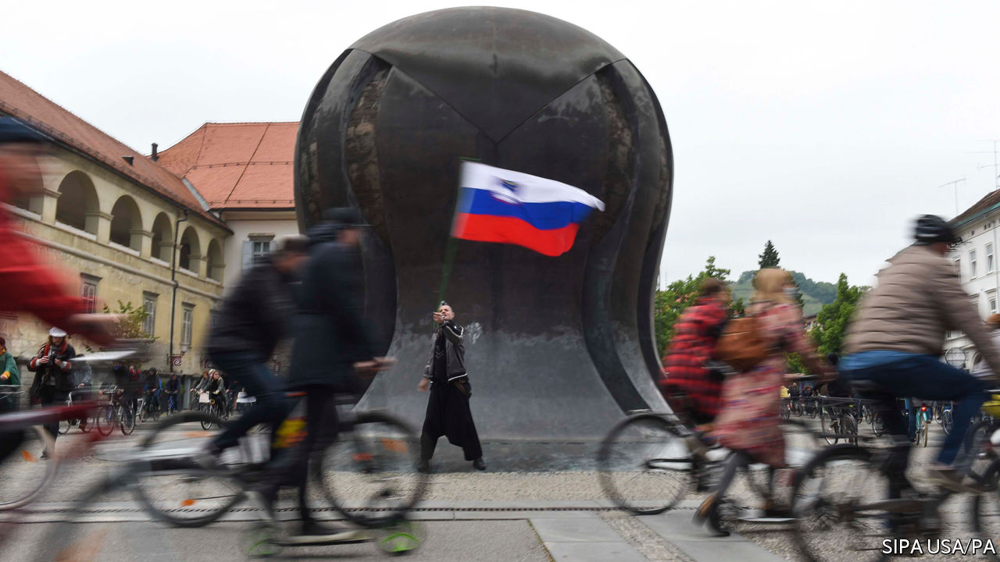

## Barbarians at the gates

# Slovenia’s prime minister hunts for enemies

> Janez Jansa is copying his Hungarian chum, Viktor Orban

> Jun 6th 2020

“VICTORY!” SLOVENIA HAS CONQUERED COVID-19, shouts the cover of a magazine that backs Janez Jansa, the prime minister. On June 1st American military jets helped the country to celebrate by streaking across the sky, while three propeller planes from Slovenia’s air force puttered along too. Now is the time, says Mr Jansa, who became prime minister for the third time in March, to ensure that recession does not turn into depression and that Slovenia preserves its reputation as “a safe and orderly country”.

Mr Jansa, whose entire adult life has been entwined with the history of modern Slovenia, has a point. His country does indeed have a good reputation. Since its ten-day war for independence when he was defence minister during Yugoslavia’s collapse in 1991, it has drawn little attention. Considered neither fully central European nor properly Balkan, Slovenia is often seen as the goody-two-shoes that emerged unscathed from the wreckage of Yugoslavia, and duly joined NATO and the EU in 2004.

But its politics are ugly. Its society is riven by divisions as deep as those elsewhere in Europe. Anuska Delic, an investigative reporter who in 2011 exposed neo-Nazi links to Mr Jansa’s party, says he is bent on making the country another “illiberal democracy” in the mould of neighbouring Hungary under his friend Viktor Orban.

If that were to happen, it would be unlikely to do so quickly, since Mr Jansa has only a wafer-thin majority in parliament. In any event, like Mr Orban, he reckons he knows who his enemies are—and is determined to bring them down.

First in his line of fire are Slovenia’s public broadcaster and parts of the press. Some of the media outlets that support him are part-owned by Hungarian friends of Mr Orban. Among their targets, as in Hungary, is the liberal billionaire philanthropist George Soros. Another butt of Mr Jansa’s hostility is the judiciary. “Key functions” of it, he says, are controlled by people determined “to protect the elite, the deep state, economic crime and tycoon networks”. They are an “octopus of clientelism”. Every Friday several thousand people, fearing a slide into autocracy, protest against him by biking around Ljubljana, the capital.

Meanwhile he hails Slovenia’s fight against covid-19, comparing it to the heroic struggle against Yugoslavia a generation ago and accusing the protesters of treacherously sporting Yugoslav symbols. In fact, Slovenia’s performance against the virus has been about average in the region: around 52 people per million population have died so far, compared with 25 in neighbouring Croatia to the south and 74 in Austria to the north. Moreover, there was a whiff of scandal when the agency charged with procuring masks and other vital equipment was accused of having to sign dodgy contracts, a charge it denies.

In 2014 Mr Jansa went to jail for corruption. The constitutional court annulled his conviction, but a proposed retrial never took place. In prison he wrote a novel about brave proto-Slovene warriors and their sexy maidens defending their homeland from marauding eastern tribes two millennia ago. Nowadays, just like Mr Orban, he attacks today’s migrants, hoping that the theme of barbarians at and within the gates will keep him on the throne. ■