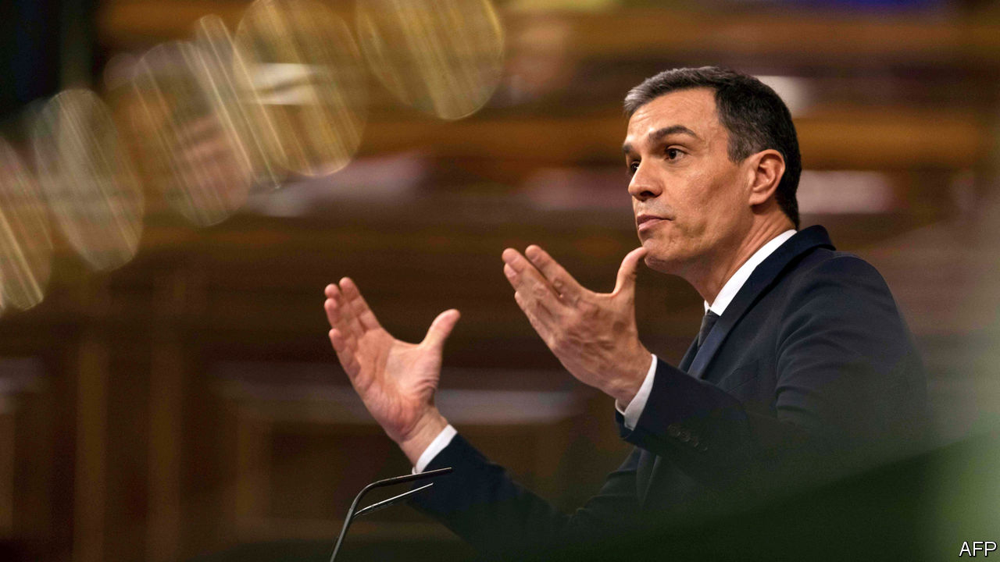

## Raising the floor

# Spain’s embattled government proposes a new anti-poverty scheme

> A permanent top-up for the incomes of the worst-off Spaniards

> Jun 4th 2020MADRID

IN WORKING-CLASS southern Madrid there are queues for food at community centres and parish soup kitchens. Caritas, a Catholic charity, reports a surge in demand for its help. Covid-19 has exposed holes in Spain’s welfare state, just as the slump after 2008 did. This time, though, the government is trying to plug the gaps. Some of the aid is temporary: almost 4m furloughed workers have been getting 70% of their wages paid by the state, which has also made emergency payments to 1.2m self-employed people.

On May 29th the government, a left-wing coalition headed by Pedro Sánchez, approved something big and permanent: a minimum income for those who fall through the cracks. Backdated to June 1st, the new scheme will pay up to €1,015 per month to families and €461.50 to single people who are “severely poor”. (The government defines this as making less than 40% of the median income of €1,050 per person each month.) José Luis Escrivá, the social-security minister and architect of the scheme, thinks 850,000 households or 2.3m people will qualify, mostly women and children.

Spain has long had a poverty problem, partly because successive governments have concentrated on transport infrastructure, in a large and mountainous country, rather than social assistance. Before the virus struck, 12.4% of Spaniards fell below the 40% of median income threshold. In the EU as a whole, only 6.9% of people do.

Until now social assistance has been the purview of the regions, and varies greatly. The rich Basque country is generous; poor Andalucía is not. “Something that was designed to reduce inequality had the opposite effect,” says Mr Escrivá. The regions will now be free to redirect their spending. The new scheme has innovative features. To identify those eligible the government is enlisting the help of NGOs as well as town halls. To provide incentives, the payment will be tapered if earned income increases.

Podemos, the far-left member of the coalition, initially championed a broad universal basic income. Mr Escrivá’s scheme is the “opposite”, he says: a tightly targeted top-up costing, he thinks, around €3bn a year (0.24% of GDP). Some in the opposition worry that even that may not be affordable when Spain is heading for a huge budget deficit. Nevertheless, the scheme has been broadly welcomed. Only Vox, a hard-right party, says it will vote against it.

For Mr Sánchez’s minority government, that is balm after a rough fortnight. Spaniards are reeling from one of the world’s worst covid-19 epidemics. By the (disputed) official count, 28,000 people have died. A strict lockdown has brought the virus under control. Officials are defensive over accusations that they were slow to impose it. The interior minister sacked the head of the civil guard in Madrid, prompting two guard generals to resign, after he sent a report to a judge which confirmed that claim (although the evidence was flimsy).

As well as being accused of undermining the police, Mr Sánchez, a Socialist, has struggled for parliamentary support to continue the state of emergency which he thinks is needed to enforce his deconfinement plan. The coalition parties last month reached an agreement with a Basque separatist party, which abstained in return for a promise to tear up a job-creating labour reform from 2012. That infuriated the opposition and private business, and prompted open dissent from the economy minister, Nadia Calviño.

This week Mr Sánchez secured a final extension of the emergency, until June 21st, but only by agreeing to let regional governments fix most of the rules. Long after these rows have faded, the income-supplement scheme should make Spain a more equal country. ■

## URL

https://www.economist.com/europe/2020/06/04/spains-embattled-government-proposes-a-new-anti-poverty-scheme
