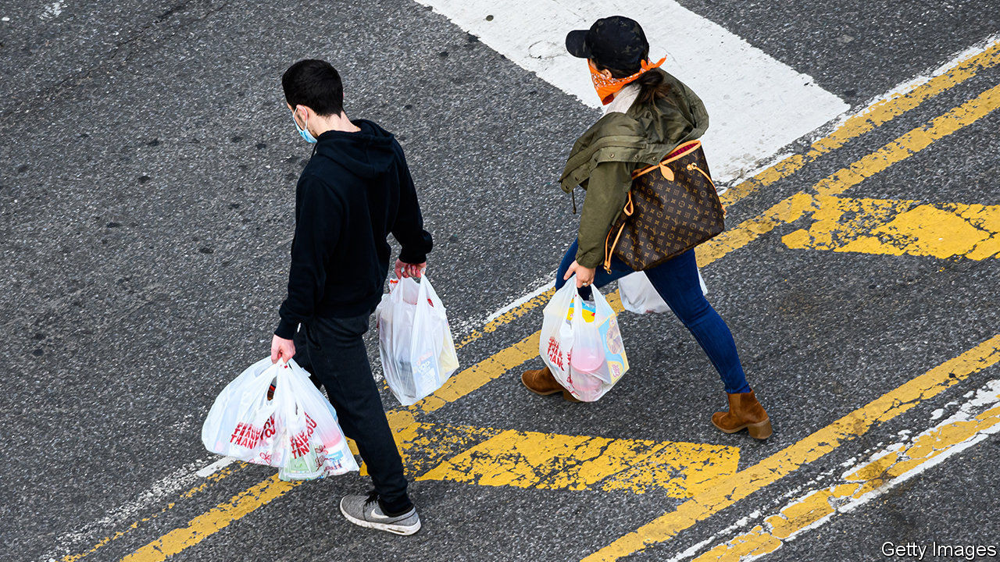
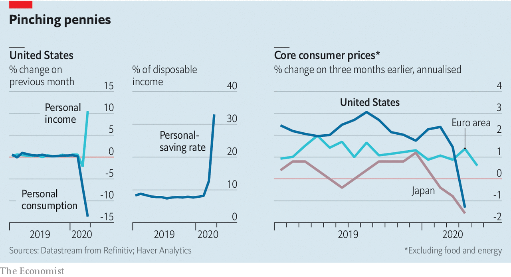

## Prudence in the pandemic

# Americans saved a record chunk of their incomes in April

> The economic recovery depends on their willingness to splash the cash

> Jun 4th 2020

STIMULUS CHEQUES arrived in April, but lockdowns gave Americans little chance to splurge. Instead they squirrelled away a third of their incomes—their highest saving rate ever. The collapse in demand probably weighed on inflation: even excluding oil-price declines, consumer prices fell in America and Japan. The extent to which activity rebounds as lockdowns end will depend on whether consumers stay cautious, perhaps because of an uncertain jobs market, or whether they splash the cash.