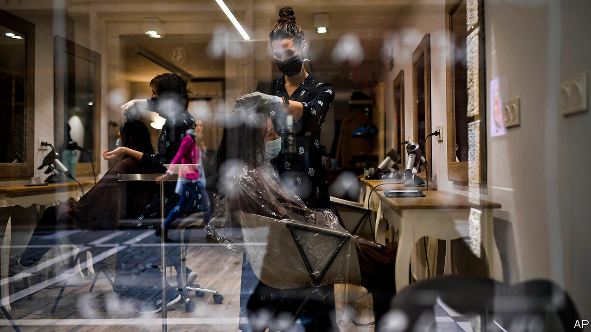
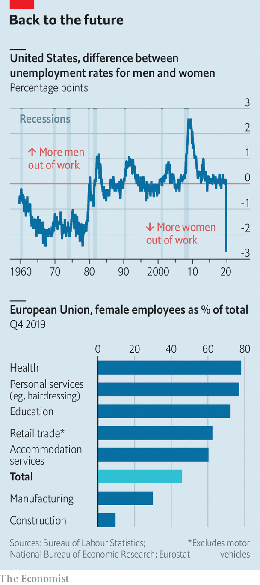

## This time is different

# Downturns tend to reduce gender inequality. Not under covid-19

> Women’s unemployment has risen more than men’s

> Jun 4th 2020AMSTERDAM

HAIR SALONS tend to be recession-proof. People always need haircuts. During the financial crisis of 2007-09 the number of hairdressers in America even rose. For Sylvia, who owns a small salon in Amsterdam, that crisis was very different from today’s. “Lockdown came out of nowhere and I had no buffer.” She is heartened that regulars phoned in when she reopened. “If it had lasted any longer”, she says, fighting back tears while disinfecting the previous customer’s seat, “I would have gone under.”

Women have borne the brunt of the economic disruption caused by the pandemic. In America, despite making up less than half of the workforce, they accounted for 55% of jobs lost in April. In Britain mothers are one-and-a-half times as likely as fathers to have lost or quit their jobs during lockdown, according to the Institute for Fiscal Studies (IFS), a think-tank.

The unevenness reflects the fact that women are more likely to work in services that require interacting with people. But hotels and shops have shut, and the work cannot be done from home. And crèches and schools have closed, leading some women to stop work and others to work less, in order to look after their children. If job and productivity losses persist, they could reverse progress towards gender equality in the workplace.

Today’s picture is in stark contrast to past recessions (see chart). Men are usually worse affected, because they dominate sectors such as manufacturing and construction, which tend to be badly hit. Matthias Doepke of Northwestern University and Michele Tertilt of the University of Mannheim estimate that three-quarters of all cyclical employment fluctuations in 1989-2014 were owing to men losing and gaining jobs. Women, by contrast, have acted as stabilisers. Employment in services, which is female-dominated, tends to be less volatile. And wives take up work or increase their hours when husbands lose jobs.

This time, though, industries involving face-to-face interaction, such as hospitality, have suffered most. In America health care and education have not been spared, with five times as many women losing their jobs as men. Firms run by women are also concentrated in customer-facing areas, which is why female small-business founders are much more likely than men to expect a drop in sales owing to covid-19, according to a survey by Nicholas Bloom and Robert Fletcher of Stanford University.

Whether the hit to so-called “pink” sectors persists depends on whether customers flock back as restrictions are lifted. Structural shifts could well mean fewer air hostesses or event organisers, for instance. Temporary lay-offs could become permanent as firms go bust. (The pink crisis could also turn purple: in Canada, job losses in “blue” sectors seem to be catching up.)

Sex segregation alone cannot explain why women have been hit hardest, though. Even after controlling for it, women in Britain were 15% more likely to have lost their job and 8% more likely to have been furloughed, according to research led by Abi Adams-Prassl of Oxford University. Possible explanations include discrimination, or that, bereft of child care, some mothers chose to leave their jobs.

Higher-skilled women are less likely to lose their jobs than lower-skilled ones. Many are juggling working from home with child care. British households with young children are doing an extra 40 hours of care and schooling a week, find Almudena Sevilla of University College London and Sarah Smith of the University of Bristol. Mums do two-thirds of this, on average.

The gradual emergence from lockdowns could do particular harm to women’s careers, worries Claudia Goldin of Harvard University. With workplaces reopening before crèches fully do, couples could be forced to decide who returns to work and who minds the kids. The lower earner, often the woman, might stay home.

Meanwhile, mothers working at home are 50% more likely to be interrupted than fathers, according to the IFS. This “Mu-u-um” pattern, evident even when the woman is the higher earner, could harm pay and promotions. “I fear we’ll see the impact in two to three years’ time in a widening gender pay gap,” says Vera Troeger of Warwick University. Academia offers a glimpse of what may come. Several journals report fewer submissions by women during the pandemic; male submissions to some journals have picked up.

The pandemic has, at least, made remote working normal. Before it, only one in 50 Americans worked from home full-time. By April, more than one in three did. With the concept tested, says Mr Bloom, “we’re never going back to the old world.” That would be good news for mothers, who tend to pick jobs that fit around their children, with more forgiving hours and shorter commutes. But it will mainly benefit university graduates, whose jobs are easier to do from home. Less-educated women cannot count on such a silver lining. A loss of employer demand and extra child-care duties make their job prospects bleaker. ■

## URL

https://www.economist.com/finance-and-economics/2020/06/04/downturns-tend-to-reduce-gender-inequality-not-under-covid-19
