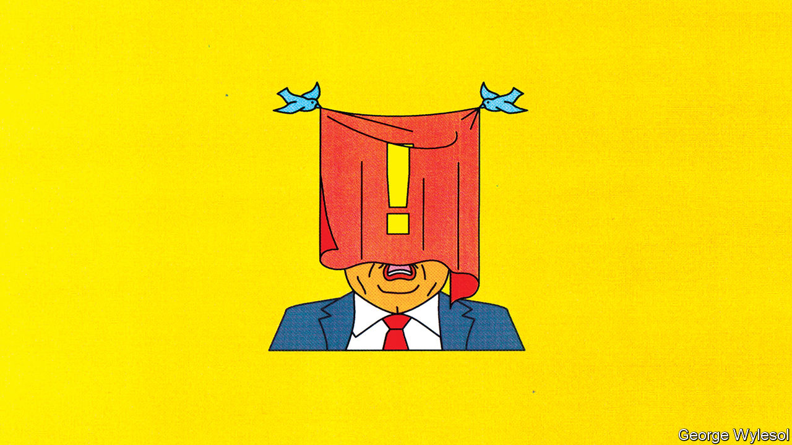

## The moderator’s dilemma

# Donald Trump has reignited a debate about regulating speech online

> The pandemic has already prompted social-media firms to monitor more online content

> Jun 4th 2020SAN FRANCISCO

HASTILY DRAFTED, legally flawed and unworkable. Experts poured scorn on the executive order Donald Trump signed on May 28th in reaction to a decision by Twitter, a microblogging service, to flag one of his tweets as unsubstantiated. The company had put warnings on a pair of tweets in which the president said: “There is NO WAY (ZERO!) that Mail-In Ballots will be anything less than substantially fraudulent”. Social-media firms are not liable in America for the content published on them, thanks to section 230 of the Communications Decency Act (CDA). Mr Trump seems to be arguing that if they do not remain—at least in his view—politically neutral, they should lose that protection.

To many, the document seemed like a blatant attempt to bully Twitter, Facebook and other big tech firms into abandoning any efforts to fact-check the president’s online utterances ahead of the election in November. In this, if nothing else, the executive order may succeed. But it will not end the debate over how to regulate speech in the virtual realm.

Section 230 and its analogues elsewhere were crafted to solve what might be called the “moderator’s dilemma”. In the mid-1990s regulators worried that online firms would refrain from policing their services for fear this would make them liable for the content and open them up to costly lawsuits. To solve this problem, section 230 stipulated that, even if firms moderated content, they could not be held liable for it. It does not, however, eliminate all liability for online content. Material that is copyrighted or violates federal criminal law must still be taken down. And those posting offending content can be sued, though this is often difficult and costly.

Much has changed since the CDA was passed in 1996. Few predicted back then the flood of invective and misinformation that now sloshes around online. Nor did they guess that social-media firms, fixated on growth and profitability, would do little to stem the tide until the negative effects became too egregious to deny. Big tech firms now employ armies of moderators and use artificial intelligence to police their services, but governments, particularly in Europe, want them to do more. Meanwhile, civil libertarians worry about the stifling impact on free speech. (And so, he claims, does Mr Trump.)

Section 230 and similar regulations have already gone through one round of mini-reforms. In May 2016 the European Union (EU) agreed to a “Code of Conduct” with Facebook, Microsoft, Twitter and YouTube to counter online hate speech. It includes a commitment to deal with most offensive content within 24 hours. In 2017 Germany made compliance with such rules mandatory, while giving firms some leeway in how they apply them. And in 2018 Congress added communications that promote sex-trafficking to the list of content that is exempt from immunity.

A second round of reforms has now begun. The EU intends to follow the example of Germany, which itself is in the process of tightening its law, the Netzwerkdurchsetzungsgesetz. Britain may soon get similar legislation. In America calls are growing to scrap section 230—on the left as well as the right. Joe Biden, the presumptive Democratic presidential candidate, is not a fan. But without such legislation social-media firms will probably err on the side of caution and become the “ministries of truth” that so many fear.

Governments, particularly in Europe, where limits on free speech are more acceptable, seem to be urging online firms to police their platforms more. Tech titans are unlikely to put up much resistance, since they have already begun monitoring more content in the wake of the pandemic (see [article](https://www.economist.com//business/2020/06/04/twitter-and-facebook-have-differing-business-models)). Groups charged with overseeing the companies’ decisions will become more common. They may be public agencies, as is planned in Britain, or semi-independent self-regulatory groups, such as Facebook’s “oversight board”, also known as its “supreme court”, which in early May welcomed its first batch of judges. Perhaps one day Mr Trump can look forward to their rulings.■