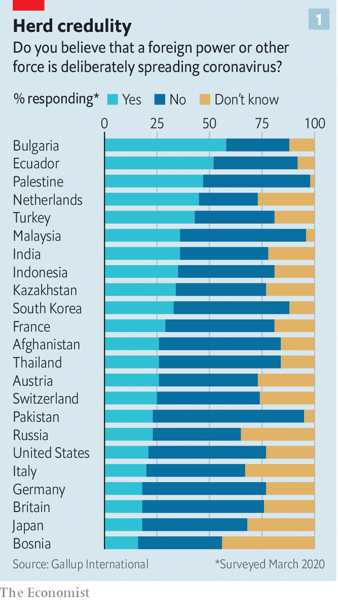
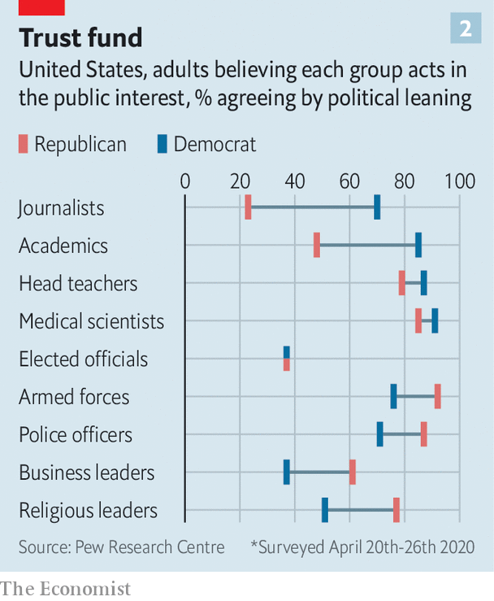

## Return of the paranoid style

# Fake news is fooling more conservatives than liberals. Why?

> As with the coronavirus itself, some people seem to be more vulnerable than others to the infodemic

> Jun 3rd 2020

“DOCTORS NEED three qualifications: to be able to lie and not get caught; to pretend to be honest; and to cause death without guilt.” So wrote Jean Froissart, a diarist of the Middle Ages, after an outbreak of bubonic plague in the 14th century. Fake news then meant rumours that the plague could be cured by sitting in a sewer, eating decade-old treacle or ingesting arsenic.

The “infodemic” around covid-19, declared by the World Health Organisation (WHO) in February, is not the world’s first outbreak of misinformation. This time the myths include the notion that the disease can be cured by drinking methanol, which has led to more than 700 deaths in Iran, and that it is spread by 5G transmitters, which has convinced arsonists in Britain to carry out more than 90 attacks on phone towers. Just as the virus lodges in people’s lungs, dangerous ideas are infecting their minds.

One big difference between the infodemics of the 1300s and 2020 is the rapid worldwide transmission of today’s nonsense, enabled by the internet. In March a poll by Gallup International of 28 countries in four continents found that in all of them, at least 16%—and as many as 58%—of people thought covid-19 was being deliberately spread (see chart 1). A clip of a film called “Plandemic”, which claims that a shadowy elite started the outbreak for profit, was uploaded on May 4th; within a week it had been seen 8m times and its star, Judy Mikovits, had topped Amazon’s bestseller list.

Social media enable people to share true news as well as the fake sort. But the fabulists seem to be winning. A study published in Nature in May found that, although pro-vaccine Facebook users outnumber anti-vaccine ones, the anti-vaxxers are better at forging links with non-aligned groups like school parents’ associations, so their number is growing faster. Among Americans, exposure to social media is associated with a greater likelihood of believing that the government created the virus or that officials exaggerate its seriousness, according to a recent paper in the Harvard Kennedy School’s Misinformation Review.

Broadcasters in many countries need a licence and must convince regulators that they try to report the news truthfully. Few such constraints apply to the internet. In April Britain’s broadcasting watchdog, Ofcom, censured a tiny TV station called London Live for airing part of an interview with David Icke, a conspiracy theorist who believes the pandemic is a hoax. The broadcast had been watched by only 80,000 people. Yet at the time of Ofcom’s ruling 6m had viewed the full interview on YouTube, which is outside Ofcom’s jurisdiction.

YouTube has since taken the video down, along with many others. Section 230 of America’s Communications Decency Act absolves tech firms of responsibility in that country for fact-checking uploaded content. But President Donald Trump wants to change this (see [article](https://www.economist.com//international/2020/06/04/donald-trump-has-reignited-a-debate-about-regulating-speech-online)). Even if he is blocked by the courts, public opinion favours more intervention. In America 84% say social networks should delete posts that they suspect contain inaccurate information about covid-19. Half that number say they should do so without confirming the posts are false. Tech firms have thus begun to add warnings to false information and signposts to reliable sources.

Covid-19 may seem a relatively straightforward subject on which to play censor. Compared with, say, politics, “it’s easier to set policies that are a little more black and white and take a much harder line,” Mark Zuckerberg, Facebook’s boss, told the New York Times in March. Yet it is proving tricky. The science is changing rapidly. In February America’s surgeon-general tweeted that facemasks were “NOT effective in preventing general public from catching coronavirus”. Now he says they are.

Worse, any hope that the pandemic would be politically uncontentious has evaporated. In March Mr Zuckerberg said Facebook had no problem taking down “things like ‘You can cure this by drinking bleach.’ I mean, that’s just in a different class”. Yet weeks later Mr Trump suggested it might help to inject disinfectant. Facebook, Twitter and YouTube have removed videos posted by Brazil’s president, Jair Bolsonaro, declaring hydroxychloroquine an effective treatment. So far clips of Mr Trump praising (and even claiming to take) “the hydroxy” remain up. The firms say the difference is that Mr Trump stopped short of saying that the drug was a proven cure.

Just as misinformation is not new, nor is its political use. In 1964 an essay by a historian, Richard Hofstadter, on the “paranoid style” in American politics described “the sense of heated exaggeration, suspiciousness, and conspiratorial fantasy” running through everything from 18th-century protests against the Illuminati to the anti-Masonic movement. Yet whereas Hofstadter argued that the paranoid style came as easily to those on the left as on the right—for instance, he cited the rumours of a slave-owners’ plot that were propagated by some abolitionists—today’s infodemic appears to be spreading more easily among the world’s conservatives than its liberals.

In America the Pew Research Centre found in March that 30% of Republicans believed the virus was created intentionally, nearly twice the share of Democrats. Last month a poll by YouGov found that 44% of Republicans think Bill Gates wants to use covid-19 vaccines to implant microchips in people; 19% of Democrats agree. In France a poll by Ifop found that 40% of those who support Marine Le Pen’s National Rally (once the National Front) believed that the virus was made by design, twice the share among backers of the far-left Unsubmissive France party. Supporters of the Dutch right-populist Freedom Party and the Forum for Democracy (FvD) are 40% more likely than backers of the far-left Socialist Party to say covid-19 is a biological weapon.

Wilder conspiracy theories aside, conservatives also seem more likely than liberals to question the official line on the pandemic. In late March, with Britain freshly locked down, a quarter of Tories but only 15% of Labour supporters believed that covid-19 was “just like the flu”.

The reluctance of so many conservatives to believe the conventional narrative of covid-19 is part of a more general suspicion of mainstream sources of information in some places. In America there is a yawning partisan gap in trust (see chart 2). The widest gulf concerns journalists, the next academics. These professions have long been conservative targets. Rush Limbaugh, an American talk-show host, speaks of the “four corners of deceit”: the media, scientists, academia and the government.

Such language is echoed by European populists of the right. Thierry Baudet, leader of the FvD, declared last year that “we’re being destroyed by the people who should protect us and undermined by our universities, by our journalists.” He has set up a “hotline” to report left-wing academics, and scoffs that the Dutch public broadcaster “obediently nods for the powers that be”. In France Ms Le Pen claims that “the government has been the biggest provider of fake news since the start of this [covid] crisis.” And in Britain, Brexiteers have questioned the impartiality of journalists, academics and civil servants, their attitude summed up by then justice secretary Michael Gove’s remark that people “have had enough of experts from organisations with acronyms saying that they know what is best and getting it consistently wrong”. British Conservatives have less faith than others in most of the media, as well as in international institutions. In April an Opinium poll found they were twice as likely as Labour voters to mistrust Tedros Adhanom Ghebreyesus, the head of the WHO.

Elite-bashing is hardly unique to conservatives. Andrés Manuel López Obrador, Mexico’s populist left-wing president, continually lays into the media. So did Labour’s former leader, Jeremy Corbyn, who talked darkly about an “establishment” that mysteriously kept causing him to lose elections. Democrats are likelier than Republicans to believe that 9/11 was an inside job. And the left is partial to corporate conspiracies, including the myth that AIDS was invented by Big Pharma and the CIA. One prominent peddler of covid-19 myths, according to NewsGuard, which vets sites for accuracy, is @OrganicLife, whose tweets combine vegan nut-milk recipes with paranoia about 5G transmitters.

Conspiracy beliefs are associated with ideological extremism of any variety, argues Karen Douglas, an expert on conspiracy theories at the University of Kent. Yet she says there is an “asymmetry”. People on the right believe in them more often, and entertain a broader range of theories, particularly those that accuse the other “side” of plotting, whether that be left-wingers, foreigners or other groups.

Structural shifts may explain why conservative voters seem to be more prone to the infodemic, and why conservative leaders have more reason—and are more likely—to undermine reliable sources. For one thing, conservatives’ complaints that elites are not on their side have become more plausible. In many countries the old left-right political divide, based on economics, has been replaced by a liberal-conservative split, based on culture. This largely pits liberal graduates against conservative school-leavers. And elites—whether in the media, the civil service, science or academia—are dominated by graduates. This doesn’t necessarily make them partial. But when Brexiteers complain that the civil service is a nest of Remainers, or Republicans growl that America’s universities are stuffed with liberals, they are right.

Conservatives have responded by tuning in to their own media sources, which have found that there is money to be made in amplifying their fears. American talk-radio punctuates paranoid chat with ads for dubious health remedies (Alex Jones, a Texas-based radio host, was recently ordered to stop selling toothpaste which he claimed “kills the whole SARS-corona family at point-blank range”). Cable channels such as Fox News and websites like Breitbart have drawn audiences by bringing fringe theories into the mainstream.

Most recently, social networks’ algorithms have steered people towards polarising content, which is more likely to provoke “engagement” and thus generate ad impressions. In 2018 an internal report at Facebook warned that users were being pointed to divisive material. Yet plans to highlight less controversial posts—a project dubbed “Eat Your Veggies”—were sidelined, partly because of concerns that the changes would affect conservative users more than others, according to the Wall Street Journal. Some 16% of Americans get their covid-19 news directly from the White House; three-quarters of those who do so think the media have exaggerated the seriousness of the pandemic.

Another cause of conservative mistrust is that, in some countries, the electoral system gives conservative politicians a particular incentive to encourage polarisation. Liberals tend to be concentrated in cities; conservatives are more spread out. In winner-takes-all systems, this puts liberal parties at a disadvantage, as they pile up huge majorities in cities while conservative parties win more seats by lower margins elsewhere. In America this means the Republicans can win the electoral college with a minority of the popular vote (as they did in 2000 and 2016). In Britain it means Brexit supporters are in the majority in nearly two-thirds of constituencies but make up only about half of voters. The upshot, argues Ezra Klein in a new book on America, “Why We’re Polarised”, is that ultra-partisanship works better for conservatives. Liberals have to win votes from moderates; conservatives can prevail by just getting out their base. As politics becomes more polarised, energising the base gets easier, and winning over moderates harder.

The lessons from history are gloomy. Hofstadter believed that political paranoia “may be a persistent psychic phenomenon, more or less constantly affecting a modest minority of the population.” But, he warned, “certain historical catastrophes or frustrations may be conducive to the release of such psychic energies, and to situations in which they can more readily be built into mass movements or political parties.” Like the Iraq war and the global financial crisis, the pandemic may prove to be exactly that kind of catastrophe. ■

Correction (June 8th, 2020): The poll cited in the third paragraph was by Gallup International, not Gallup as we originally stated. The two are separate organisations.

## URL

https://www.economist.com/international/2020/06/03/fake-news-is-fooling-more-conservatives-than-liberals-why
