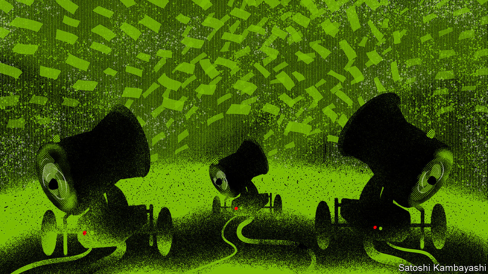

## Tomorrow’s problem

# Don’t worry about inflation—yet

> Monetary stimulus is unlikely to spark sustained price rises while labour markets remain depressed

> Jun 4th 2020

NEVER BEFORE have central banks created so much money in so little time. In the past three months America’s monetary base has grown by $1.7trn as the Federal Reserve has hoovered up assets using new money. As The Economist went to press, the European Central Bank (ECB) was expected to expand its emergency bond-buying programme beyond its initial size of €750bn ($830bn). Money-creation has tacitly financed much of the emergency spending unleashed to help economies through the pandemic. It has also propped up asset markets. The Fed is buying junk bonds; the Bank of Japan has stepped up its purchases of equities and could soon own over a fifth of many large Japanese companies (see [article](https://www.economist.com//node/21787298)). All the while economies are contracting. As a result, America’s base-money-to-GDP ratio may grow by nine percentage points in the second quarter of 2020. That would be by far the biggest such rise in decades.

It is only natural for money-creation on this scale to spark fears about inflation, which is the consequence of too much money chasing too few goods and services. All the more so because the pandemic has constrained production, at least temporarily, by forcing factories and shops to close and limiting global trade. It is no surprise, therefore, that a vocal minority of investors and economists predict an inflation surge, including researchers at Morgan Stanley; Ray Dalio, a hedge-fund manager; and a clutch of monetarist academics. Similar forecasts after the financial crisis in 2007-09, when central banks’ balance-sheets also ballooned, proved to be wholly wrong. But, in contrast to then, much of today’s stimulus is ending up in households’ bank accounts. In April, for instance, Americans’ total incomes rose by 11% thanks to emergency support from the government (and, indirectly, from the Fed), even as overall wages and salaries fell by 8% as 20.5m workers lost their jobs. More money in consumers’ pockets, according to hawkish logic, means this time will be different—and that inflation is more likely.

It is not. Several reasons suggest the hawks will probably be proved wrong again. Even accounting for the fall in oil prices, inflation is sharply lower in most places because households are slashing their consumption and saving more (see [article](https://www.economist.com//finance-and-economics/2020/06/04/americans-saved-a-record-chunk-of-their-incomes-in-april)). Some of that is by necessity—it is hard to spend when shops are shut. But even as economies reopen, spending is likely to remain tepid, not least because unemployment is soaring. America’s latest monthly unemployment figures, due on June 5th, are likely to show a jobless rate of 20%. It would be similarly high in many other countries, like Britain, were they not generously subsidising employers’ payrolls. Job insecurity in a depressed labour market is reason enough to save. And governments cannot replace lost incomes indefinitely. Many are already thinking about how to wind down their support in order to get people back to work.

The immediate risk, therefore, is not too much inflation, but too little, amid a slow recovery and a painful economic restructuring. Many firms will emerge from lockdown with huge debts. Many workers may need to move from one industry to another. In such an environment the chief danger will be that policymakers withdraw stimulus too soon. That is what happened in 2011, after the global financial crisis, when the ECB raised interest rates. Financial markets seem to expect such stimulus to be insufficient. Their inflation expectations suggest the Fed, the ECB and the Bank of Japan will all undershoot their targets on average for the next decade. Even America’s buoyant stockmarket is favouring firms that can thrive in a low-inflation environment.

Only after economies and job markets have healed will a sustained rise in inflation become a risk. Governments will emerge from the pandemic with much higher public debts, and they may be tempted to press monetary policymakers to keep interest rates low rather than to apply the brakes. Even then, inflation will become a threat only if central bankers buckle under the pressure and thus start to lose the faith of the markets. In other words, there will be a time to worry. But it is not now. ■