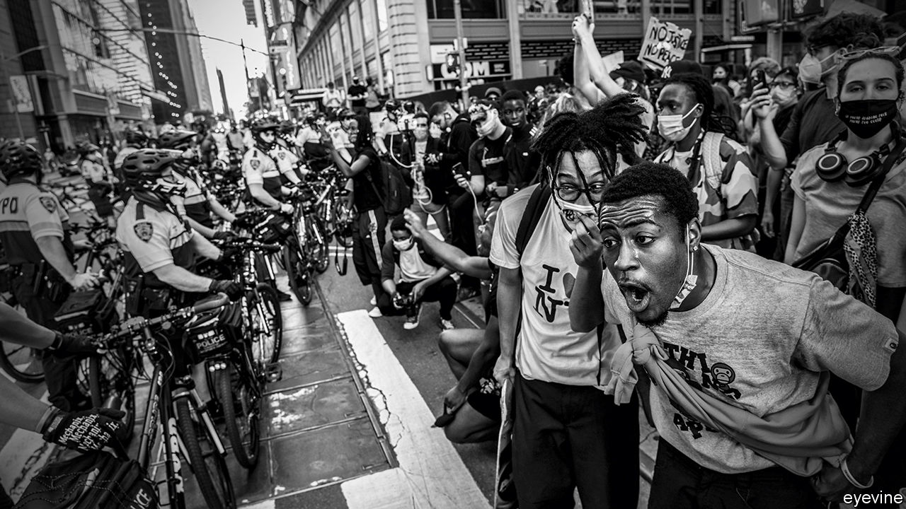

## The fire this time

# Police violence, race and protest in America

> Will protesters in American cities bring progress, or set back the cause they champion?

> Jun 4th 2020

ONE HUNDRED THOUSAND Americans are dead from a virus. A feat of space flight demonstrates American ingenuity. In cities across the country, protests sparked by racial injustice are showing an ugly side of America to the world. In November voters must choose between a Republican running on a law-and-order platform, and an uninspiring vice-president running for the Democrats. The year is 1968. It is also 2020.

In 1968 the virus was flu and the space mission Apollo 7. But the injustice had the same corrosive effect. As James Baldwin wrote in the early 1960s, racism “compromises, where it does not corrupt, all the American efforts to build a better world—here, there or anywhere.” Today more than 350 cities nationwide erupted after George Floyd, an unarmed African-American man, was killed by a white police officer (see [article](https://www.economist.com//obituary/2020/06/04/george-floyd-was-killed-on-may-25th)). For nearly nine agonising minutes, deaf to Mr Floyd’s pleas and the growing alarm of the crowd, the officer choked the life out of him.

No wonder the spark ignited a bundle of kindling lying nearby. The fire this time is burning for the same reasons it has so often in the past: that many African-Americans still live in places with the worst schools, the worst health care and the worst jobs; that the rules apply differently to black people; the fact, rammed home by covid-19, that whenever America suffers misfortune, black America suffers most; a sense that the police are there to keep a lid on a city’s poor, even as they protect wealthy suburbs. And, yes, the sheer intoxication that comes from belonging to a crowd that has suddenly found its voice, and which demands to be heard.

The cycle of injustice, protest, riot and conservative reaction has come round many times since 1968. So many, that it would be easy to conclude that police violence and racial inequality in America are just too hard a problem to fix. Yet such pessimism is unwarranted. It is also counter-productive.

Activists sometimes charge that the entire criminal-justice system is racist. Police unions protect their members, including the rotten ones. In recent days a police car has rammed protesters and officers have assaulted people on the street. But the system is made up of thousands of jurisdictions and police departments. They are not all the same. For every Minneapolis, where some thuggish officers went on “warrior” courses and saw themselves as an occupying force, there is a Camden, New Jersey. Camden’s police force was so broken that in 2013 it was disbanded and the city started afresh. Its police chief was this week able to march with peaceful protesters through their city.

Policing America is hard because America is more violent than any other rich country and its citizens more heavily armed. About 50 police officers are murdered while doing their job each year. But the sustained falls in crime over the past three decades have made room for less warlike law enforcement—by training officers to defuse confrontation, not seek it, and by making them accountable whenever they use force. Many police departments, including Camden, have already taken this chance to turn themselves round (see [article](https://www.economist.com//united-states/2020/06/04/how-to-fix-american-policing)). Others have not, partly because the federal government under President Donald Trump has eased the pressure for change. But the police and prosecutors are under local democratic control. They can be made to embrace reform if enough people vote for it.

Pessimism is self-defeating, too. It is a short step from thinking that America’s original racial sin is so deep that it cannot be overcome, to thinking that smashing and burning things is justified, because it is the only way to get attention. Yet if today’s protests slide into persistent rioting, as in 1968 after Martin Luther King’s assassination, the harm they cause could be felt most keenly in African-American districts. Those people who can leave will. The left-behind will be worse off, as home values plunge and jobs and shops disappear. The police may withdraw, leading to an increase in crime, which in turn may eventually bring more violent policing. The scars will be visible for decades.

Across the country, black leaders, who have seen this happen before, are telling protesters not to undermine their cause. “A protest has purpose,” said Atlanta’s mayor, Keisha Lance Bottoms, condemning the vandalism in her city. In recent days protesters have heeded that and have been trying to restrain those who just want to start a fire—some of them white troublemakers.

Black leaders also understand how riots can wreck a political cause. When neighbourhoods are ablaze, the rest of the country focuses on putting out the fires. Harm to police officers in riots may cause voters to forget where their sympathies lay when it all began. When rioting takes hold, those who support the protests may find that their demands for change are drowned out by the clamour for order to be re-established.

In a presidential election, fear often beats idealism. Mr Trump seems to want this to be the choice in November. He has encouraged his supporters to clash with protesters outside the White House and been looking to deploy active troops alongside the national guard so as to “dominate” what his people call the battlespace (see [article](https://www.economist.com//united-states/2020/06/04/far-worse-than-nixon)). Law and order helped Richard Nixon beat Hubert Humphrey in 1968. It could work again.

Yet fear betrays Mr Floyd’s memory. The more America is united, the better it can strive to ensure that all its citizens are able to live by its founding ideals. Unity will not come from Mr Trump, who has spent four years trying to divide the country. Instead, the leaders of protest movements, along with America’s mayors and police chiefs, must inspire it themselves. If the protests are overwhelmingly non-violent, they also carry a promise. Not that the protesters will get everything they want, nor that the injustices holding back African-Americans can all be put right at once, but that tomorrow can be better than today.

By the end of the decade in which Baldwin wrote of the need to heal America, the country had set about dismantling the legal edifice of racial segregation. It was also in the grip of a reaction from those who thought civil rights had gone too far. America is like that. Progress tussles with its opposite. But Americans have been tugging away at racism for half a century. This week, when the cruel death of a black man drew protesters of all races onto America’s streets, it was not just a sign of how much work lies ahead, but also that progress is possible. ■

Correction (June 5th 2020): The original version of this article claimed that the space mission of autumn 1968 was Apollo 8. We meant Apollo 7. Sorry.

## URL

https://www.economist.com/leaders/2020/06/04/police-violence-race-and-protest-in-america
