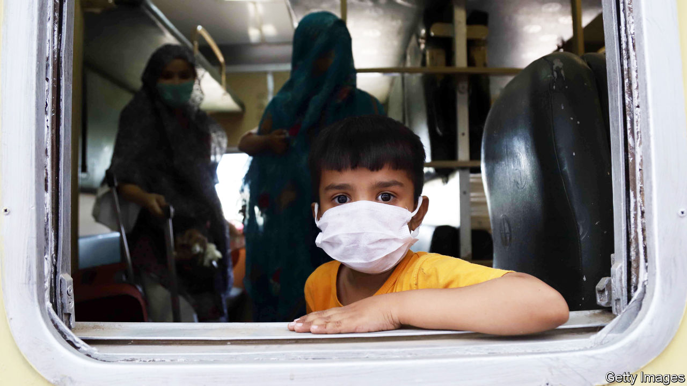
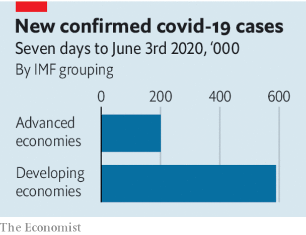

## The other three-quarters

# The pandemic is still gathering pace in most of the world

> But there is lots that countries can do to curb it

> Jun 4th 2020

Editor’s note: Some of our covid-19 coverage is free for readers of The Economist Today, our daily [newsletter](https://www.economist.com/https://my.economist.com/user#newsletter). For more stories and our pandemic tracker, see our [coronavirus hub](https://www.economist.com//news/2020/03/11/the-economists-coverage-of-the-coronavirus)

HOW TO PREVENT new surges in cases? How to reopen businesses in an era of social distancing? How to revive prone economies? These are the questions preoccupying most of the rich world, where covid-19’s first wave, at least, is mercifully ebbing. But elsewhere the pandemic remains far from any crest. Brazil is adding around 25,000 new confirmed cases a day, more than the United States. Russia and India are not far behind, with 8,000 or so apiece. All told, poorer countries account for some three-quarters of the 100,000 or so new cases detected around the world each day.

These numbers are alarming, especially because they are grave underestimates. Poorer countries tend to conduct fewer tests than richer ones, so even more infections and deaths are going uncounted in them. Random testing in the Pakistani city of Lahore suggests that the official count is catching only one case in 25. Many governments are reluctant to advertise how rapidly the virus is advancing on their watch (see [article](https://www.economist.com//graphic-detail/2020/06/06/democracies-contain-epidemics-most-effectively)). Russia initially claimed that barely 600 Muscovites died of the disease in April, but the number of deaths in the city in excess of the average for the month was three times that. And some countries are too chaotic and violent to have much of a government. This week the UN sounded the alarm about Yemen, where the coronavirus seems to be rampaging across territory contested by the country’s two warring governments (see [article](https://www.economist.com//middle-east-and-africa/2020/06/04/covid-19-quietly-sweeps-across-yemen)).

In the most worrying countries, many live hand-to-mouth. Their governments tend not to have much money, either. That has prompted the authorities to relax the restrictions they put in place to slow the spread of the disease, to save their citizens from ruin. India, for instance, ended its lockdown on June 1st, just as the number of daily infections hit a new record (see [article](https://www.economist.com//asia/2020/06/06/covid-19-infections-are-rising-fast-in-bangladesh-india-and-pakistan)). Mexico has declared that it will open for tourism on June 8th. And non-essential businesses have been allowed to reopen in Rio de Janeiro, Brazil’s second-largest city.

When outbreaks are big enough to overwhelm health-care systems, deaths soar, since even cases that might respond to treatment become deadly. Poor countries have fewer hospitals and doctors and less of the necessary kit, from ventilators to disposable gloves and gowns. This can lead to horrifying scenes like those witnessed in Guayaquil, Ecuador, in April, when coffins ran out and bodies were abandoned in the streets.

Even poor countries can still do much to avoid such an outcome. As many have discovered, long-lasting lockdowns, ordered from on high, tend to be both hard to enforce and to come at a calamitous cost to the economy and to people’s overall health. But basic public-health campaigns, ideally in the hands of village councils, primary health-care clinics and so on, can promote practices like washing hands, wearing face-masks and social distancing. They can organise isolation for those with symptoms and press for amenities like clean water. Even in places where it is hard to empty the streets altogether, governments can ban big gatherings in confined spaces, be it sports stadiums or churches. And—cold comfort—once it becomes clear in any given country how deadly an uncontrolled outbreak is, the instinct for self-preservation will prompt people to isolate themselves, slowing covid-19’s progress.

Richer countries can do much to help. Some stricken places will need donations of simple supplies like testing kits and protective gear. Others will need debt relief, to free money to fight the disease. Humanitarian aid for war-torn countries and the refugees they create is even more urgent than usual. Better yet, the governments backing opposing sides in civil wars in places like Afghanistan and Yemen could urge their proxies to declare temporary truces, to bring a modicum of help to afflicted regions. Coronavirus outbreaks are deadly enough without the added misery of guns and bombs. ■

## URL

https://www.economist.com/leaders/2020/06/04/the-pandemic-is-still-gathering-pace-in-most-of-the-world
