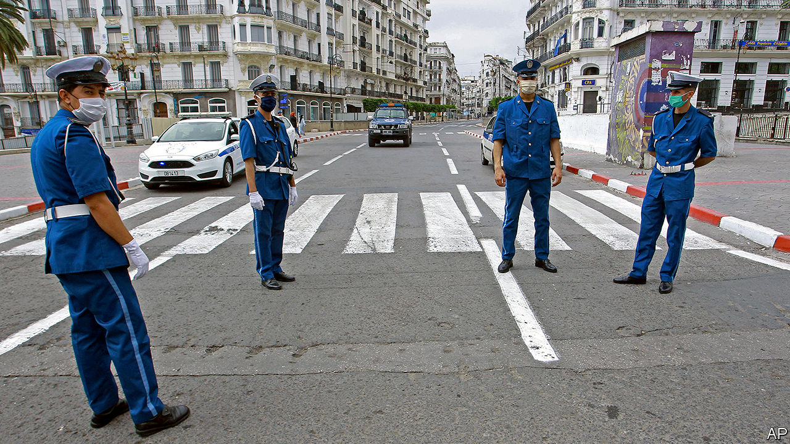

## Streets with no rage

# Algeria’s protest movement considers how and when to come back

> People are fed up with a repressive government that cannot help them

> Jun 4th 2020

COVID-19 HAS killed around 700 people in Algeria, says the government, but the real toll is surely higher. The pandemic has also crippled the country’s economy. Last month President Abdelmadjid Tebboune announced that the state budget would be cut in half because of plummeting oil revenue. The virus, though, has helped Mr Tebboune in at least one way. With the country locked down to prevent its spread, protesters have been forced off the streets. Hundreds of thousands of them had been marching for over a year, even after toppling the previous president, Abdelaziz Bouteflika, in April 2019. Their work was unfinished: many of the old economic, political and military elite remained in power. The nature of the system had not changed. Now the protesters must decide how and when to try to finish the job.

Like other countries, Algeria banned all public gatherings in response to the virus. But, unlike elsewhere, the authorities seem in no hurry to loosen things up again. Mr Tebboune recently extended the lockdown, including a 5pm curfew, until June 13th. The government has used the outbreak to repress the Hirak, as the protest movement is known, blocking critical websites, banning what it calls “fake news” and arresting some who moved their opposition online. Many of the movement’s leaders were already in jail, charged with vague crimes such as “harming national unity” or attacking “the integrity of national territory”. Efforts to reduce prison overcrowding during the outbreak by freeing some detainees have excluded Hirak leaders (though two will soon be freed, says the leader of an opposition party).

For years the Hirak organised, while the government of Mr Bouteflika, an ailing octogenarian, did little. Now it is the protesters who feel incapacitated. Many want to return to the streets before Mr Tebboune can do more harm. They had considered him a weak president, the victor of an election in December that most voters boycotted. But, with no active opposition, he has drafted a new constitution that maintains his existing powers, such as the authority to hire and fire prime ministers and judges, and adds some extra ones. Activists refused to take part in discussions of the document, questioning the president’s timing and doubting his intentions. Meanwhile, the old ruling parties are regrouping.

But the Hirak also spies an opportunity. The lockdown has exacerbated many of the socioeconomic grievances that prompted the protests in the first place. Millions are jobless in a country which has no unemployment benefit. The government has given the poorest families a one-time handout of 10,000 dinars ($78), equal to about two weeks of the minimum wage. With oil revenues plummeting, Mr Tebboune lacks the money to soothe a growing sense of hogra (alienation from the regime). The Hirak wants to tap into that frustration.

Protesting is risky while the threat of the virus persists, and not just for health reasons. The lockdown could give the generals an excuse to open fire, which some have long wanted to do. That might, in turn, trigger a violent response from the protesters, who have remained remarkably peaceful and united. Old divisions could re-emerge, between liberals and Islamists, Berbers and Arabs, rich and poor. If the people fear another civil war, like the one that killed tens of thousands in the 1990s, they may abandon the Hirak.

Some are already taking to the streets, though. Before the pandemic the biggest protests were in Algiers, the capital. Today the provinces are stirring. In Bejaia, a city in the Berber heartland about 200km east of Algiers, business owners have protested against the lockdown and activists have blocked the police from arresting their friends. In nearby Kherrata, which was the first town to rise against French colonial rule, demonstrators chanted anti-government slogans during Eid al-Fitr celebrations last month. Protests are expected to resume soon in Algiers, too. “It’s going to be a hot summer,” says a businessman in the capital. ■