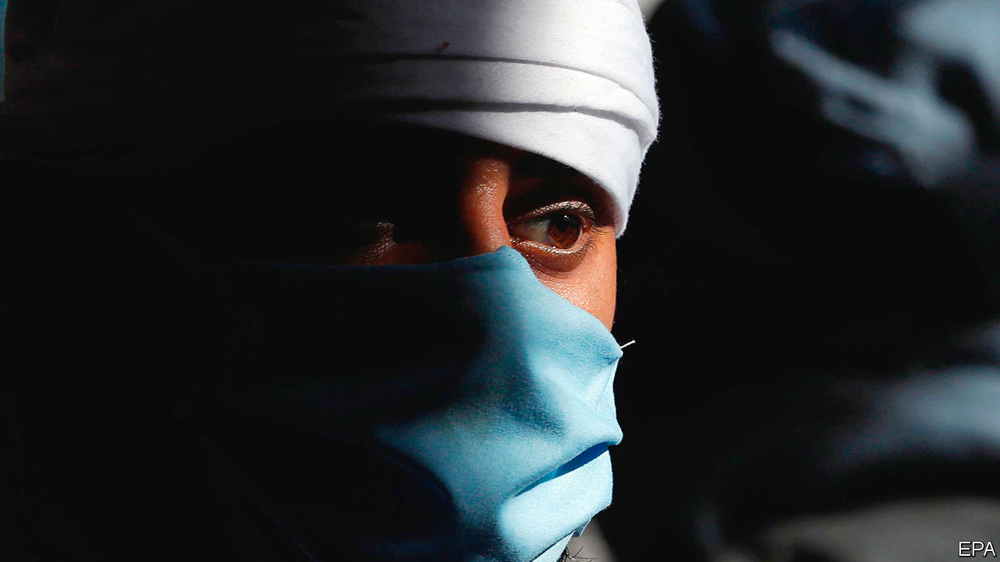
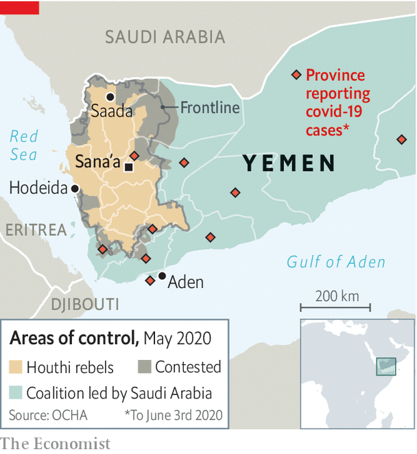

## The invisible outbreak

# Covid-19 quietly sweeps across Yemen

> The authorities either cannot test for the virus—or do not want to

> Jun 4th 2020BEIRUT

Editor’s note: Some of our covid-19 coverage is free for readers of The Economist Today, our daily [newsletter](https://www.economist.com/https://my.economist.com/user#newsletter). For more stories and our pandemic tracker, see our [coronavirus hub](https://www.economist.com//news/2020/03/11/the-economists-coverage-of-the-coronavirus)

THERE ARE no daily news conferences about covid-19 in Yemen, no charts or maps or deluge of data. There are barely any tests. But there are bodies. Silently but steadily the virus has taken root in the Arab world’s poorest country. Its spread can be glimpsed in anecdotes from doctors and snippets on social media. In one city aid agencies say gravediggers work overtime to keep up with the dead, most of them middle-aged men. In another city doctors who talk about the pandemic are threatened with arrest or worse.

If you judge by the official numbers, Yemen has largely been spared. It has reported just 419 coronavirus infections and 95 deaths. But no one believes those numbers. Ravaged by years of war, the health-care system has all but collapsed. Authorities lack the ability to track the outbreak—and in parts of the country, they do not want to.

Yemen was singularly ill prepared for a pandemic. Even now, after shipments of extra supplies, it has just 675 intensive-care beds and 309 ventilators, says the UN. Hospitals and clinics have been bombed throughout a five-year war between a Saudi-led coalition and the Houthis, a Shia militant group. Medical staff have fled the country, leaving one in six of Yemen’s 333 districts without any doctors. Millions of people cannot properly wash their hands because they lack clean water. A cholera outbreak has infected more than 2m people and killed 4,000 since 2016.

The country has been split in two since the coalition invaded in 2015, a campaign meant to topple the Houthis, who had seized the capital months earlier. The south is formally controlled by Saudi allies loyal to the president, Abd Rabbo Mansour Hadi (see map). In April, though, secessionists seized the port city of Aden and declared the region autonomous. The two camps have spent weeks fighting for control; the health ministry, split along the same lines, was paralysed as the virus approached.

Doctors say more than 500 people have died recently in Aden alone, many with respiratory symptoms that look a lot like covid-19. They cannot know for sure: tests are scarce. As of May 30th Yemen had screened just 2,678 people for the virus, from a population of 28m. Some clinics have closed rather than treat people who may be infected. Cases go unnoticed because symptoms can resemble mosquito-borne diseases such as dengue fever, already endemic in south Yemen and now spreading rapidly after floods that inundated Aden in April.

The Houthis, who control the north, claim the situation is far better in their fief. They reported their first case of covid-19 on May 5th, perhaps two months after the virus reached Yemen. At the end of May they claimed, absurdly, a total of four infections in Sana’a (one of them fatal) and none in outlying provinces. There have been isolated closures, but the Houthis have refused to impose a full lockdown. Doctors keep quiet for fear of reprisals.

On social media, though, Yemenis post stories of death: at least a dozen in the capital, dozens more in outlying provinces. Some families have been unable to bury their relatives, their bodies trapped in morgues by the Houthis. The UN has pulled about half of its foreign staff out of Sana’a.

Aid agencies have offered help. The World Health Organisation (WHO) and other groups are shipping hundreds of ventilators, thousands of tests and other kit. But cash is short. Earlier this year America cut $73m in humanitarian aid to Yemen, noting (accurately enough) that the Houthis profit from it. Some agencies have been forced to trim services. The World Food Programme halved the rations it provides to 8.5m people in the north. The WHO stopped payments to doctors and nurses, many of whom have not received government salaries for years. A Saudi-led donors’ conference on June 2nd, meant to raise money for a covid-19 response and other aid programmes, netted $1.4bn, well below its target of $2.4bn.

Yemenis in all parts of the country struggle to afford protective gear. Disposable face-masks, if replaced daily, would eat up about half the monthly income of a typical family of four. The better N95 masks cost about $8 each, several days’ pay even for doctors, who often must supply their own gear. Residents of Sana’a cannot find hand-sanitiser and other necessities.

The outbreak is not only exacerbated by economic crisis—it also worsens it. Saudi Arabia has been the biggest donor to Yemen, contributing billions even as it simultaneously bombs the country. In 2018 it deposited $2bn in Yemen’s central bank to pay for imports. Only a tenth of that is thought to remain. With the kingdom facing a deep deficit brought on by lockdowns and low oil prices, few in Yemen expect the money to be replenished, so the currency will probably depreciate. The slump in wealthy Gulf states has also hurt remittances to Yemen, which last year amounted to $3.8bn (13% of GDP). Oxfam, an aid agency, estimates that the volume of remittances has dropped by 80% in the first four months of 2020.

All of this comes as the war itself seemed to be winding down. The United Arab Emirates, which led the fighting in the south, withdrew most of its troops last summer. The Saudis want to find a face-saving escape from a costly war that seems unwinnable. But they would leave behind a country bitterly divided, between north and south and between Mr Hadi and the separatists. Even if the bombs stop, disease and hunger will take their own toll. ■

## URL

https://www.economist.com/middle-east-and-africa/2020/06/04/covid-19-quietly-sweeps-across-yemen
