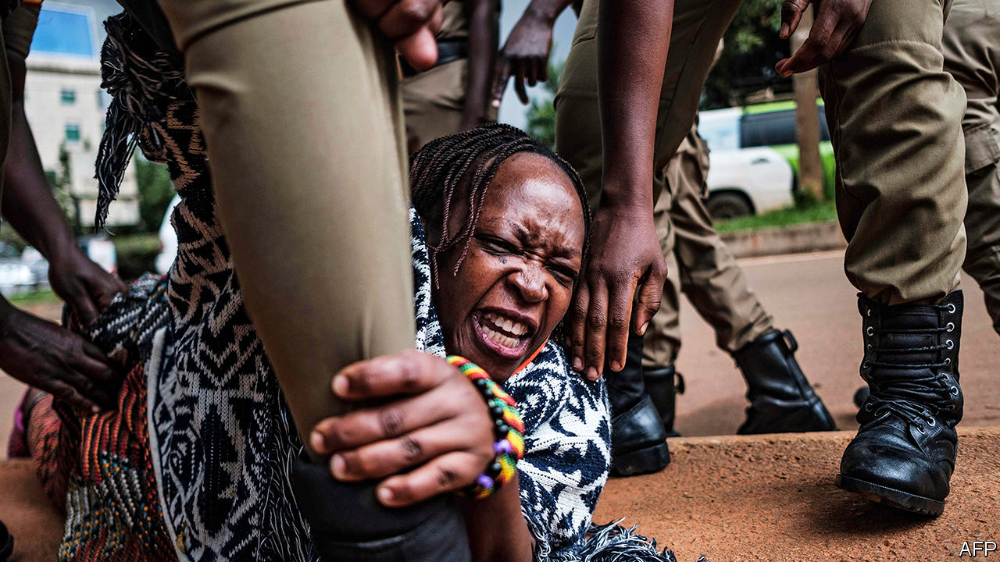

## “You can’t just say ‘please’”

# How Ugandan feminists make themselves heard

> Asking nicely will not stop sexism, some say

> Jun 4th 2020KAMPALA

SAMANTHA MWESIGYE, a Ugandan lawyer, used to take offence when people called her a feminist. Everybody knew that feminists were loud, rude and a little bit mad. But then she decided to go public with allegations against her boss, the deputy solicitor-general, who she says ridiculed and victimised her after she would not have sex with him. He denied it—while claiming that her clothing was “unacceptably revealing and seductive”—and was later cleared by a committee. Feminist groups took out a full-page advert in a national newspaper declaring that they believed her. She wept when she read it. If that is how to get heard, she says, then “hell yeah, I’m a feminist.”

A new wave of activism is spreading in Uganda, rippling through WhatsApp groups and Twitter hashtags, as young women push back against harassment and unequal treatment. Those who call themselves feminists are a tiny minority. And Ugandan politics are still largely a power struggle between men. But Ugandan feminists are determined to make their views heard. “Political change is nothing if there’s no social change in the way men perceive women,” says Rosebell Kagumire, the editor of African Feminism, a website.

There is much to do. At Makerere University, young women recall their time in high school. One was trained to sit and talk “like a woman”. Another recounts how older boys would vet potential prefects: “They start making you turn around to see how big your butt is.” A student activist remembers a call from a female administrator advising her to leave serious business to the men. “It’s hard to be a feminist,” says Marion Kirabo, a law student. “It becomes a constant war between you and society.”

The state is both priggish and prurient. It orders female civil servants not to wear short skirts. But it also organised a “Miss Curvy” beauty contest to entice foreign tourists. Women whose nude photos are shared online without their consent have been arrested. Meanwhile, a senior policeman recently blamed women who “wiggle their butts seductively” for causing road accidents. He added that “unnecessary exposure of [female] flesh amounts to sexual assault”—on the men who see it.

Social conservatism divides the women’s movement itself. Many campaigners describe themselves as “gender advocates” rather than feminists, because they reject permissiveness on issues such as abortion, says Eunice Musiime of Akina Mama wa Afrika, Uganda’s most influential feminist group. She describes meetings where some attendees would refuse to sit next to a gay person or talk to a sex worker.

However, more radical voices are finding each other online. Stella Nyanzi (pictured), an activist with more than 200,000 Facebook followers, likens social media to “a gym in which feminists grow muscles”. Several women have made accusations against abusers online; one was even arrested for doing so. Twitter and Facebook have “taken the movement out of NGO boardrooms”, says Godiva Akullo, a lawyer.

Ugandan feminists talk about race as well as sex. Many draw as much inspiration from #BlackLivesMatter as from #MeToo. Ms Kagumire notes ways in which black women are doubly disadvantaged. For example, Western embassies interrogate single African women applying for visas, assuming that they are seeking a husband.

Online organising amplifies offline struggles. In 2018 hundreds of people marched through Kampala to protest about the police’s failure to stop the kidnapping and murder of scores of young women. And women are taking the lead in wider struggles. Last year Ms Kirabo and her fellow students led what started out as a women’s protest against rising tuition fees. Male students joined them in demonstrations that halted lectures for weeks.

Their protests draw on a decades-long tradition of women-led resistance. For at least a year market vendors have fined traders who harass them. And for generations rural women have used nudity to protest against injustices such as land theft.

The fearless Ms Nyanzi has clashed with the president himself. In 2017 she lambasted Janet Museveni, the education minister (and the president’s wife), who had said there was no money in the budget to buy sanitary pads for schoolgirls. Ms Nyanzi later spent 16 months in prison after writing a poem about the vagina of the president’s mother. She shouts, strips and swears. “You can’t just say ‘please don’t do it,’” she has said. “You’ve got to say ‘fucking don’t do it’ and shake your dreadlocks like a crazy woman and throw off your dress.” ■

## URL

https://www.economist.com/middle-east-and-africa/2020/06/04/how-ugandan-feminists-make-themselves-heard
